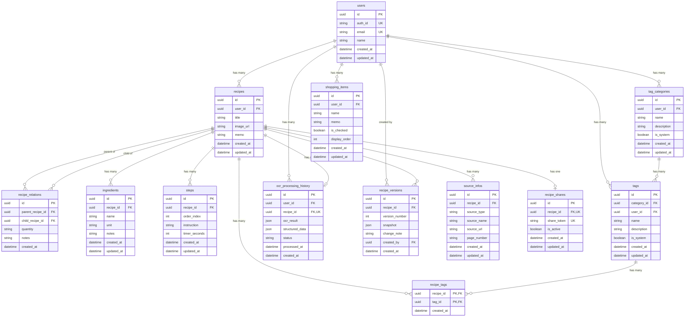

# ER図

```mermaid
erDiagram
    users {
        uuid id PK
        string auth_id UK
        string email UK
        string name
        datetime created_at
        datetime updated_at
    }

    recipes {
        uuid id PK
        uuid user_id FK
        string title
        string image_url
        string memo
        datetime created_at
        datetime updated_at
    }

    recipe_relations {
        uuid id PK
        uuid parent_recipe_id FK
        uuid child_recipe_id FK
        string quantity
        string notes
        datetime created_at
    }

    ingredients {
        uuid id PK
        uuid recipe_id FK
        string name
        string unit
        string notes
        datetime created_at
        datetime updated_at
    }

    steps {
        uuid id PK
        uuid recipe_id FK
        int order_index
        string instruction
        int timer_seconds
        datetime created_at
        datetime updated_at
    }

    tag_categories {
        uuid id PK
        uuid user_id FK
        string name
        string description
        boolean is_system
        datetime created_at
        datetime updated_at
    }

    tags {
        uuid id PK
        uuid category_id FK
        uuid user_id FK
        string name
        string description
        boolean is_system
        datetime created_at
        datetime updated_at
    }

    recipe_tags {
        uuid recipe_id PK,FK
        uuid tag_id PK,FK
        datetime created_at
    }

    ocr_processing_history {
        uuid id PK
        uuid user_id FK
        uuid recipe_id FK,UK
        json ocr_result
        json structured_data
        string status
        datetime processed_at
        datetime created_at
    }

    recipe_versions {
        uuid id PK
        uuid recipe_id FK
        int version_number
        json snapshot
        string change_note
        uuid created_by FK
        datetime created_at
    }

    shopping_items {
        uuid id PK
        uuid user_id FK
        string name
        string memo
        boolean is_checked
        int display_order
        datetime created_at
        datetime updated_at
    }

    source_infos {
        uuid id PK
        uuid recipe_id FK
        string source_type
        string source_name
        string source_url
        string page_number
        datetime created_at
        datetime updated_at
    }

    recipe_shares {
        uuid id PK
        uuid recipe_id FK,UK
        string share_token UK
        boolean is_active
        datetime created_at
        datetime updated_at
    }

    users ||--o{ recipes : "has many"
    users ||--o{ tag_categories : "has many"
    users ||--o{ tags : "has many"
    users ||--o{ shopping_items : "has many"
    users ||--o{ ocr_processing_history : "has many"
    users ||--o{ recipe_versions : "created by"

    recipes ||--o{ ingredients : "has many"
    recipes ||--o{ steps : "has many"
    recipes ||--o{ recipe_tags : "has many"
    recipes ||--o| ocr_processing_history : "has one"
    recipes ||--o{ recipe_versions : "has many"
    recipes ||--o{ source_infos : "has many"
    recipes ||--o| recipe_shares : "has one"
    recipes ||--o{ recipe_relations : "parent of"
    recipes ||--o{ recipe_relations : "child of"

    tag_categories ||--o{ tags : "has many"
    tags ||--o{ recipe_tags : "has many"
```
