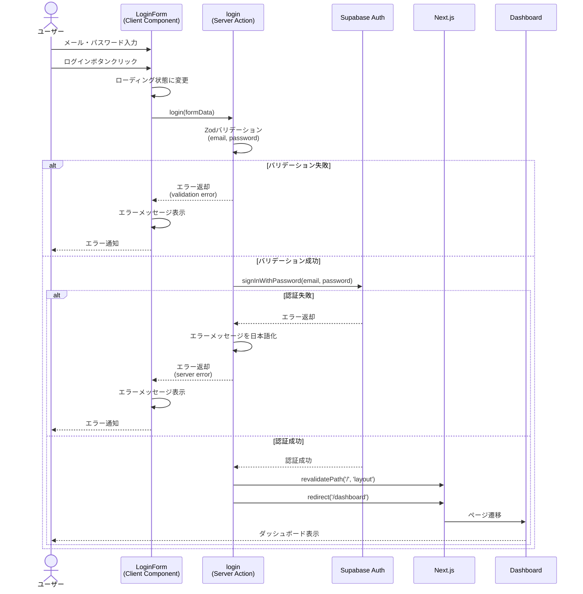

# ログイン機能

## 概要

CookScanアプリケーションのログイン機能は、メールアドレスとパスワードを使用してユーザーがアプリケーションにアクセスできるようにするための認証機能です。Supabase Authを使用して安全な認証を提供し、ログイン成功後はダッシュボードへリダイレクトします。

## 機能仕様

### 目的

- ユーザー認証を通じてセキュアなアクセスを提供
- ユーザーごとのレシピデータを保護
- 認証済みユーザーのみがアプリケーション機能を利用できるようにする

### 機能詳細

#### 認証方式
- メールアドレスとパスワードによる認証
- Supabase Authを使用したセキュアな認証処理

#### 入力バリデーション
- メールアドレス形式のバリデーション（Zodスキーマ使用）
- パスワードの必須チェック
- サーバーサイドでのバリデーション実行

#### エラーハンドリング
- バリデーションエラーのユーザーフレンドリーな表示
- Supabaseエラーメッセージの日本語変換
  - `Invalid login credentials` → 「メールアドレスまたはパスワードが正しくありません」
  - その他のエラー → 「ログインに失敗しました。時間をおいて再度お試しください。」

#### UI/UX
- ローディング状態の表示（ボタンが「ログイン中...」に変化）
- 送信中は入力フィールドとボタンを無効化
- エラーメッセージはAlertコンポーネントで表示
- レスポンシブデザイン対応

#### その他
- 新規登録ボタンは現在無効化されている

### ユーザーフロー

```
1. ユーザーがログインページ (/login) にアクセス
   ↓
2. メールアドレスとパスワードを入力
   ↓
3. 「ログイン」ボタンをクリック
   ↓
4. クライアントサイドでフォームデータを収集
   ↓
5. Server Action (login) を呼び出し
   ↓
6. サーバーサイドでバリデーション実行
   ├─ バリデーション失敗 → エラーメッセージを返す
   └─ バリデーション成功
      ↓
7. Supabase Auth で認証処理
   ├─ 認証失敗 → エラーメッセージを返す
   └─ 認証成功
      ↓
8. キャッシュを再検証 (revalidatePath)
   ↓
9. ダッシュボード (/dashboard) へリダイレクト
```

## シーケンス図



## 技術仕様

### フロントエンド

#### コンポーネント構成
- **ファイル**: `src/features/auth/login/LoginForm.tsx`
- **タイプ**: Client Component (`'use client'`)
- **スタイリング**: Tailwind CSS v4

#### 使用コンポーネント
- `Button` - ログインボタン、新規登録ボタン
- `Input` - メールアドレス、パスワード入力フィールド
- `FormField` - フォームフィールドラッパー
- `Alert` - エラーメッセージ表示
- アイコン: `BookIcon`, `MailIcon`, `LockIcon`, `LoginIcon`, `UserAddIcon`

#### 状態管理
```typescript
const [isPending, startTransition] = useTransition() // 送信中状態
const [error, setError] = useState<string | null>(null) // エラーメッセージ
```

#### 主要な処理フロー
```typescript
const handleLogin = async (formData: FormData) => {
  setError(null)
  startTransition(async () => {
    const result = await login(formData)
    // 成功時はリダイレクトされるため、失敗時のみエラーを設定
    if (!isSuccess(result)) {
      setError(result.error.message)
    }
  })
}
```

### バックエンド

#### Server Action
- **ファイル**: `src/features/auth/actions.ts`
- **関数**: `login(formData: FormData): Promise<Result<void>>`
- **ディレクティブ**: `'use server'`

#### バリデーションスキーマ
```typescript
const loginSchema = z.object({
  email: z.string().email('有効なメールアドレスを入力してください'),
  password: z.string().min(1, 'パスワードを入力してください'),
})
```

#### 処理フロー
1. Supabaseクライアントの作成
2. Zodスキーマによる入力バリデーション
3. Supabase Auth で認証処理
4. エラーハンドリングとメッセージの日本語化
5. 成功時のキャッシュ再検証とリダイレクト

#### 使用ライブラリ
- `@supabase/supabase-js` - Supabase Auth
- `zod` - バリデーション
- `next/cache` - キャッシュ再検証
- `next/navigation` - リダイレクト

### 認証ユーティリティ

#### ファイル
- `src/features/auth/auth-utils.ts`

#### 主要関数
```typescript
export async function checkUserProfile(): Promise<{
  hasAuth: boolean
  hasProfile: boolean
  authUser?: User
  profile?: UserProfile
}>
```

この関数は、ユーザーの認証状態とプロフィールの存在を確認するために使用されます。

- Supabase Authからユーザー情報を取得
- Prismaを使用してデータベース内のプロフィールを確認
- 認証状態とプロフィール状態を返却

## データモデル

### User モデル

```prisma
model User {
  id        String   @id @default(cuid())
  authId    String   @unique // Supabase Auth User ID
  email     String   @unique
  name      String?
  createdAt DateTime @default(now())
  updatedAt DateTime @updatedAt

  recipes       Recipe[]
  tagCategories TagCategory[]
  tags          Tag[]
}
```

#### 関連フィールド
- `authId`: Supabase Authで管理されるユーザーIDとの紐付け
- `email`: ログイン時に使用するメールアドレス
- `name`: ユーザー名（プロフィール設定で入力）

## API仕様

### login (Server Action)

#### 概要
メールアドレスとパスワードを使用してユーザー認証を行う

#### シグネチャ
```typescript
async function login(formData: FormData): Promise<Result<void>>
```

#### パラメータ
| 名前 | 型 | 説明 |
|------|------|------|
| formData | FormData | フォームデータ（email, passwordを含む） |

#### FormDataフィールド
| フィールド名 | 型 | 必須 | バリデーション |
|------------|------|------|--------------|
| email | string | ✓ | メールアドレス形式 |
| password | string | ✓ | 最低1文字 |

#### 戻り値
```typescript
Result<void> =
  | { success: true }
  | { success: false; error: { code: string; message: string } }
```

#### エラーコード
| コード | メッセージ | 発生条件 |
|--------|-----------|---------|
| validation | バリデーションエラーメッセージ | 入力形式が不正 |
| validation | メールアドレスまたはパスワードが正しくありません | 認証情報が不一致 |
| server | ログインに失敗しました。時間をおいて再度お試しください。 | その他のサーバーエラー |

#### 処理詳細
1. FormDataから email, password を抽出
2. Zodスキーマでバリデーション
3. Supabase Auth の `signInWithPassword` を呼び出し
4. エラー時はユーザーフレンドリーなメッセージに変換
5. 成功時は `revalidatePath('/', 'layout')` を実行
6. `/dashboard` へリダイレクト

### logout (Server Action)

#### 概要
現在のユーザーをログアウトさせる

#### シグネチャ
```typescript
async function logout(): Promise<void>
```

#### パラメータ
なし

#### 処理詳細
1. Supabaseクライアントを作成
2. `supabase.auth.signOut()` を呼び出し
3. `/login` へリダイレクト

### checkUserProfile (ユーティリティ関数)

#### 概要
ユーザーの認証状態とプロフィールの存在を確認する

#### シグネチャ
```typescript
async function checkUserProfile(): Promise<{
  hasAuth: boolean
  hasProfile: boolean
  authUser?: User
  profile?: UserProfile
}>
```

#### 戻り値
| フィールド | 型 | 説明 |
|-----------|------|------|
| hasAuth | boolean | Supabase Authでの認証状態 |
| hasProfile | boolean | データベースにプロフィールが存在するか |
| authUser | User \| undefined | Supabase Authユーザー情報 |
| profile | UserProfile \| undefined | データベース内のプロフィール情報 |

#### 使用例
プロフィール設定が完了しているかを確認し、未完了の場合は設定画面へリダイレクトする処理などで使用されます。

## セキュリティ

### 実装されているセキュリティ対策

1. **Supabase Auth の利用**
   - 業界標準のセキュアな認証サービスを使用
   - パスワードはハッシュ化されて保存

2. **Server Actions**
   - サーバーサイドで認証処理を実行
   - クライアントサイドにAPIキーや機密情報を露出しない

3. **入力バリデーション**
   - Zodスキーマによるサーバーサイドバリデーション
   - SQLインジェクション対策（Prisma ORM使用）

4. **エラーメッセージ**
   - 詳細な内部エラーを隠蔽
   - ユーザーフレンドリーなメッセージに変換

5. **HTTPS通信**
   - Vercelデプロイ時は自動的にHTTPS通信

## 関連ドキュメント

- [プロフィール設定機能](./profile-setup.md)（存在する場合）
- [ダッシュボード機能](./dashboard.md)（存在する場合）
- [認証フロー全体](./auth-flow.md)（存在する場合）

## 今後の拡張予定

- 新規登録機能の実装
- パスワードリセット機能
- ソーシャルログイン（Google、GitHub等）
- 二要素認証（2FA）
- Remember Me 機能

## 参考リンク

- [Supabase Auth ドキュメント](https://supabase.com/docs/guides/auth)
- [Next.js Server Actions](https://nextjs.org/docs/app/building-your-application/data-fetching/server-actions-and-mutations)
- [Zod バリデーション](https://zod.dev/)
