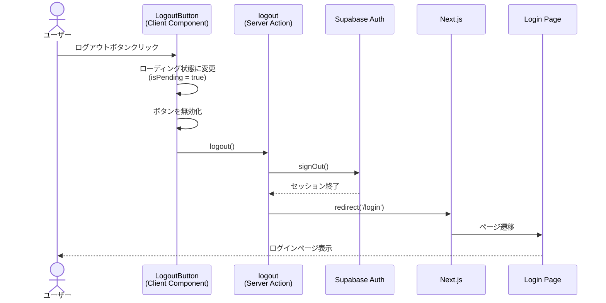

# ログアウト機能

## 概要

CookScanアプリケーションのログアウト機能は、ユーザーがアプリケーションから安全にログアウトし、認証セッションを終了させるための機能です。Supabase Authを使用してセッションを終了し、ログアウト後はログインページへリダイレクトします。

## 機能仕様

### 目的

- 認証セッションの明示的な終了によるセキュリティ確保
- 共有デバイスでの安全なアプリケーション利用
- ユーザーが任意のタイミングでアプリケーションを離脱できる仕組みの提供

### 機能詳細

#### ログアウト方法
- ヘッダーのログアウトボタンからログアウト可能
- モバイルナビゲーションからログアウト可能
- ワンクリックでログアウト処理が実行

#### UI/UX
- ローディング状態の表示（スピナーアイコン＋「ログアウト中...」テキスト）
- ホバー時のスタイル変更（赤系の警告色で視覚的フィードバック）
- レスポンシブデザイン対応
  - デスクトップ: アイコン＋テキスト表示
  - モバイル: アイコンのみ表示（テキストは非表示）
- ローディング中はボタンを無効化
- アクセシビリティ対応（`aria-label`属性）

#### セキュリティ
- Supabase Authによるセキュアなセッション終了
- Server Actionsによるサーバーサイド処理
- ログアウト後は自動的にログインページへリダイレクト

### ユーザーフロー

```
1. ユーザーがログアウトボタンをクリック
   ↓
2. ボタンがローディング状態に変化
   （スピナーアイコン＋「ログアウト中...」表示）
   ↓
3. Server Action (logout) を呼び出し
   ↓
4. Supabase Auth でセッション終了処理
   ↓
5. ログインページ (/login) へリダイレクト
```

## シーケンス図



## 技術仕様

### フロントエンド

#### コンポーネント構成
- **ファイル**: `src/features/auth/logout-button.tsx`
- **タイプ**: Client Component (`'use client'`)
- **スタイリング**: Tailwind CSS v4

#### 使用コンポーネント
- `Button` - ログアウトボタン（secondaryバリアント）
- アイコン:
  - `LogoutIcon` - ログアウトアイコン
  - `SpinnerIcon` - ローディング時のスピナーアイコン

#### 状態管理
```typescript
const [isPending, startTransition] = useTransition() // ローディング状態
```

#### 主要な処理フロー
```typescript
const handleLogout = () => {
  startTransition(async () => {
    await logout()
  })
}
```

#### スタイリング詳細
```typescript
className="transition-all duration-200 hover:border-red-300 hover:bg-red-50 hover:text-red-600 hover:shadow-sm"
```

ホバー時に赤系の警告色に変化することで、ログアウトという重要なアクションであることを視覚的に伝えています。

#### レスポンシブ対応
```typescript
<span className="hidden sm:inline">ログアウト</span>
```

画面サイズが小さい場合（モバイル）はテキストを非表示にし、アイコンのみを表示します。

### バックエンド

#### Server Action
- **ファイル**: `src/features/auth/actions.ts`
- **関数**: `logout(): Promise<void>`
- **ディレクティブ**: `'use server'`

#### 処理フロー
1. Supabaseクライアントの作成
2. Supabase Auth の `signOut()` を呼び出し
3. `/login` へリダイレクト

#### 使用ライブラリ
- `@supabase/supabase-js` - Supabase Auth
- `next/navigation` - リダイレクト

#### 実装コード
```typescript
export async function logout(): Promise<void> {
  const supabase = await createClient()
  await supabase.auth.signOut()
  redirect('/login')
}
```

シンプルな実装で、エラーハンドリングは不要です（ログアウトは常に成功するべき操作のため）。

### 認証ミドルウェア

ログアウト後のリダイレクトは、Next.jsのミドルウェアとSupabase Authの連携により自動的に処理されます。

- **ファイル**: `src/lib/supabase/middleware.ts`
- **役割**:
  - 認証状態の確認
  - 保護されたルートへのアクセス制御
  - 未認証時の自動リダイレクト

## データモデル

### 関連モデル

ログアウト機能は既存のUserモデルに依存しますが、新しいモデルは作成しません。

```prisma
model User {
  id        String   @id @default(cuid())
  authId    String   @unique // Supabase Auth User ID
  email     String   @unique
  name      String?
  createdAt DateTime @default(now())
  updatedAt DateTime @updatedAt

  recipes       Recipe[]
  tagCategories TagCategory[]
  tags          Tag[]
}
```

ログアウト時は、Supabase Authのセッション情報のみが削除され、データベース内のUserレコードは保持されます。

## API仕様

### logout (Server Action)

#### 概要
現在のユーザーをログアウトさせ、認証セッションを終了する

#### シグネチャ
```typescript
async function logout(): Promise<void>
```

#### パラメータ
なし

#### 戻り値
- `void` - 成功時はリダイレクトされるため戻り値なし

#### 処理詳細
1. サーバーサイドSupabaseクライアントを作成
2. `supabase.auth.signOut()` を呼び出してセッション終了
3. `/login` へリダイレクト

#### エラーハンドリング
- ログアウト処理は常に成功するべき操作のため、明示的なエラーハンドリングは実装していません
- リダイレクト失敗時はNext.jsのエラーハンドリング機構が動作します

## テスト

### テストファイル
- **ファイル**: `src/features/auth/__tests__/logout-button.test.tsx`
- **フレームワーク**: Vitest + React Testing Library

### テストケース
1. **基本レンダリング**
   - ログアウトボタンが正しく表示されること
   - LogoutIconが表示されること

2. **ローディング状態**
   - クリック時にローディング状態に変化すること
   - SpinnerIconが表示されること
   - ボタンが無効化されること

3. **Server Action呼び出し**
   - クリック時にlogout関数が呼び出されること

4. **アクセシビリティ**
   - aria-label属性が正しく設定されていること

## セキュリティ

### 実装されているセキュリティ対策

1. **Supabase Auth の利用**
   - 業界標準のセキュアな認証サービスを使用
   - セッション管理はSupabaseが自動的に処理

2. **Server Actions**
   - サーバーサイドでログアウト処理を実行
   - クライアントサイドで直接セッションを操作しない

3. **自動リダイレクト**
   - ログアウト後は必ずログインページへリダイレクト
   - 認証が必要なページへの不正アクセスを防止

4. **ミドルウェアによる保護**
   - Next.jsミドルウェアで認証状態をチェック
   - 未認証時は自動的にログインページへリダイレクト

## 配置場所

LogoutButtonコンポーネントは以下の場所で使用されています：

1. **ヘッダー**
   - `src/components/layouts/header.tsx`
   - デスクトップ・モバイル共通で表示

2. **モバイルナビゲーション**
   - モバイルメニュー内に配置
   - タッチ操作に最適化

## 関連ドキュメント

- [ログイン機能](./login.md)
- [認証フロー全体](./auth-flow.md)（存在する場合）
- [プロフィール設定機能](./profile-setup.md)（存在する場合）

## 今後の拡張予定

- ログアウト前の確認ダイアログ（オプション）
- 全デバイスからのログアウト機能
- ログアウト履歴の記録（セキュリティログ）
- セッションタイムアウト後の自動ログアウト

## 参考リンク

- [Supabase Auth - Sign Out](https://supabase.com/docs/guides/auth/auth-helpers/auth-ui#sign-out)
- [Next.js Server Actions](https://nextjs.org/docs/app/building-your-application/data-fetching/server-actions-and-mutations)
- [React useTransition](https://react.dev/reference/react/useTransition)
