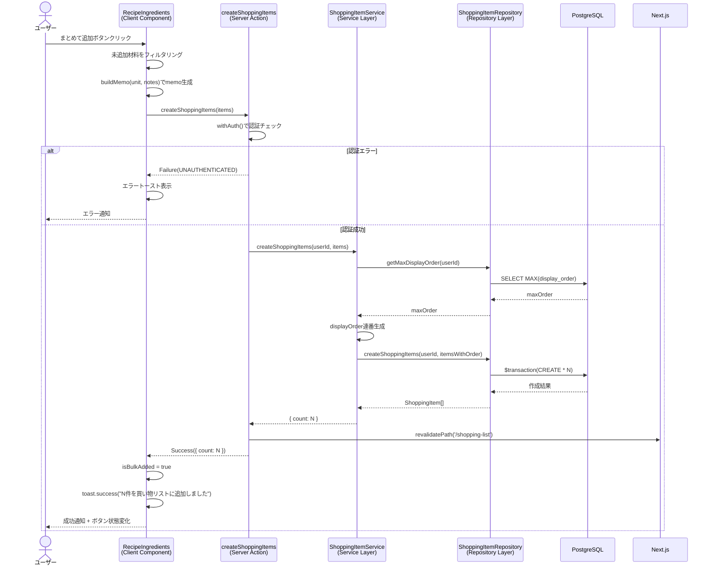

# レシピ詳細からの買い物リスト追加

## 概要

レシピ詳細ページの材料一覧から、買い物リストへ材料を追加する機能。個別追加とまとめて一括追加の2つの方法を提供し、材料のunit（単位）とnotes（メモ）を買い物アイテムのmemoとして自動変換する。

## 機能仕様

### 目的

- レシピの材料を買い物リストへ素早く追加できるようにする
- 個別追加と一括追加の両方をサポートし、柔軟な操作を提供する
- 材料の単位・メモ情報を買い物アイテムに自動的に引き継ぐ

### 機能詳細

#### 個別追加
- 各材料行の買い物カートアイコンボタンをクリックすると、その材料を買い物リストに追加する
- 追加後はチェックアイコンに変わり、ボタンが無効化される

#### まとめて追加
- カードヘッダーの「まとめて追加」ボタンをクリックすると、未追加の全材料を一括で買い物リストに追加する
- 一括追加中は個別追加ボタンも無効化され、重複登録を防止する

#### memo生成ロジック
- Ingredientの`unit`と`notes`を以下のルールで結合し、ShoppingItemの`memo`として設定する：
  - 両方あり: `"${unit} / ${notes}"` (例: `"1本 / 皮をむく"`)
  - unitのみ: `"${unit}"` (例: `"200g"`)
  - notesのみ: `"${notes}"` (例: `"みじん切り"`)
  - 両方なし: `undefined`

#### UI/UX
- **追加前**: `ShoppingCartIcon`（グレー）のghostボタン
- **追加中**: スピナー表示（ローディング状態）
- **追加後**: `CheckIcon`（緑色）+ ボタン無効化
- **一括追加中**: 全ての個別追加ボタンも無効化
- **成功時**: トースト通知で追加件数を表示（例: `"3件を買い物リストに追加しました"`）
- **失敗時**: エラートーストで`error.message`を表示
- **空状態**: 材料が0件の場合、メッセージ表示＋まとめて追加ボタン非表示

#### その他
- 追加済み状態はセッション中のみ保持（ページリロードでリセット）
- 買い物リストページ（`/shopping-list`）のキャッシュは追加成功時に再検証される

### ユーザーフロー

```
1. ユーザーがレシピ詳細ページを開く
   ↓
2. 材料セクションで追加方法を選択
   ├── 個別追加: 材料行のカートアイコンをクリック
   └── まとめて追加: ヘッダーの「まとめて追加」ボタンをクリック
   ↓
3. ローディング状態が表示される
   ↓
4a. 成功: トースト通知 + アイコンがチェックマークに変化
4b. 失敗: エラートースト表示
```

## シーケンス図



## 技術仕様

### フロントエンド

#### コンポーネント構成
- **ファイル**: `src/features/recipes/detail/recipe-ingredients.tsx`
- **タイプ**: Client Component (`'use client'`)
- **スタイリング**: Tailwind CSS

#### 使用コンポーネント
- `Card`, `CardHeader`, `CardContent` - 材料セクションのカードレイアウト
- `Button` - まとめて追加ボタン（`variant="secondary"`）、個別追加ボタン（`variant="ghost"`, `size="icon"`）
- アイコン: `BeakerIcon`（ヘッダー）, `ShoppingCartIcon`（未追加）, `CheckIcon`（追加済み）

#### 状態管理
```typescript
const [addedIds, setAddedIds] = useState<Set<string>>(new Set())
const [loadingIds, setLoadingIds] = useState<Set<string>>(new Set())
const [isBulkLoading, setIsBulkLoading] = useState(false)
const [isBulkAdded, setIsBulkAdded] = useState(false)
```

#### 主要な処理フロー
```typescript
function buildMemo(unit: string | null, notes: string | null): string | undefined {
  if (unit && notes) return `${unit} / ${notes}`
  if (unit) return unit
  if (notes) return notes
  return undefined
}

// 個別追加
async function handleAddSingle(ingredient: Ingredient) {
  setLoadingIds((prev) => new Set(prev).add(ingredient.id))
  const result = await createShoppingItems([
    { name: ingredient.name, memo: buildMemo(ingredient.unit, ingredient.notes) },
  ])
  if (result.ok) {
    setAddedIds((prev) => new Set(prev).add(ingredient.id))
    toast.success('買い物リストに追加しました')
  } else {
    toast.error(result.error.message)
  }
  setLoadingIds((prev) => { const next = new Set(prev); next.delete(ingredient.id); return next })
}

// 一括追加
async function handleAddAll() {
  setIsBulkLoading(true)
  const items = ingredients
    .filter((i) => !addedIds.has(i.id))
    .map((i) => ({ name: i.name, memo: buildMemo(i.unit, i.notes) }))
  const result = await createShoppingItems(items)
  if (result.ok) {
    setIsBulkAdded(true)
    setAddedIds(new Set(ingredients.map((i) => i.id)))
    toast.success(`${result.data.count}件を買い物リストに追加しました`)
  } else {
    toast.error(result.error.message)
  }
  setIsBulkLoading(false)
}
```

### バックエンド

#### Server Action
- **ファイル**: `src/features/shopping-list/actions.ts`
- **関数**: `createShoppingItems(items: { name: string; memo?: string }[]): Promise<Result<{ count: number }>>`
- **ディレクティブ**: `'use server'`

#### バリデーションスキーマ
```typescript
// src/backend/domain/shopping-items/validators.ts
const createShoppingItemInputSchema = z.object({
  name: z.string().min(1, 'アイテム名を入力してください'),
  memo: z.string().optional(),
})
```

#### 処理フロー
1. `withAuth()`で認証チェック
2. `ShoppingItemService.createShoppingItems(userId, { items })`呼び出し
3. 成功時: `revalidatePath('/shopping-list')`でキャッシュ再検証
4. `Result<{ count: number }>`を返却

#### 使用ライブラリ
- `zod` - 入力バリデーション
- `@prisma/client` - データベースアクセス

### ヘルパー関数

#### ファイル
- `src/features/recipes/detail/recipe-ingredients.tsx`（コンポーネント内定義）

#### 主要関数
```typescript
function buildMemo(unit: string | null, notes: string | null): string | undefined
```

## データモデル

### ShoppingItem モデル

```prisma
model ShoppingItem {
  id           String   @id @default(uuid())
  userId       String   @map("user_id")
  name         String
  memo         String?
  isChecked    Boolean  @default(false) @map("is_checked")
  displayOrder Int      @map("display_order")
  createdAt    DateTime @default(now()) @map("created_at")
  updatedAt    DateTime @updatedAt @map("updated_at")

  user User @relation(fields: [userId], references: [id])
  @@map("shopping_items")
}
```

#### 関連フィールド
- `name`: 材料名（Ingredient.nameから転記）
- `memo`: 単位・メモ情報（Ingredient.unit + Ingredient.notesからbuildMemoで生成）
- `isChecked`: 購入済みフラグ（デフォルト: `false`）
- `displayOrder`: 表示順（既存最大値+1から連番で自動採番）

### Ingredient → ShoppingItem マッピング

| Ingredient | ShoppingItem | 変換ルール |
|-----------|-------------|-----------|
| `name` | `name` | そのまま転記 |
| `unit` + `notes` | `memo` | `buildMemo()`で結合 |
| - | `isChecked` | `false`（固定） |
| - | `displayOrder` | 自動採番 |

## API仕様

### createShoppingItems (Server Action)

#### 概要
複数の買い物アイテムを一括作成する。レシピ材料からの追加と、買い物リストページからの直接追加の両方で使用される。

#### シグネチャ
```typescript
async function createShoppingItems(
  items: { name: string; memo?: string }[]
): Promise<Result<{ count: number }>>
```

#### パラメータ
| 名前 | 型 | 説明 |
|------|------|------|
| items | `{ name: string; memo?: string }[]` | 作成する買い物アイテムの配列 |

#### 戻り値
```typescript
type Result<{ count: number }> =
  | { ok: true; data: { count: number } }
  | { ok: false; error: AppError }
```

#### エラーコード
| コード | メッセージ | 発生条件 |
|--------|-----------|---------|
| UNAUTHENTICATED | 認証が必要です | 未ログイン状態でのアクセス |
| VALIDATION_ERROR | アイテム名を入力してください | nameが空文字 |
| SERVER_ERROR | サーバーエラーが発生しました | DB接続エラー等 |

#### 処理詳細
1. `withAuth()`で認証チェック（userId取得）
2. `ShoppingItemService.createShoppingItems(userId, { items })`呼び出し
3. Service層で`getMaxDisplayOrder(userId)`により現在の最大表示順を取得
4. 各アイテムに`maxOrder + 1 + index`でdisplayOrderを割り当て
5. `prisma.$transaction`で一括INSERT
6. `revalidatePath('/shopping-list')`でキャッシュ再検証
7. `Success({ count })`を返却

## テスト

### テストファイル
- **ファイル**: `src/features/recipes/detail/__tests__/recipe-ingredients.test.tsx`
- **フレームワーク**: Vitest + React Testing Library

### テストケース

1. **材料一覧が表示される**
   - 材料名、単位、メモが正しく表示される

2. **まとめて追加ボタンが表示される**
   - 材料がある場合にヘッダーにボタンが表示される

3. **個別追加ボタンが各材料に表示される**
   - 各行に買い物カートアイコンボタンが表示される

4. **個別追加ボタンクリックでcreateShoppingItemsが呼ばれる**
   - 正しいname, memoパラメータでServer Actionが呼ばれる

5. **memo生成ロジックが正しい**
   - unit + notes → `"1本 / 皮をむく"`形式で結合される

6. **まとめて追加で全材料が追加される**
   - 未追加の全材料がまとめてServer Actionに渡される

7. **一括追加中は個別ボタンが無効化される**
   - 重複登録防止のため個別ボタンがdisabledになる

8. **材料0件時にメッセージが表示される**
   - 空状態メッセージ表示、まとめて追加ボタン非表示

### バックエンドテストファイル
- **ファイル**: `src/backend/services/shopping-items/__tests__/shopping-item.service.test.ts`
- **フレームワーク**: Vitest

### バックエンドテストケース

1. **一括作成で正しい件数を返す**
   - `{ count: 2 }`のように作成件数が返る

2. **displayOrderが連番で設定される**
   - 既存アイテムがある場合、maxOrder + 1から連番

3. **空配列の処理**
   - 空配列が渡された場合のハンドリング

## セキュリティ

### 実装されているセキュリティ対策

1. **認証チェック**
   - `withAuth()`ヘルパーにより全Server Actionで認証を強制
   - 未ログインユーザーは`UNAUTHENTICATED`エラー

2. **認可（所有権チェック）**
   - Service層でuserId検証を実施
   - 他ユーザーの買い物アイテムへのアクセスを防止

3. **入力バリデーション**
   - Zodスキーマによるサーバーサイドバリデーション
   - `name`は必須・1文字以上

4. **データ整合性**
   - `prisma.$transaction`による一括処理でアトミック性を保証

5. **キャッシュ再検証**
   - `revalidatePath('/shopping-list')`で画面とデータの一貫性を維持

## 配置場所

RecipeIngredientsコンポーネントは以下の場所で使用されています：

1. **レシピ詳細ページ**
   - `src/app/(auth)/recipes/[id]/page.tsx`
   - RecipeDetailServerContent → RecipeDetailContent内で表示
