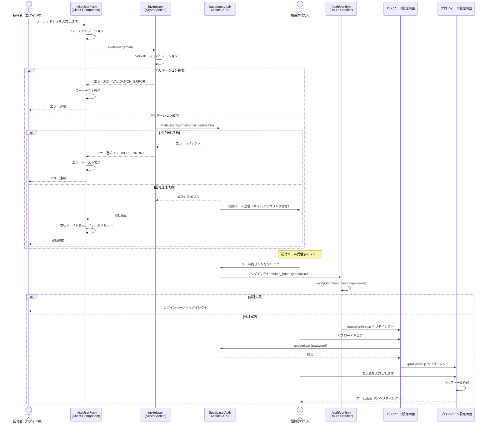

# 招待送信機能

## 概要

ログイン中のユーザーが、メールアドレスを入力して他のユーザーを招待できる機能。CookScanは招待制のサービスであり、招待を受けた人のみがアカウントを作成して利用できる。

## 機能仕様

### 目的

- CookScanを招待制サービスとして運用し、利用者を制限する
- 既存ユーザーが信頼できる相手を招待できるようにする

### 機能詳細

#### 招待メール送信
- ログイン中のユーザーがメールアドレスを入力して招待メールを送信する
- 招待は1件ずつ送信する（複数同時送信は不可）
- 同じメールアドレスへの再送信が可能
- 招待の取り消しはできない
- 招待履歴の一覧表示はない

#### 招待メールの内容
- サインアップ用リンクが含まれる
- リンク先: `/auth/confirm`（トークン検証後、パスワード設定ページへリダイレクト）

#### UI/UX
- プロフィール編集画面の下部に招待フォームを配置
- メールアドレス入力フィールドと送信ボタンで構成
- 送信成功時: 成功トースト表示、フォームリセット
- エラー時: エラートースト表示

### ユーザーフロー

```
1. ユーザーがプロフィール編集画面を開く
   ↓
2. 「ユーザー招待」セクションでメールアドレスを入力
   ↓
3. 「招待を送信」ボタンをクリック
   ↓
4. 招待メールが送信される（成功トースト表示）
   ↓
5. 招待された人がメール内のリンクをクリック
   ↓
6. トークン検証後、パスワード設定画面へ遷移
   ↓
7. パスワード設定完了後、プロフィール設定画面へ遷移
   ↓
8. プロフィール設定完了後、ホーム画面へ遷移
```

## シーケンス図



## 技術仕様

### フロントエンド

#### コンポーネント構成
- **ファイル**: `src/features/profile/invite/invite-user-form.tsx`
- **タイプ**: Client Component（`'use client'`）
- **スタイリング**: Tailwind CSS

#### 使用コンポーネント
- `Input` - メールアドレス入力フィールド
- `Button` - 送信ボタン
- `toast` - 成功/エラー通知

#### 配置場所
- `src/features/profile/edit/profile-edit-form.tsx` のプロフィール編集画面下部に配置

### バックエンド

#### Server Action
- **ファイル**: `src/features/profile/invite/actions.ts`
- **関数**: `inviteUser(email: string): Promise<Result<void>>`
- **ディレクティブ**: `'use server'`

#### バリデーションスキーマ
```typescript
const inviteSchema = z.object({
  email: z.string().email(),
})
```

#### 処理フロー
1. Zodスキーマでメールアドレスをバリデーション
2. Supabase Admin API `inviteUserByEmail` を呼び出し
3. リダイレクト先を `${NEXT_PUBLIC_APP_URL}/auth/confirm` に設定
4. 成功/失敗をResult型で返却

#### 使用ライブラリ
- `zod` - 入力バリデーション
- `@supabase/supabase-js` - Supabase Admin Client

### 認証確認ルート

#### ファイル
- `src/app/auth/confirm/route.ts`

#### 処理フロー
1. クエリパラメータから `token_hash` と `type` を取得
2. `supabase.auth.verifyOtp()` でOTP検証
3. `type === 'invite'` の場合、`/password/setup` へリダイレクト
4. 失敗時はログインページへリダイレクト

## データモデル

招待機能専用のデータモデルはなし。Supabase Authの内部機能で招待管理を行う。

招待受諾後に作成されるユーザー:

```prisma
model User {
  id        String   @id @default(uuid())
  authId    String   @unique @map("auth_id")
  email     String   @unique
  name      String?
  createdAt DateTime @default(now()) @map("created_at")
  updatedAt DateTime @updatedAt @map("updated_at")
}
```

## API仕様

### inviteUser (Server Action)

#### 概要
指定されたメールアドレスに招待メールを送信する

#### シグネチャ
```typescript
async function inviteUser(email: string): Promise<Result<void>>
```

#### パラメータ
| 名前 | 型 | 説明 |
|------|------|------|
| email | string | 招待先のメールアドレス |

#### 戻り値
```typescript
type Result<void> =
  | { ok: true; data: void }
  | { ok: false; error: AppError }
```

#### エラーコード
| コード | メッセージ | 発生条件 |
|--------|-----------|---------|
| VALIDATION_ERROR | バリデーションエラーメッセージ | メールアドレスの形式が不正 |
| SERVER_ERROR | Supabaseエラーメッセージ | Supabase APIの呼び出しに失敗 |

## テスト

### テストファイル
- **ファイル**: `src/features/profile/invite/__tests__/invite-user-form.test.tsx`
- **フレームワーク**: Vitest + React Testing Library

### テストケース
1. **有効なメールアドレスで招待を送信できる**
   - 正しいメールアドレスを入力して送信し、成功トーストが表示されることを検証

2. **UIフィールドが正しく表示される**
   - 入力フィールドと送信ボタンが表示されることを検証

3. **サーバーエラー時にエラーメッセージが表示される**
   - Server Actionがエラーを返した場合、エラートーストが表示されることを検証

4. **送信成功後にフォームがリセットされる**
   - 成功後にメールアドレス入力欄がクリアされることを検証

## セキュリティ

### 実装されているセキュリティ対策

1. **認証済みユーザーのみ利用可能**
   - 招待フォームはプロフィール編集画面内に配置されており、ログイン済みユーザーのみアクセス可能

2. **Supabase Admin Clientのサーバーサイド限定利用**
   - Service Role Keyを使用するAdmin Clientはサーバーサイドでのみ使用
   - クライアントサイドに秘密鍵が露出しない

3. **入力バリデーション**
   - Zodスキーマによるメールアドレス形式の検証

4. **トークンベースの招待検証**
   - Supabase Authのトークン検証によるセキュアな招待フロー
