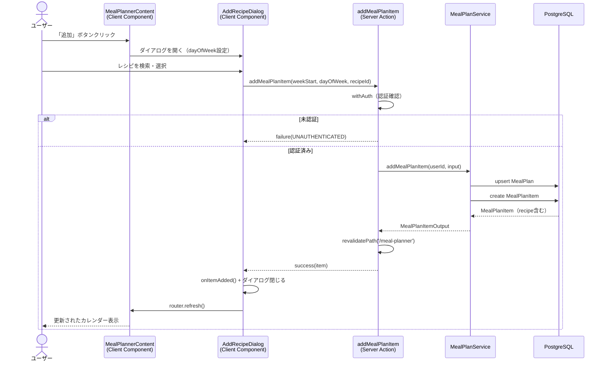
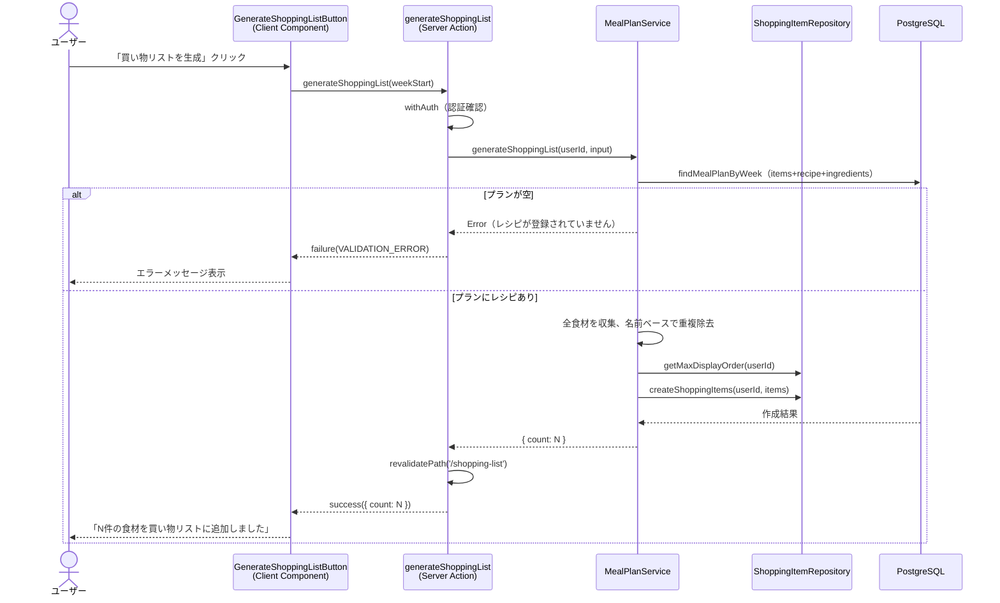

# 週間献立プランナー

## 概要

カレンダーUIでレシピを曜日に割り当て、1週間分の献立を計画する機能。献立に登録されたレシピの食材から買い物リストを一括生成できる。モバイルファースト設計で、曜日のみ（食事区分なし）、1日に複数レシピ登録可能。

## 機能仕様

### 目的

- 1週間の献立を視覚的に計画・管理する
- 献立に基づいて必要な食材を買い物リストに一括追加する
- レシピの活用頻度を高め、食事の計画性を向上させる

### 機能詳細

#### 週間カレンダー表示
- 月曜始まりの7日間カレンダーを表示
- 各日に登録されたレシピを一覧表示
- 前週・次週のナビゲーション、「今週」ボタンによる即時移動

#### レシピ割り当て
- 各曜日の「追加」ボタンからダイアログを起動
- ダイアログ内でレシピ名を検索・フィルタリング
- レシピを選択すると即座に献立に追加
- 1日に複数レシピを登録可能

#### 買い物リスト一括生成
- 「買い物リストを生成」ボタンで全食材を収集
- 食材名ベースで重複を除去
- 既存の買い物リストの末尾にバルク追加

#### UI/UX
- モバイル: 縦スクロールで7日分のカードを表示
- PC: `sm:grid-cols-2 lg:grid-cols-3` のグリッドレイアウト
- 当日カードはリングでハイライト、「今日」バッジを表示
- 土曜日は青背景、日曜日は赤背景でヘッダーを色分け

#### その他
- 週の開始日はURLクエリパラメータ `?week=YYYY-MM-DD` で管理
- ダッシュボードのクイックアクションからアクセス可能

### ユーザーフロー

```
1. ダッシュボードから「献立プランナー」をクリック
   ↓
2. 今週のカレンダーが表示される
   ↓
3. 任意の曜日の「追加」ボタンをクリック
   ↓
4. レシピ追加ダイアログでレシピを検索・選択
   ↓
5. 選択したレシピが対象曜日に追加される
   ↓
6. 必要に応じて他の曜日にもレシピを追加
   ↓
7. 「買い物リストを生成」ボタンで食材を一括追加
   ↓
8. 買い物リストページで確認
```

## シーケンス図

### レシピ追加



### 買い物リスト生成



## 技術仕様

### フロントエンド

#### コンポーネント構成

| ファイル | タイプ | 用途 |
|---|---|---|
| `src/app/(auth)/meal-planner/page.tsx` | Server Component | ページ。認証確認、データ取得、Content に渡す |
| `src/features/meal-planner/components/meal-planner-content.tsx` | Client Component | メインコンテナ。週ナビゲーション、状態管理 |
| `src/features/meal-planner/components/week-navigator.tsx` | Client Component | 前週/次週/今週ナビゲーション |
| `src/features/meal-planner/components/meal-plan-day-card.tsx` | Client Component | 1日分のカード（曜日ヘッダー+レシピリスト+追加ボタン） |
| `src/features/meal-planner/components/add-recipe-dialog.tsx` | Client Component | Radix Dialog。レシピ検索+選択 |
| `src/features/meal-planner/components/generate-shopping-list-button.tsx` | Client Component | 買い物リスト一括生成ボタン+結果メッセージ |

#### 使用コンポーネント
- `AuthLayoutWrapper` - 認証済みレイアウト
- `PageContainer` - ページコンテナ
- `Button` - 各種ボタン（variant: primary, secondary, ghost, danger-ghost）
- `Dialog`, `DialogContent`, `DialogHeader`, `DialogTitle`, `DialogDescription` - ダイアログ
- `Input` - 検索入力
- `Alert` - 成功/エラーメッセージ
- アイコン: `ChevronLeftIcon`, `ChevronRightIcon`, `PlusIcon`, `TrashIcon`, `SearchIcon`, `ClipboardListIcon`, `CalendarIcon`

#### 状態管理
```typescript
// MealPlannerContent
const [weekStart, setWeekStart] = useState(initialWeekStart)
const [dialogOpen, setDialogOpen] = useState(false)
const [selectedDay, setSelectedDay] = useState<number | null>(null)

// AddRecipeDialog
const [search, setSearch] = useState('')

// GenerateShoppingListButton
const [message, setMessage] = useState<{ type: 'success' | 'error'; text: string } | null>(null)
```

#### 週ナビゲーションの仕組み
- `weekStart` を client state で管理
- `router.push('/meal-planner?week=YYYY-MM-DD')` で URL を更新
- ページに `key={weekStart}` を設定し、週変更時にコンポーネントをリマウント
- サーバーコンポーネントが新しい `searchParams.week` で再フェッチ

### バックエンド

#### Server Actions
- **ファイル**: `src/features/meal-planner/actions.ts`
- **ディレクティブ**: `'use server'`

| 関数 | シグネチャ | 用途 |
|---|---|---|
| `getMealPlan` | `(weekStart: string) => Promise<Result<MealPlanOutput \| null>>` | 週の献立プラン取得 |
| `addMealPlanItem` | `(weekStart: string, dayOfWeek: number, recipeId: string) => Promise<Result<MealPlanItemOutput>>` | レシピ追加 |
| `removeMealPlanItem` | `(itemId: string) => Promise<Result<void>>` | レシピ削除 |
| `generateShoppingList` | `(weekStart: string) => Promise<Result<{ count: number }>>` | 買い物リスト生成 |
| `getRecipesForMealPlan` | `() => Promise<Result<RecipeListOutput[]>>` | レシピ一覧取得 |

#### Service
- **ファイル**: `src/backend/services/meal-plans/meal-plan.service.ts`
- 所有権確認（`mealPlan.userId !== userId` チェック）
- 買い物リスト生成時の食材重複除去（名前の`trim().toLowerCase()`で比較）
- `ShoppingItemRepository.createShoppingItems()` を再利用してバルク追加

#### Repository
- **ファイル**: `src/backend/repositories/meal-plan.repository.ts`
- `findMealPlanByWeek` - items + recipe + ingredients を eager load
- `upsertMealPlan` - プランがなければ作成、あれば取得
- `createMealPlanItem` - アイテム追加
- `deleteMealPlanItem` - アイテム削除
- `findMealPlanItemById` - 所有権確認用

### ユーティリティ

#### ファイル
- `src/features/meal-planner/utils.ts`

#### 主要関数
```typescript
// 月曜始まりの週開始日を返す（ローカルタイムゾーンベース）
function getWeekStart(date: Date): string  // "YYYY-MM-DD"

// 週の7日分の日付配列を生成
function getWeekDates(weekStart: string): Date[]

// 日付を M/D 形式にフォーマット
function formatShortDate(date: Date): string

// 曜日ラベル定数
const DAY_LABELS = ['月', '火', '水', '木', '金', '土', '日']
```

## データモデル

### MealPlan モデル

```prisma
model MealPlan {
  id        String   @id @default(uuid())
  userId    String   @map("user_id")
  weekStart DateTime @map("week_start")
  createdAt DateTime @default(now()) @map("created_at")
  updatedAt DateTime @updatedAt @map("updated_at")

  user  User           @relation(fields: [userId], references: [id])
  items MealPlanItem[]

  @@unique([userId, weekStart])
  @@map("meal_plans")
}
```

### MealPlanItem モデル

```prisma
model MealPlanItem {
  id         String   @id @default(uuid())
  mealPlanId String   @map("meal_plan_id")
  recipeId   String   @map("recipe_id")
  dayOfWeek  Int      @map("day_of_week")
  createdAt  DateTime @default(now()) @map("created_at")

  mealPlan MealPlan @relation(fields: [mealPlanId], references: [id], onDelete: Cascade)
  recipe   Recipe   @relation(fields: [recipeId], references: [id], onDelete: Cascade)

  @@map("meal_plan_items")
}
```

#### 関連フィールド
- `MealPlan.userId + weekStart`: ユニーク制約。ユーザーごとに週あたり1プラン
- `MealPlanItem.dayOfWeek`: 0=月曜〜6=日曜
- `MealPlanItem.mealPlanId`: Cascade削除。プラン削除時にアイテムも削除
- `MealPlanItem.recipeId`: Cascade削除。レシピ削除時にアイテムも削除
- `User.mealPlans`: リレーション追加
- `Recipe.mealPlanItems`: リレーション追加

## API仕様

### getMealPlan (Server Action)

#### 概要
指定した週の献立プランを取得する。

#### シグネチャ
```typescript
async function getMealPlan(weekStart: string): Promise<Result<MealPlanOutput | null>>
```

#### パラメータ
| 名前 | 型 | 説明 |
|------|------|------|
| weekStart | string | 週の開始日（YYYY-MM-DD形式、月曜日） |

#### 戻り値
```typescript
type MealPlanOutput = {
  id: string
  weekStart: Date
  items: MealPlanItemOutput[]
}

type MealPlanItemOutput = {
  id: string
  dayOfWeek: number
  recipe: {
    id: string
    title: string
    imageUrl: string | null
    ingredients: Array<{ id: string; name: string; unit: string | null; notes: string | null }>
  }
}
```

### addMealPlanItem (Server Action)

#### 概要
献立プランにレシピを追加する。プランが存在しない場合は自動作成する。

#### シグネチャ
```typescript
async function addMealPlanItem(weekStart: string, dayOfWeek: number, recipeId: string): Promise<Result<MealPlanItemOutput>>
```

#### パラメータ
| 名前 | 型 | 説明 |
|------|------|------|
| weekStart | string | 週の開始日（YYYY-MM-DD形式） |
| dayOfWeek | number | 曜日（0=月〜6=日） |
| recipeId | string | 追加するレシピのID |

### removeMealPlanItem (Server Action)

#### 概要
献立プランからレシピを削除する。所有権を確認する。

#### シグネチャ
```typescript
async function removeMealPlanItem(itemId: string): Promise<Result<void>>
```

#### エラーコード
| コード | メッセージ | 発生条件 |
|--------|-----------|---------|
| NOT_FOUND | アイテム | アイテムが存在しない |
| FORBIDDEN | このアイテムを削除する権限がありません | 他ユーザーのアイテム |

### generateShoppingList (Server Action)

#### 概要
献立プランの全食材を買い物リストに一括追加する。

#### シグネチャ
```typescript
async function generateShoppingList(weekStart: string): Promise<Result<{ count: number }>>
```

#### 処理詳細
1. 指定週のプランを取得（items + recipe + ingredients を eager load）
2. プランが空の場合は VALIDATION_ERROR を返す
3. 全食材を収集し、名前（trim + toLowerCase）で重複除去
4. 既存買い物リストの最大 displayOrder を取得
5. `ShoppingItemRepository.createShoppingItems()` でバルク INSERT
6. `/shopping-list` と `/meal-planner` のキャッシュを再検証

#### エラーコード
| コード | メッセージ | 発生条件 |
|--------|-----------|---------|
| VALIDATION_ERROR | 献立プランにレシピが登録されていません | プランが空 |
| SERVER_ERROR | 買い物リストの生成に失敗しました | その他のエラー |

## テスト

### テストファイル

| ファイル | テスト数 | フレームワーク |
|---|---|---|
| `src/features/meal-planner/__tests__/utils.test.ts` | 14 | Vitest |
| `src/features/meal-planner/components/__tests__/week-navigator.test.tsx` | 6 | Vitest + React Testing Library |
| `src/features/meal-planner/components/__tests__/meal-plan-day-card.test.tsx` | 9 | Vitest + React Testing Library |
| `src/features/meal-planner/components/__tests__/add-recipe-dialog.test.tsx` | 9 | Vitest + React Testing Library |
| `src/features/meal-planner/components/__tests__/generate-shopping-list-button.test.tsx` | 7 | Vitest + React Testing Library |
| `src/features/meal-planner/components/__tests__/meal-planner-content.test.tsx` | 9 | Vitest + React Testing Library |

### テストケース（主要）

1. **utils: getWeekStart**
   - 各曜日→月曜日の計算、連続した前後週ナビゲーション、月またぎ、年またぎ

2. **WeekNavigator**
   - 日付範囲表示、前週/次週/今週ボタンのコールバック

3. **MealPlanDayCard**
   - 曜日/日付/レシピ名表示、空状態、追加/削除ボタン

4. **AddRecipeDialog**
   - レシピ一覧表示、検索フィルタリング、選択時のAction呼び出し、成功後の閉じ処理

5. **GenerateShoppingListButton**
   - ボタン有効/無効切替、成功/エラーメッセージ表示

6. **MealPlannerContent**
   - 7日分カード表示、週ナビゲーション、ダイアログ起動

## セキュリティ

### 実装されているセキュリティ対策

1. **認証チェック**
   - 全Server Actionで `withAuth()` ラッパーにより認証を確認
   - ページレベルでも `checkUserProfile()` による認証確認

2. **所有権確認**
   - `removeMealPlanItem`: `mealPlan.userId !== userId` をチェック
   - `getMealPlan`: `userId` をWHERE条件に含めて他ユーザーのデータを返さない

3. **Cascade削除**
   - MealPlan削除時にMealPlanItemも自動削除
   - Recipe削除時に関連MealPlanItemも自動削除

## 配置場所

1. **メインページ**
   - `src/app/(auth)/meal-planner/page.tsx`
   - `/meal-planner` でアクセス

2. **ダッシュボード**
   - `src/features/dashboard/quick-actions.tsx`
   - クイックアクションに「献立プランナー」カード（紫色、CalendarIcon）を追加
