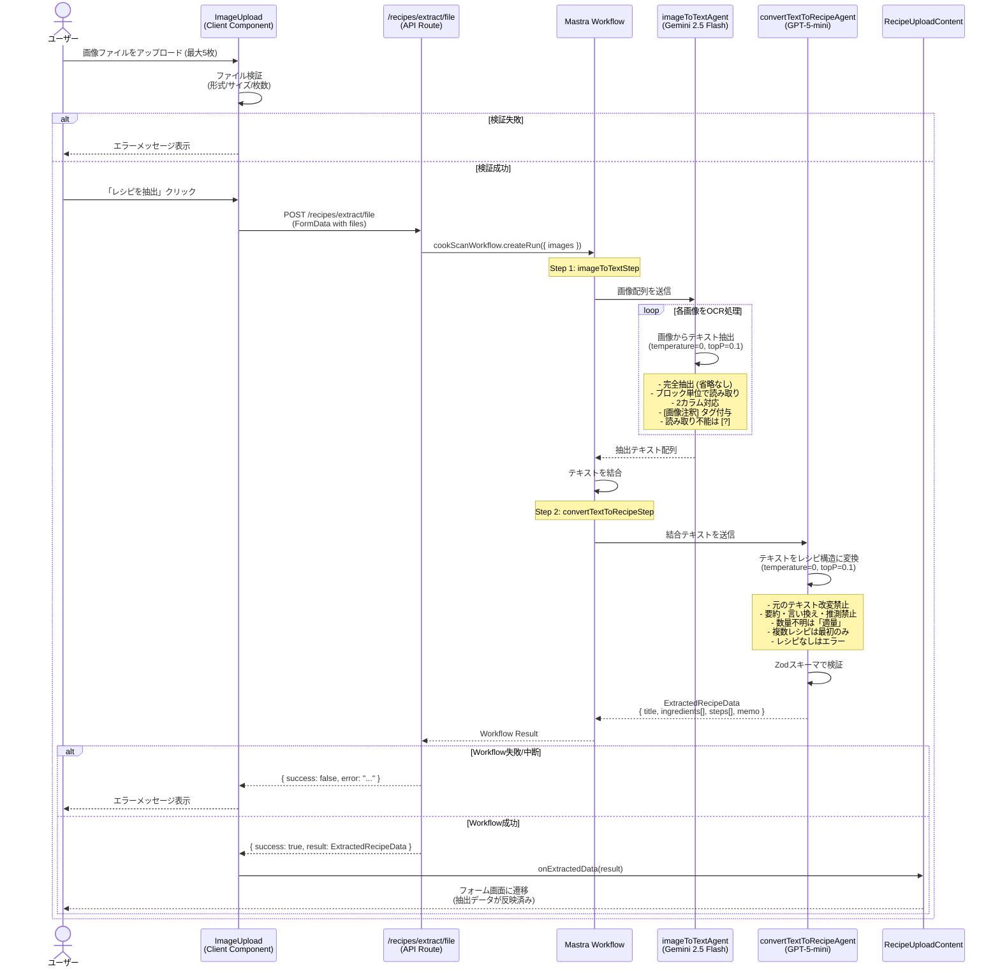
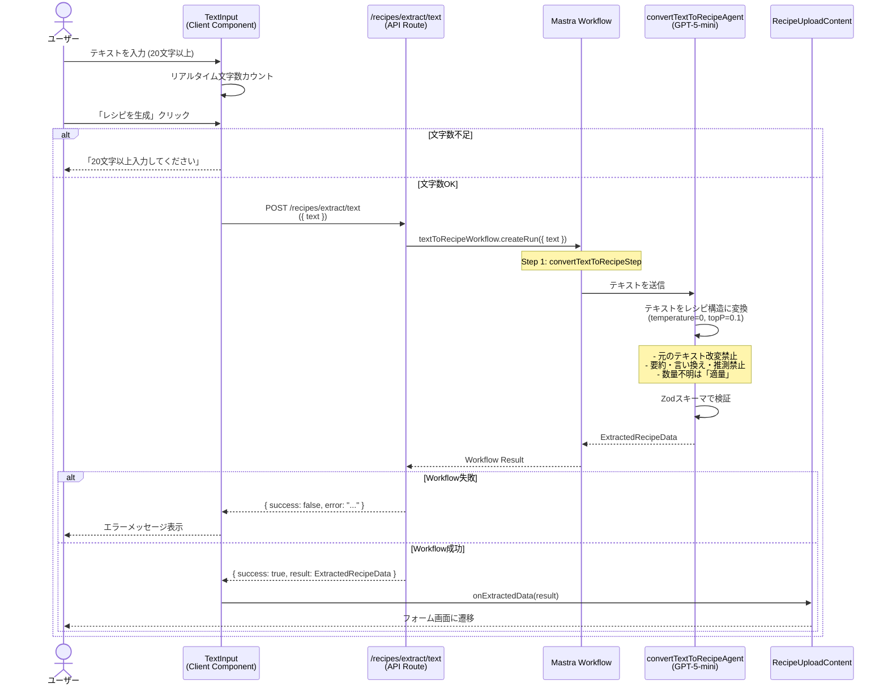

# OCR・レシピ抽出機能

## 概要

画像やテキストからレシピ情報を自動抽出する機能。Google Gemini 2.5 Flash による高精度OCRと、OpenAI GPT-5-mini による構造化データ変換を組み合わせて、ユーザーの入力負担を最小化します。Mastraワークフローフレームワークで処理を統合管理しています。

## 機能仕様

### 目的

- 紙媒体のレシピや料理本のレシピをデジタル化する際の入力負担を削減
- OCR技術で画像から正確にテキストを抽出
- AI技術でテキストから構造化レシピデータを生成
- 抽出の精度と再現性を高める (temperature=0設定)
- 元のレシピ情報を改変せずに忠実に抽出

### 機能詳細

#### 画像からの抽出 (cookScanWorkflow)

1. **OCRステップ** (imageToTextStep)
   - 使用モデル: **Google Gemini 2.5 Flash**
   - 最大5枚の画像を一括処理
   - 各画像からテキストを完全抽出
   - 2カラムレイアウト対応 (左→右の順で読み取り)
   - 画像注釈の区別 ([画像注釈]タグ付与)
   - 読み取り不能箇所は [?] でマーク

2. **構造化ステップ** (convertTextToRecipeStep)
   - OCR結果のテキストをレシピ構造に変換
   - 使用モデル: **OpenAI GPT-5-mini**
   - 出力: title, ingredients[], steps[], memo

#### テキストからの抽出 (textToRecipeWorkflow)

1. **構造化ステップのみ** (convertTextToRecipeStep)
   - ユーザー入力テキストをレシピ構造に変換
   - 使用モデル: **OpenAI GPT-5-mini**
   - 出力: title, ingredients[], steps[], memo

#### AI エージェントの役割

**imageToTextAgent (OCR専門)**
- 完全性重視: 1文字も省略しない
- ブロック単位で読み取り (上→下、左→右)
- 2カラムは左カラムを先に処理
- 画像注釈を区別
- 単位・記号をそのまま保持
- 読み取り不能箇所は [?]

**convertTextToRecipeAgent (レシピ抽出専門)**
- **厳守ルール: 元のテキストを改変しない**
- 要約・言い換え・推測は一切しない
- 元の表現をできるだけ使用
- 存在しない材料・手順は追加しない
- 数量不明は「適量」と記載
- 複数レシピがある場合は最初のみ抽出
- レシピが検出できない場合はエラー返却
- 必ず日本語で出力

#### UI/UX

- **ドラッグ&ドロップ**: 画像を直感的にアップロード
- **クリップボード対応**: Ctrl+V/Cmd+V で画像貼り付け
- **プレビュー表示**: アップロード前に画像確認
- **リアルタイム文字数カウント**: テキスト入力時 (20文字以上必須)
- **ローディング表示**: 処理中の視覚的フィードバック
- **エラーハンドリング**: 失敗時の明確なメッセージ

#### その他

- **決定論的出力**: temperature=0, topP=0.1 で再現性を確保
- **Zodスキーマ検証**: 構造化出力の型安全性を保証
- **エラーハンドリング**: ワークフロー失敗時は適切なエラーコード返却
- **ファイル制限**: 最大5枚、各10MB以下
- **対応フォーマット**: PNG, JPG, GIF, WebP (HEIC非対応)

### ユーザーフロー

#### 画像からの抽出

```
1. ユーザーがレシピアップロード画面で「画像からスキャン」を選択
   ↓
2. 画像アップロードエリアが表示
   ↓
3. 画像ファイルを選択/ドラッグ&ドロップ/貼り付け (最大5枚)
   ↓
4. プレビュー表示で確認
   ↓
5. 「レシピを抽出」ボタンをクリック
   ↓
6. ローディング表示
   ↓
7. /recipes/extract/file APIが実行
   ↓
8. cookScanWorkflow が処理
   - imageToTextStep: 画像 → テキスト (Gemini OCR)
   - convertTextToRecipeStep: テキスト → レシピ構造 (GPT-5-mini)
   ↓
9. 成功時: 抽出データがフォームに反映
   失敗時: エラーメッセージ表示
```

#### テキストからの抽出

```
1. ユーザーがレシピアップロード画面で「テキストから生成」を選択
   ↓
2. テキスト入力エリアが表示
   ↓
3. レシピテキストを入力/貼り付け (20文字以上)
   ↓
4. リアルタイム文字数カウント表示
   ↓
5. 「レシピを生成」ボタンをクリック
   ↓
6. ローディング表示
   ↓
7. /recipes/extract/text APIが実行
   ↓
8. textToRecipeWorkflow が処理
   - convertTextToRecipeStep: テキスト → レシピ構造 (GPT-5-mini)
   ↓
9. 成功時: 抽出データがフォームに反映
   失敗時: エラーメッセージ表示
```

## シーケンス図

### 画像からのレシピ抽出



### テキストからのレシピ抽出



## 技術仕様

### フロントエンド

#### 画像アップロードコンポーネント

**ImageUpload**
- **ファイル**: `/src/features/recipes/upload/image-upload.tsx`
- **タイプ**: Client Component
- **スタイリング**: Tailwind CSS v4

#### 使用コンポーネント
- `Button` - アップロードボタン
- `Upload` アイコン (lucide-react)
- `Image` コンポーネント (next/image) - プレビュー表示

#### 状態管理
```typescript
const [selectedFiles, setSelectedFiles] = useState<File[]>([])
const [previews, setPreviews] = useState<string[]>([])
const [isExtracting, setIsExtracting] = useState(false)
const [error, setError] = useState<string | null>(null)

const MAX_FILES = 5
const MAX_FILE_SIZE = 10 * 1024 * 1024 // 10MB
const ACCEPTED_FORMATS = ['image/png', 'image/jpeg', 'image/gif', 'image/webp']
```

#### 主要な処理フロー
```typescript
// ファイル検証
const validateFiles = (files: FileList | File[]): File[] => {
  const validFiles: File[] = []

  for (const file of Array.from(files)) {
    // 形式チェック
    if (!ACCEPTED_FORMATS.includes(file.type)) {
      setError(`非対応の形式です: ${file.name}`)
      continue
    }

    // サイズチェック
    if (file.size > MAX_FILE_SIZE) {
      setError(`ファイルサイズが大きすぎます: ${file.name}`)
      continue
    }

    validFiles.push(file)
  }

  // 枚数チェック
  if (selectedFiles.length + validFiles.length > MAX_FILES) {
    setError(`画像は最大${MAX_FILES}枚までです`)
    return []
  }

  return validFiles
}

// プレビュー生成
const createPreviews = (files: File[]) => {
  const newPreviews = files.map(file => URL.createObjectURL(file))
  setPreviews(prev => [...prev, ...newPreviews])
}

// レシピ抽出API呼び出し
const handleExtract = async () => {
  setIsExtracting(true)
  setError(null)

  const formData = new FormData()
  selectedFiles.forEach(file => formData.append('files', file))

  try {
    const response = await fetch('/recipes/extract/file', {
      method: 'POST',
      body: formData,
    })

    const data = await response.json()

    if (data.success) {
      onExtractedData(data.result)
    } else {
      setError(data.error || 'レシピの抽出に失敗しました')
    }
  } catch (err) {
    setError('ネットワークエラーが発生しました')
  } finally {
    setIsExtracting(false)
  }
}

// ドラッグ&ドロップハンドラ
const handleDrop = (e: React.DragEvent) => {
  e.preventDefault()
  const files = validateFiles(e.dataTransfer.files)
  if (files.length > 0) {
    setSelectedFiles(prev => [...prev, ...files])
    createPreviews(files)
  }
}

// クリップボード貼り付けハンドラ
useEffect(() => {
  const handlePaste = (e: ClipboardEvent) => {
    const items = e.clipboardData?.items
    if (!items) return

    const imageFiles: File[] = []
    for (const item of Array.from(items)) {
      if (item.type.startsWith('image/')) {
        const file = item.getAsFile()
        if (file) imageFiles.push(file)
      }
    }

    const validFiles = validateFiles(imageFiles)
    if (validFiles.length > 0) {
      setSelectedFiles(prev => [...prev, ...validFiles])
      createPreviews(validFiles)
    }
  }

  window.addEventListener('paste', handlePaste)
  return () => window.removeEventListener('paste', handlePaste)
}, [selectedFiles])
```

#### テキスト入力コンポーネント

**TextInput**
- **ファイル**: `/src/features/recipes/upload/text-input.tsx`
- **タイプ**: Client Component
- **スタイリング**: Tailwind CSS v4

#### 状態管理
```typescript
const [text, setText] = useState('')
const [isExtracting, setIsExtracting] = useState(false)
const [error, setError] = useState<string | null>(null)

const MIN_TEXT_LENGTH = 20
const charCount = text.length
```

#### 主要な処理フロー
```typescript
// レシピ生成API呼び出し
const handleGenerate = async () => {
  if (text.length < MIN_TEXT_LENGTH) {
    setError(`${MIN_TEXT_LENGTH}文字以上入力してください`)
    return
  }

  setIsExtracting(true)
  setError(null)

  try {
    const response = await fetch('/recipes/extract/text', {
      method: 'POST',
      headers: { 'Content-Type': 'application/json' },
      body: JSON.stringify({ text }),
    })

    const data = await response.json()

    if (data.success) {
      onExtractedData(data.result)
    } else {
      setError(data.error || 'レシピの生成に失敗しました')
    }
  } catch (err) {
    setError('ネットワークエラーが発生しました')
  } finally {
    setIsExtracting(false)
  }
}
```

### バックエンド

#### API Routes

**POST /recipes/extract/file**
- **ファイル**: `/src/app/(auth)/recipes/extract/file/route.ts`
- **Content-Type**: multipart/form-data
- **ディレクティブ**: Next.js Route Handler

**POST /recipes/extract/text**
- **ファイル**: `/src/app/(auth)/recipes/extract/text/route.ts`
- **Content-Type**: application/json
- **ディレクティブ**: Next.js Route Handler

#### Mastra Framework

**Mastraインスタンス**
- **ファイル**: `/src/mastra/index.ts`

```typescript
export const mastra = new Mastra({
  workflows: {
    cookScanWorkflow,
    textToRecipeWorkflow,
    recommendAlternativesWorkflow,
  },
  agents: {
    imageToTextAgent,
    convertTextToRecipeAgent,
    recommendAlternativesAgent,
  },
  logger: new PinoLogger({ level: 'info' }),
})
```

#### Workflows

**cookScanWorkflow**
- **ファイル**: `/src/mastra/workflows/cook-scan-workflow.ts`

```typescript
export const cookScanWorkflow = new Workflow({
  name: 'cook-scan-workflow',
  triggerSchema: z.object({
    images: z.array(z.any()),
  }),
})

// Step 1: 画像からテキスト抽出
cookScanWorkflow.step(imageToTextStep)

// Step 2: テキストをレシピ構造に変換
cookScanWorkflow.step(convertTextToRecipeStep)

cookScanWorkflow.commit()
```

**textToRecipeWorkflow**
- **ファイル**: `/src/mastra/workflows/text-to-recipe.ts`

```typescript
export const textToRecipeWorkflow = new Workflow({
  name: 'text-to-recipe',
  triggerSchema: z.object({
    text: z.string(),
  }),
})

// Step 1: テキストをレシピ構造に変換
textToRecipeWorkflow.step(convertTextToRecipeStep)

textToRecipeWorkflow.commit()
```

#### Workflow Steps

**imageToTextStep**
- **ファイル**: `/src/mastra/workflows/cook-scan-workflow.ts` (内部定義)

```typescript
const imageToTextStep = createStep({
  id: 'image-to-text',
  execute: async ({ context }) => {
    const { images } = context.machineContext?.triggerData || {}

    const texts: string[] = []

    for (const image of images) {
      const result = await imageToTextAgent.generate('画像からテキストを抽出', {
        attachments: [{ data: image, contentType: 'image' }],
      })
      texts.push(result.text)
    }

    return { combinedText: texts.join('\n\n') }
  },
})
```

**convertTextToRecipeStep**
- **ファイル**: `/src/mastra/workflows/steps/convert-text-to-recipe.ts`

```typescript
export const convertTextToRecipeStep = createStep({
  id: 'convert-text-to-recipe',
  execute: async ({ context }) => {
    const text = context.machineContext?.triggerData?.text ||
                 context.stepResults?.['image-to-text']?.combinedText

    const schema = z.object({
      title: z.string(),
      ingredients: z.array(z.object({
        name: z.string(),
        unit: z.string(),
        notes: z.string().nullable(),
      })),
      steps: z.array(z.object({
        instruction: z.string(),
        timerSeconds: z.number().nullable(),
      })),
      memo: z.string().nullable(),
    })

    const result = await convertTextToRecipeAgent.generate(text, {
      output: 'structured_output',
      schema,
      model: {
        temperature: 0,
        topP: 0.1,
      },
    })

    return result.object
  },
})
```

#### AI Agents

**imageToTextAgent**
- **ファイル**: `/src/mastra/agents/image-to-text-agent.ts`
- **モデル**: Google Gemini 2.5 Flash

```typescript
export const imageToTextAgent = new Agent({
  name: 'image-to-text-agent',
  model: googleGemini2_5Flash,
  instructions: `
あなたはレシピ画像のOCR専門家です。

【厳守事項】
1. 画像内のすべてのテキストを完全に抽出してください。1文字も省略しないでください。
2. テキストはブロック単位で、上から下、左から右の順に読み取ってください。
3. 2カラムレイアウトの場合は、左カラムを先に読み取り、次に右カラムを読み取ってください。
4. 画像の説明文やキャプションは [画像注釈] タグで囲んでください。
5. 単位や記号はそのまま保持してください。
6. 読み取り不能な箇所は [?] と記載してください。
  `,
})
```

**convertTextToRecipeAgent**
- **ファイル**: `/src/mastra/agents/convert-text-to-recipe-agent.ts`
- **モデル**: OpenAI GPT-5-mini

```typescript
export const convertTextToRecipeAgent = new Agent({
  name: 'convert-text-to-recipe-agent',
  model: openaiGpt,
  instructions: `
あなたはレシピ情報の抽出専門家です。生成ではありません。

【厳守事項】
1. 元のテキストを改変・要約・言い換え・推測しないでください。
2. 元の表現をできるだけそのまま使用してください。
3. 存在しない材料や手順を追加しないでください。
4. 数量が不明な場合は「適量」と記載してください。
5. 複数のレシピがある場合は、最初のレシピのみを抽出してください。
6. レシピが検出できない場合はエラーを返してください。
7. 必ず日本語で出力してください。

【出力形式】
- title: レシピのタイトル
- ingredients: 材料の配列 (name, unit, notes)
- steps: 手順の配列 (instruction, timerSeconds)
- memo: メモ (任意)
  `,
})
```

#### AI Models

**OpenAI Models**
- **ファイル**: `/src/mastra/models/openai.ts`

```typescript
import { openai } from '@ai-sdk/openai'

export const openaiGpt = openai('gpt-5-mini-2025-08-07')
export const openaiGpt4oMini = openai('gpt-4o-mini')
```

**Google Generative AI Models**
- **ファイル**: `/src/mastra/models/google.ts`

```typescript
import { google } from '@ai-sdk/google'

export const googleGemini2_5Flash = google('gemini-2.5-flash')
export const googleGemini3ProImagePreview = google('gemini-3-pro-image-preview')
```

#### 使用ライブラリ
- `@mastra/core` (v1.2.0) - ワークフロー管理
- `@ai-sdk/openai` (v2.0.64) - OpenAI統合
- `@ai-sdk/google` (v3.0.19) - Google AI統合
- `ai` (v5.0.0) - Vercel AI SDK
- `zod` (v3.25.76) - スキーマ検証

## データモデル

### OcrProcessingHistory モデル

```prisma
model OcrProcessingHistory {
  id             String   @id @default(uuid())
  userId         String   @map("user_id")
  recipeId       String   @unique @map("recipe_id")
  ocrResult      Json     @map("ocr_result")
  structuredData Json     @map("structured_data")
  status         String
  processedAt    DateTime @map("processed_at")
  createdAt      DateTime @default(now()) @map("created_at")

  user   User   @relation(fields: [userId], references: [id])
  recipe Recipe @relation(fields: [recipeId], references: [id])

  @@map("ocr_processing_history")
}
```

#### 関連フィールド
- `ocrResult`: OCRで抽出した生テキスト (JSON形式)
- `structuredData`: AIで構造化したレシピデータ (JSON形式)
- `status`: 処理ステータス (例: 'completed', 'failed')
- `processedAt`: 処理完了日時

**注**: 現在の実装では、OCR履歴はデータベースに保存されていません。将来的な拡張用のモデルです。

## API仕様

### POST /recipes/extract/file (API Route)

#### 概要
画像ファイルからレシピ情報を抽出するAPIエンドポイント

#### シグネチャ
```typescript
export async function POST(request: Request): Promise<Response>
```

#### パラメータ
| 名前 | 型 | 説明 |
|------|------|------|
| request | Request | Next.js Request オブジェクト |

#### FormData フィールド
| フィールド名 | 型 | 必須 | バリデーション |
|------------|------|------|--------------|
| files | File[] | ✓ | 1個以上5個以下、各10MB以下、PNG/JPG/GIF/WebP |

#### 戻り値
```typescript
// 成功時
{
  success: true,
  result: {
    title: string,
    ingredients: [
      { name: string, unit: string, notes: string | null }
    ],
    steps: [
      { instruction: string, timerSeconds: number | null }
    ],
    memo: string | null
  }
}

// 失敗時
{
  success: false,
  error: string
}
```

#### エラーコード
| HTTPステータス | メッセージ | 発生条件 |
|--------|-----------|---------|
| 400 | ファイルがアップロードされていません | files フィールドが空 |
| 400 | ファイルは最大5個までです | 6個以上のファイル |
| 500 | レシピの抽出に失敗しました | ワークフロー失敗 |

#### 処理詳細
1. リクエストから FormData を取得
2. files フィールドをすべて取得 (getAll)
3. ファイル数をバリデーション (1-5個)
4. `cookScanWorkflow.createRun({ images: files })` 実行
5. ワークフロー結果を確認
   - status='completed': 成功
   - status='failed'/'suspended'/'tripwire': 失敗
6. 成功時は `result.output` を返却
7. 失敗時は error メッセージを返却

---

### POST /recipes/extract/text (API Route)

#### 概要
テキストからレシピ情報を抽出するAPIエンドポイント

#### シグネチャ
```typescript
export async function POST(request: Request): Promise<Response>
```

#### パラメータ
| 名前 | 型 | 説明 |
|------|------|------|
| request | Request | Next.js Request オブジェクト |

#### JSON Body フィールド
| フィールド名 | 型 | 必須 | バリデーション |
|------------|------|------|--------------|
| text | string | ✓ | 空でない文字列 |

#### 戻り値
```typescript
// 成功時
{
  success: true,
  result: {
    title: string,
    ingredients: [
      { name: string, unit: string, notes: string | null }
    ],
    steps: [
      { instruction: string, timerSeconds: number | null }
    ],
    memo: string | null
  }
}

// 失敗時
{
  success: false,
  error: string
}
```

#### エラーコード
| HTTPステータス | メッセージ | 発生条件 |
|--------|-----------|---------|
| 400 | テキストが入力されていません | text フィールドが空 |
| 500 | レシピの生成に失敗しました | ワークフロー失敗 |

#### 処理詳細
1. リクエストから JSON を取得
2. text フィールドをバリデーション (空でないこと)
3. `textToRecipeWorkflow.createRun({ text })` 実行
4. ワークフロー結果を確認
5. 成功時は `result.output` を返却
6. 失敗時は error メッセージを返却

## テスト

### テストファイル
- **ファイル**: OCR機能単体のテストは未実装
- **関連テスト**: `/src/features/recipes/upload/__tests__/recipe-form.test.tsx` で抽出データのフォーム反映をテスト

### 推奨テストケース (未実装)

1. **画像アップロードテスト**
   - 有効な画像ファイルのアップロード成功
   - 無効な形式のファイル拒否 (HEIC等)
   - サイズ超過ファイルの拒否 (10MB超)
   - 枚数超過の拒否 (6枚以上)
   - プレビュー表示の確認

2. **テキスト入力テスト**
   - 20文字以上の入力で送信可能
   - 20文字未満で送信不可
   - 文字数カウント表示の正確性

3. **OCRワークフローテスト**
   - cookScanWorkflow の正常実行
   - imageToTextStep の正常実行
   - convertTextToRecipeStep の正常実行
   - エラー時の適切なハンドリング

4. **AIエージェントテスト**
   - imageToTextAgent の出力形式確認
   - convertTextToRecipeAgent の出力形式確認
   - Zodスキーマ検証の成功

5. **API Routeテスト**
   - POST /recipes/extract/file の正常系・異常系
   - POST /recipes/extract/text の正常系・異常系

## セキュリティ

### 実装されているセキュリティ対策

1. **ファイルアップロード検証**
   - クライアント側でファイル形式を検証 (MIME type check)
   - ファイルサイズ制限 (各10MB以下)
   - アップロード枚数制限 (最大5枚)
   - サーバー側でも枚数を再検証

2. **入力サニタイゼーション**
   - テキスト入力は空文字チェックのみ (特殊文字は許可)
   - AIエージェントの出力はZodスキーマで厳密に検証
   - 構造化データのみをクライアントに返却

3. **認証不要 (認証済みルートで実行)**
   - `/recipes/extract/*` は `(auth)` グループ内
   - Next.js Middleware で認証済みユーザーのみアクセス可能

4. **AIモデルのセキュリティ設定**
   - temperature=0, topP=0.1 で決定論的出力
   - 改変・推測を禁止するプロンプト設計
   - 構造化出力で型安全性を保証

5. **エラーハンドリング**
   - ワークフロー失敗時は詳細を隠蔽
   - クライアントには汎用エラーメッセージのみ返却
   - サーバーログに詳細を記録 (PinoLogger)

6. **インジェクション対策**
   - SQLインジェクション: Prisma ORM使用 (該当なし、DB未使用)
   - XSS: Reactの自動エスケープ
   - Prompt Injection: AIエージェントの厳密なプロンプト設計

## 配置場所

OCR・レシピ抽出機能は以下の場所で使用されています:

1. **レシピアップロード画面 (画像スキャン)**
   - `/src/features/recipes/upload/recipe-upload-content.tsx`
   - ImageUpload コンポーネント経由で /recipes/extract/file を呼び出し

2. **レシピアップロード画面 (テキスト入力)**
   - `/src/features/recipes/upload/recipe-upload-content.tsx`
   - TextInput コンポーネント経由で /recipes/extract/text を呼び出し

3. **API エンドポイント**
   - `/src/app/(auth)/recipes/extract/file/route.ts` (画像)
   - `/src/app/(auth)/recipes/extract/text/route.ts` (テキスト)

4. **Mastra ワークフロー**
   - `/src/mastra/workflows/cook-scan-workflow.ts` (画像 → レシピ)
   - `/src/mastra/workflows/text-to-recipe.ts` (テキスト → レシピ)

5. **AI エージェント**
   - `/src/mastra/agents/image-to-text-agent.ts` (OCR専門)
   - `/src/mastra/agents/convert-text-to-recipe-agent.ts` (レシピ抽出専門)
