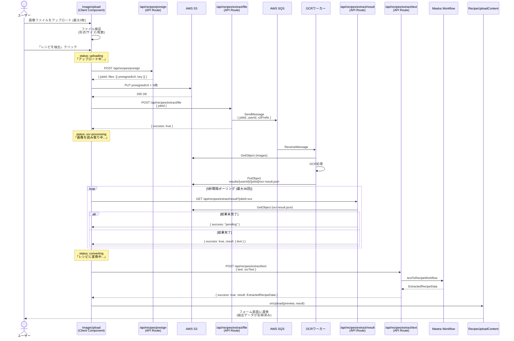
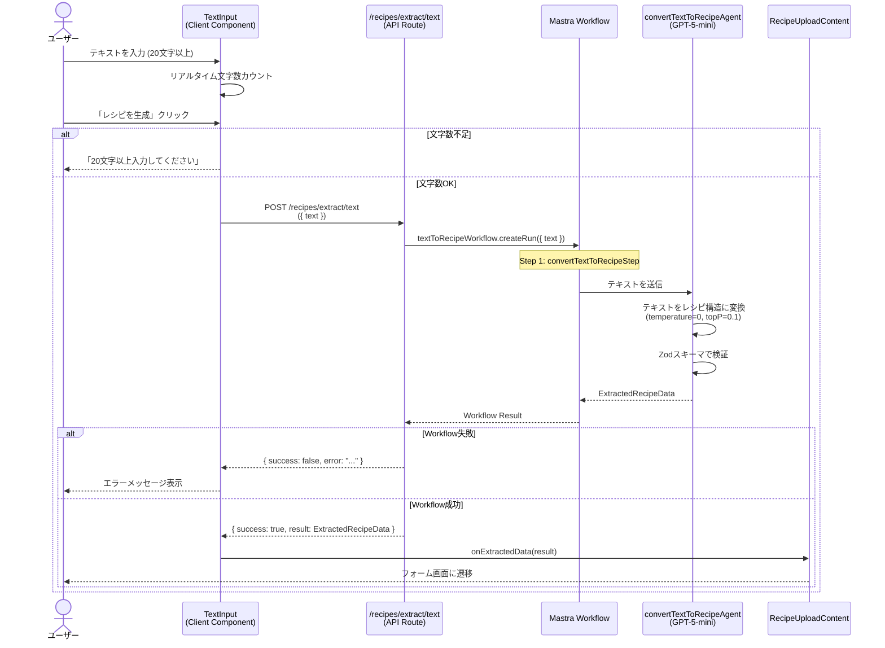

# OCR・レシピ抽出機能

## 概要

画像やテキストからレシピ情報を自動抽出する機能。S3 presigned URLによる画像アップロード、SQSキューを介したOCR非同期処理、OpenAI GPT-5-mini によるレシピ構造化を組み合わせて、ユーザーの入力負担を最小化します。Mastraワークフローフレームワークで処理を統合管理しています。

## 機能仕様

### 目的

- 紙媒体のレシピや料理本のレシピをデジタル化する際の入力負担を削減
- OCR技術で画像から正確にテキストを抽出
- AI技術でテキストから構造化レシピデータを生成
- 抽出の精度と再現性を高める (temperature=0設定)
- 元のレシピ情報を改変せずに忠実に抽出

### 機能詳細

#### 画像からの抽出（S3 + SQS + ポーリング方式）

1. **S3アップロード**
   - クライアントから `/api/recipes/presign` で presigned URL を取得
   - presigned URL を使って画像を直接S3にアップロード
   - S3キー形式: `uploads/{userId}/{jobId}/{index}`

2. **SQSエンキュー**
   - `/api/recipes/extract/file` に jobId を送信
   - SQSメッセージ形式: `{ jobId, userId, s3Prefix }`

3. **OCR処理（バックエンドワーカー）**
   - SQSからメッセージを受信
   - S3から画像を読み取り、OCR処理を実行
   - 結果を S3 `results/{userId}/{jobId}/ocr-result.json` に書き込み

4. **ポーリング**
   - クライアントが `/api/recipes/extract/result?jobId=xxx` を5秒間隔でポーリング
   - 最大36回（3分タイムアウト）

5. **レシピ構造化**
   - OCRテキスト取得後、`/api/recipes/extract/text` でレシピ構造に変換
   - 使用モデル: **OpenAI GPT-5-mini**
   - 出力: title, ingredients[], steps[], memo

#### テキストからの抽出 (textToRecipeWorkflow)

1. **構造化ステップのみ** (convertTextToRecipeStep)
   - ユーザー入力テキストをレシピ構造に変換
   - 使用モデル: **OpenAI GPT-5-mini**
   - 出力: title, ingredients[], steps[], memo

#### AI エージェントの役割

**convertTextToRecipeAgent (レシピ抽出専門)**

- **厳守ルール: 元のテキストを改変しない**
- 要約・言い換え・推測は一切しない
- 元の表現をできるだけ使用
- 存在しない材料・手順は追加しない
- 数量不明は「適量」と記載
- 複数レシピがある場合は最初のみ抽出
- レシピが検出できない場合はエラー返却
- 必ず日本語で出力

#### UI/UX

- **ドラッグ&ドロップ**: 画像を直感的にアップロード
- **クリップボード対応**: Ctrl+V/Cmd+V で画像貼り付け
- **プレビュー表示**: アップロード前に画像確認
- **2段階ステータス表示**: 処理段階に応じたボタンテキスト変更
  - `アップロード中...` → `画像を読み取り中...` → `レシピに変換中...`
- **リアルタイム文字数カウント**: テキスト入力時 (20文字以上必須)
- **エラーハンドリング**: 失敗時の明確なメッセージ

#### その他

- **決定論的出力**: temperature=0, topP=0.1 で再現性を確保
- **Zodスキーマ検証**: 構造化出力の型安全性を保証
- **エラーハンドリング**: ワークフロー失敗時は適切なエラーコード返却
- **ファイル制限**: 最大5枚、各10MB以下
- **対応フォーマット**: PNG, JPG, GIF, WebP (HEIC非対応)

### ユーザーフロー

#### 画像からの抽出

```
1. ユーザーがレシピアップロード画面で「画像からスキャン」を選択
   ↓
2. 画像アップロードエリアが表示
   ↓
3. 画像ファイルを選択/ドラッグ&ドロップ/貼り付け (最大5枚)
   ↓
4. プレビュー表示で確認
   ↓
5. 「レシピを抽出」ボタンをクリック
   ↓
6. ボタン表示: 「アップロード中...」
   - presigned URLを取得し、S3にアップロード
   - SQSにOCRジョブをエンキュー
   ↓
7. ボタン表示: 「画像を読み取り中...」
   - OCR結果をポーリング (5秒間隔, 最大3分)
   ↓
8. ボタン表示: 「レシピに変換中...」
   - OCRテキストをレシピ構造に変換
   ↓
9. 成功時: 抽出データがフォームに反映
   失敗時: エラーメッセージ表示
```

#### テキストからの抽出

```
1. ユーザーがレシピアップロード画面で「テキストから生成」を選択
   ↓
2. テキスト入力エリアが表示
   ↓
3. レシピテキストを入力/貼り付け (20文字以上)
   ↓
4. リアルタイム文字数カウント表示
   ↓
5. 「レシピを生成」ボタンをクリック
   ↓
6. ローディング表示
   ↓
7. /recipes/extract/text APIが実行
   ↓
8. textToRecipeWorkflow が処理
   - convertTextToRecipeStep: テキスト → レシピ構造 (GPT-5-mini)
   ↓
9. 成功時: 抽出データがフォームに反映
   失敗時: エラーメッセージ表示
```

## シーケンス図

### 画像からのレシピ抽出


```mermaid
sequenceDiagram
    actor User as ユーザー
    participant IU as ImageUpload<br/>(Client Component)
    participant Presign as /api/recipes/presign<br/>(API Route)
    participant S3 as AWS S3
    participant Enqueue as /api/recipes/extract/file<br/>(API Route)
    participant SQS as AWS SQS
    participant Worker as OCRワーカー
    participant Poll as /api/recipes/extract/result<br/>(API Route)
    participant Text as /api/recipes/extract/text<br/>(API Route)
    participant MW as Mastra Workflow
    participant UC as RecipeUploadContent

    User->>IU: 画像ファイルをアップロード (最大5枚)
    IU->>IU: ファイル検証<br/>(形式/サイズ/枚数)

    User->>IU: 「レシピを抽出」クリック
    Note over IU: status: uploading<br/>「アップロード中...」

    IU->>Presign: POST /api/recipes/presign
    Presign-->>IU: { jobId, files: [{ presignedUrl, key }] }

    IU->>S3: PUT presignedUrl × N枚
    S3-->>IU: 200 OK

    IU->>Enqueue: POST /api/recipes/extract/file<br/>{ jobId }
    Enqueue->>SQS: SendMessage<br/>{ jobId, userId, s3Prefix }
    Enqueue-->>IU: { success: true }

    Note over IU: status: ocr-processing<br/>「画像を読み取り中...」

    SQS->>Worker: ReceiveMessage
    Worker->>S3: GetObject (images)
    Worker->>Worker: OCR処理
    Worker->>S3: PutObject<br/>results/{userId}/{jobId}/ocr-result.json

    loop 5秒間隔ポーリング (最大36回)
        IU->>Poll: GET /api/recipes/extract/result?jobId=xxx
        Poll->>S3: GetObject (ocr-result.json)
        alt 結果未完了
            Poll-->>IU: { success: "pending" }
        else 結果完了
            Poll-->>IU: { success: true, result: { text } }
        end
    end

    Note over IU: status: converting<br/>「レシピに変換中...」

    IU->>Text: POST /api/recipes/extract/text<br/>{ text: ocrText }
    Text->>MW: textToRecipeWorkflow
    MW-->>Text: ExtractedRecipeData
    Text-->>IU: { success: true, result: ExtractedRecipeData }

    IU->>UC: onUpload(preview, result)
    UC-->>User: フォーム画面に遷移<br/>(抽出データが反映済み)
```

### テキストからのレシピ抽出


```mermaid
sequenceDiagram
    actor User as ユーザー
    participant TI as TextInput<br/>(Client Component)
    participant API as /recipes/extract/text<br/>(API Route)
    participant MW as Mastra Workflow
    participant CVT as convertTextToRecipeAgent<br/>(GPT-5-mini)
    participant UC as RecipeUploadContent

    User->>TI: テキストを入力 (20文字以上)
    TI->>TI: リアルタイム文字数カウント

    User->>TI: 「レシピを生成」クリック

    alt 文字数不足
        TI-->>User: 「20文字以上入力してください」
    else 文字数OK
        TI->>API: POST /recipes/extract/text<br/>({ text })

        API->>MW: textToRecipeWorkflow.createRun({ text })

        Note over MW: Step 1: convertTextToRecipeStep
        MW->>CVT: テキストを送信

        CVT->>CVT: テキストをレシピ構造に変換<br/>(temperature=0, topP=0.1)

        CVT->>CVT: Zodスキーマで検証
        CVT-->>MW: ExtractedRecipeData

        MW-->>API: Workflow Result

        alt Workflow失敗
            API-->>TI: { success: false, error: "..." }
            TI-->>User: エラーメッセージ表示
        else Workflow成功
            API-->>TI: { success: true, result: ExtractedRecipeData }
            TI->>UC: onExtractedData(result)
            UC-->>User: フォーム画面に遷移
        end
    end
```

## 技術仕様

### フロントエンド

#### 画像アップロードコンポーネント

**ImageUpload**

- **ファイル**: `/src/features/recipes/upload/image-upload.tsx`
- **タイプ**: Client Component
- **スタイリング**: Tailwind CSS v4

#### 使用コンポーネント

- `Button` - アップロード/アクションボタン
- `Alert` - エラー表示
- `Image` コンポーネント (next/image) - プレビュー表示
- カスタムアイコン群 (CloudUploadIcon, ClipboardIcon, etc.)

#### 状態管理

```typescript
type UploadStatus = "idle" | "uploading" | "ocr-processing" | "converting";

const [isDragging, setIsDragging] = useState(false);
const [uploadStatus, setUploadStatus] = useState<UploadStatus>("idle");
const [selectedImages, setSelectedImages] = useState<Array<{ file: File; preview: string }>>([]);
const [error, setError] = useState<string | null>(null);

// ステータスラベルマッピング
const uploadStatusLabel: Record<UploadStatus, string> = {
  idle: "レシピを抽出",
  uploading: "アップロード中...",
  "ocr-processing": "画像を読み取り中...",
  converting: "レシピに変換中...",
};
```

#### 主要な処理フロー (handleUpload)

```typescript
const handleUpload = async () => {
  setUploadStatus("uploading");
  onUploadingChange(true);

  // 1. S3にアップロード (presigned URL経由)
  const uploadResult = await uploadFilesToS3(selectedImages.map(({ file }) => file));

  // 2. SQSにエンキュー
  await fetch("/api/recipes/extract/file", {
    method: "POST",
    body: JSON.stringify({ jobId: uploadResult.jobId }),
  });

  // 3. OCR結果をポーリング
  setUploadStatus("ocr-processing");
  // POLL_INTERVAL: 5000ms, MAX_POLLS: 36 (最大3分)
  for (let i = 0; i < MAX_POLLS; i++) {
    const pollData = await fetch(`/api/recipes/extract/result?jobId=${jobId}`);
    if (pollData.success === true) {
      ocrText = pollData.result.text;
      break;
    }
  }

  // 4. OCRテキストをレシピ構造に変換
  setUploadStatus("converting");
  const textData = await fetch("/api/recipes/extract/text", {
    method: "POST",
    body: JSON.stringify({ text: ocrText }),
  });

  onUpload(preview, textData.result);
  setUploadStatus("idle");
};
```

#### テキスト入力コンポーネント

**TextInput**

- **ファイル**: `/src/features/recipes/upload/text-input.tsx`
- **タイプ**: Client Component
- 最小20文字の入力が必要
- リアルタイム文字数カウント表示

### バックエンド

#### API Routes

**POST /api/recipes/presign**

- presigned URLの発行
- jobId (UUID) の生成
- 1時間有効期限

**POST /api/recipes/extract/file**

- SQSへのOCRジョブエンキュー
- リクエスト: `{ jobId: string }`
- SQSメッセージ: `{ jobId, userId, s3Prefix }`

**GET /api/recipes/extract/result**

- OCR結果のポーリング
- クエリパラメータ: `jobId`
- S3キー: `results/{userId}/{jobId}/ocr-result.json`
- レスポンス: `{ success: "pending" | true | false }`

**POST /api/recipes/extract/text**

- テキストからレシピ構造化
- Mastra textToRecipeWorkflow を実行

#### Mastra Framework

**textToRecipeWorkflow**

- **ファイル**: `/src/mastra/workflows/text-to-recipe.ts`
- convertTextToRecipeStep → テキストからレシピ構造化 (GPT-5-mini)

#### S3アップロードユーティリティ

**uploadFilesToS3**

- **ファイル**: `/src/lib/aws/s3-upload.ts`
- presigned URL取得 → 並列PUT → jobId返却

#### AWS構成

- S3: 画像保存・OCR結果保存
- SQS: OCRジョブキュー
- 認証: Vercel OIDC Provider (本番) / ローカルAWS認証情報 (開発)
- リージョン: ap-northeast-1

## データモデル

### OcrProcessingHistory モデル

```prisma
model OcrProcessingHistory {
  id             String   @id @default(uuid())
  userId         String   @map("user_id")
  recipeId       String   @unique @map("recipe_id")
  ocrResult      Json     @map("ocr_result")
  structuredData Json     @map("structured_data")
  status         String
  processedAt    DateTime @map("processed_at")
  createdAt      DateTime @default(now()) @map("created_at")

  user   User   @relation(fields: [userId], references: [id])
  recipe Recipe @relation(fields: [recipeId], references: [id])

  @@map("ocr_processing_history")
}
```

**注**: 現在の実装では、OCR履歴はデータベースに保存されていません。将来的な拡張用のモデルです。

## API仕様

### POST /api/recipes/presign

#### 概要

S3への画像アップロード用presigned URLを発行

#### リクエスト

```typescript
{
  files: Array<{ name: string; type: string }>;
}
```

#### レスポンス

```typescript
{
  success: true,
  result: {
    jobId: string,
    files: Array<{ presignedUrl: string; key: string }>
  }
}
```

---

### POST /api/recipes/extract/file

#### 概要

画像OCR処理をSQSにエンキュー

#### リクエスト

```typescript
{
  jobId: string;
}
```

#### レスポンス

```typescript
{ success: true, result: { jobId: string } }
```

---

### GET /api/recipes/extract/result

#### 概要

OCR処理結果をポーリング取得

#### クエリパラメータ

| 名前  | 型     | 説明     |
| ----- | ------ | -------- |
| jobId | string | ジョブID |

#### レスポンス

```typescript
// 処理中
{ success: "pending" }  // HTTP 202

// 成功
{ success: true, result: { text: string } }  // HTTP 200

// 失敗
{ success: false, error: string }  // HTTP 200
```

---

### POST /api/recipes/extract/text

#### 概要

テキストからレシピ情報を構造化

#### リクエスト

```typescript
{
  text: string;
}
```

#### レスポンス

```typescript
// 成功時
{
  success: true,
  result: {
    title: string,
    ingredients: Array<{ name: string, unit: string, notes: string | null }>,
    steps: Array<{ instruction: string, timerSeconds: number | null }>,
    memo: string | null
  }
}

// 失敗時
{ success: false, error: string }
```

#### エラーコード

| HTTPステータス | メッセージ                   | 発生条件            |
| -------------- | ---------------------------- | ------------------- |
| 400            | テキストが入力されていません | text フィールドが空 |
| 500            | レシピの生成に失敗しました   | ワークフロー失敗    |

## テスト

### テストファイル

- `/src/features/recipes/upload/__tests__/image-upload.test.tsx` (70+テスト)
- `/src/features/recipes/upload/__tests__/recipe-upload-content.test.tsx`
- `/src/features/recipes/upload/__tests__/text-input.test.tsx`
- `/src/features/recipes/upload/__tests__/method-selector.test.tsx`

### 主要テストケース

1. **画像アップロードテスト**
   - 有効な画像ファイルのアップロード成功
   - 無効な形式のファイル拒否 (HEIC等)
   - 枚数超過の拒否 (6枚以上)
   - プレビュー表示の確認
   - S3 presigned URL → SQS enqueue → ポーリング → 変換の一連フロー
   - タイムアウト時のエラー表示
   - ネットワークエラー時のハンドリング

2. **テキスト入力テスト**
   - 20文字以上の入力で送信可能
   - 20文字未満で送信不可
   - 文字数カウント表示の正確性

## セキュリティ

### 実装されているセキュリティ対策

1. **ファイルアップロード検証**
   - クライアント側でファイル形式を検証 (MIME type check)
   - HEIC/HEIF形式の明示的拒否
   - アップロード枚数制限 (最大5枚)
   - presigned URLの有効期限 (1時間)

2. **認証**
   - `/api/recipes/*` は認証済みユーザーのみアクセス可能
   - S3パスにuserIdを含めてユーザー分離
   - Vercel OIDC Provider でAWS認証

3. **AIモデルのセキュリティ設定**
   - temperature=0, topP=0.1 で決定論的出力
   - 改変・推測を禁止するプロンプト設計
   - Zodスキーマによる構造化出力の型安全性保証

4. **エラーハンドリング**
   - ワークフロー失敗時は詳細を隠蔽
   - クライアントには汎用エラーメッセージのみ返却

## 配置場所

1. **レシピアップロード画面 (画像スキャン)**
   - `/src/features/recipes/upload/image-upload.tsx`
   - S3 presigned URL + SQSポーリング方式

2. **レシピアップロード画面 (テキスト入力)**
   - `/src/features/recipes/upload/text-input.tsx`
   - /recipes/extract/text を直接呼び出し

3. **S3アップロードユーティリティ**
   - `/src/lib/aws/s3-upload.ts`

4. **API エンドポイント**
   - `/src/app/api/recipes/presign/route.ts`
   - `/src/app/api/recipes/extract/file/route.ts`
   - `/src/app/api/recipes/extract/result/route.ts`
   - `/src/app/api/recipes/extract/text/route.ts`

5. **Mastra ワークフロー**
   - `/src/mastra/workflows/text-to-recipe.ts`

6. **AI エージェント**
   - `/src/mastra/agents/convert-text-to-recipe-agent.ts`
