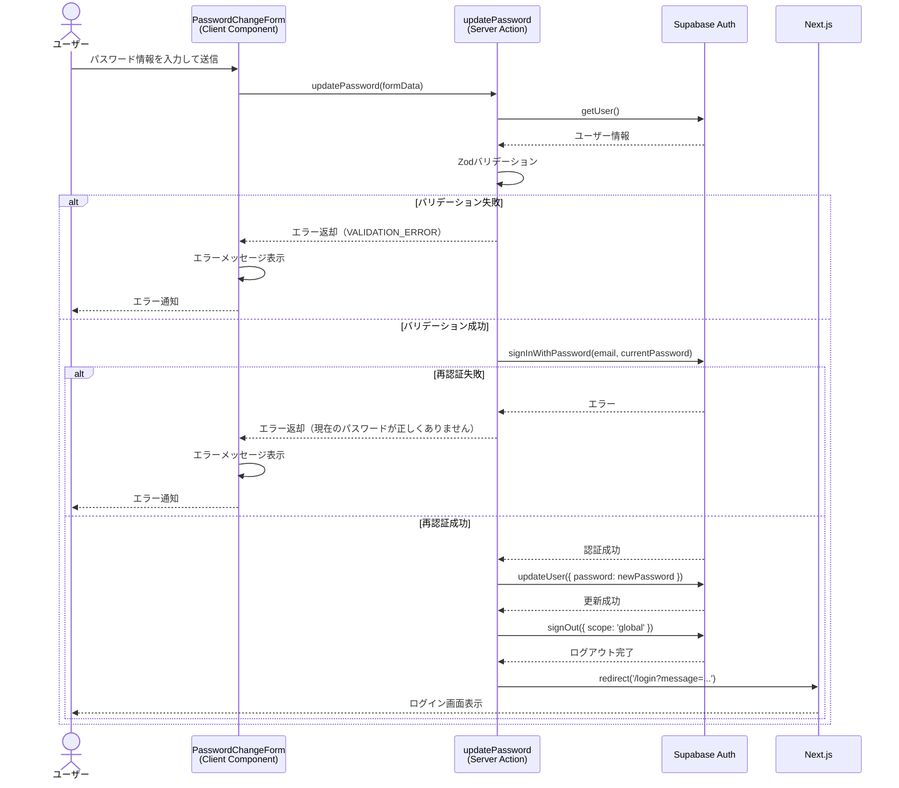

# パスワード変更

## 概要

ログイン中のユーザーが自分のパスワードを変更できる機能。セキュリティのため、現在のパスワードによる再認証が必要。変更後は全デバイスからログアウトされる。

## 機能仕様

### 目的

- ユーザーがセキュリティ上の理由でパスワードを変更できるようにする
- 現在のパスワードによる再認証で不正なパスワード変更を防止する
- パスワード変更後のグローバルログアウトで全セッションの安全性を確保する

### 機能詳細

#### パスワード変更フォーム
- 現在のパスワード入力フィールド
- 新しいパスワード入力フィールド
- 新しいパスワード確認入力フィールド
- セキュリティ警告：「パスワード変更後、すべてのデバイスから自動的にログアウトされます」

#### パスワード強度要件
- 8文字以上
- 大文字1文字以上
- 小文字1文字以上
- 数字1文字以上

#### UI/UX
- 各フィールドにアイコン表示（KeyIcon、ShieldCheckIcon、CheckCircleOutlineIcon）
- フィールドごとに色分け（スレート系、エメラルド系、ティール系）
- 送信中はボタン無効化＋ローディング表示
- バリデーションエラーはフィールド直下に表示

#### その他
- パスワード設定機能（`/password/setup`）は招待直後の初期セットアップ用として別途存在

### ユーザーフロー

```
1. プロフィール編集画面（/settings/profile）で「パスワードを変更」ボタンをクリック
   ↓
2. パスワード変更画面（/settings/password）に遷移
   ↓
3. 現在のパスワード、新しいパスワード、確認パスワードを入力
   ↓
4. 「パスワードを変更」ボタンをクリック
   ↓
5. サーバーで再認証→パスワード更新→グローバルログアウト実行
   ↓
6. ログイン画面（/login）にリダイレクト
```

## シーケンス図



## 技術仕様

### フロントエンド

#### コンポーネント構成
- **ファイル**: `src/features/profile/password/password-change-form.tsx`
- **タイプ**: Client Component
- **スタイリング**: Tailwind CSS

#### 使用コンポーネント
- `PasswordInput` - パスワード入力フィールド
- アイコン: `KeyIcon`, `ShieldCheckIcon`, `CheckCircleOutlineIcon`

#### 状態管理
```typescript
const [formData, setFormData] = useState({
  currentPassword: '',
  newPassword: '',
  confirmPassword: '',
});
const [errors, setErrors] = useState<Record<string, string>>({});
const [isPending, startTransition] = useTransition();
```

### バックエンド

#### Server Action
- **ファイル**: `src/features/profile/password/actions.ts`
- **関数**: `updatePassword(formData: PasswordChangeFormData): Promise<Result<void>>`
- **ディレクティブ**: `'use server'`

#### バリデーションスキーマ
```typescript
const passwordChangeSchema = z
  .object({
    currentPassword: z.string().min(1, '現在のパスワードを入力してください'),
    newPassword: z
      .string()
      .min(8, 'パスワードは8文字以上である必要があります')
      .regex(
        /^(?=.*[a-z])(?=.*[A-Z])(?=.*\d)/,
        'パスワードには大文字、小文字、数字を含める必要があります'
      ),
    confirmPassword: z.string(),
  })
  .refine((data) => data.newPassword === data.confirmPassword, {
    message: 'パスワードが一致しません',
    path: ['confirmPassword'],
  });
```

#### 処理フロー
1. 認証ユーザーの確認（`getUser()`）
2. Zodスキーマによるバリデーション
3. 現在のパスワードで再認証（`signInWithPassword`）
4. 新パスワードで更新（`updateUser`）
5. グローバルログアウト（`signOut({ scope: 'global' })`）
6. ログイン画面へリダイレクト

#### 使用ライブラリ
- `zod` - バリデーション
- `@supabase/ssr` - Supabase サーバークライアント

### Result型ユーティリティ

#### ファイル
- `src/utils/result/`

#### 主要関数
```typescript
type Result<T> = Success<T> | Failure

type Success<T> = { ok: true; data: T }
type Failure = { ok: false; error: AppError }
type AppError = { code: ErrorCode; message: string; details?: Record<string, unknown> }
```

## データモデル

データベースへの変更なし。パスワードはSupabase Authで管理されており、アプリケーション側のデータモデルには含まれない。

## API仕様

### updatePassword (Server Action)

#### 概要
認証済みユーザーのパスワードを変更する。現在のパスワードによる再認証後、新パスワードに更新し、全デバイスからログアウトする。

#### シグネチャ
```typescript
async function updatePassword(formData: PasswordChangeFormData): Promise<Result<void>>
```

#### パラメータ
| 名前 | 型 | 説明 |
|------|------|------|
| formData | PasswordChangeFormData | パスワード変更フォームデータ |

#### FormDataフィールド
| フィールド名 | 型 | 必須 | バリデーション |
|------------|------|------|--------------|
| currentPassword | string | ✓ | 1文字以上 |
| newPassword | string | ✓ | 8文字以上、大文字・小文字・数字を含む |
| confirmPassword | string | ✓ | newPasswordと一致 |

#### 戻り値
```typescript
Promise<Result<void>>
// 成功時: { ok: true, data: undefined } → redirect('/login')
// 失敗時: { ok: false, error: AppError }
```

#### エラーコード
| コード | メッセージ | 発生条件 |
|--------|-----------|---------|
| UNAUTHENTICATED | 認証が必要です | 未認証ユーザーのアクセス |
| VALIDATION_ERROR | （各フィールドのエラーメッセージ） | バリデーション失敗 |
| VALIDATION_ERROR | 現在のパスワードが正しくありません | 再認証失敗 |
| SERVER_ERROR | パスワードの更新に失敗しました | Supabase更新エラー |

#### 処理詳細
1. `supabase.auth.getUser()`で認証確認
2. Zodスキーマでフォームデータをバリデーション
3. `signInWithPassword`で現在のパスワードを検証
4. `updateUser({ password })`で新パスワードに更新
5. `signOut({ scope: 'global' })`で全セッション無効化
6. `/login`へリダイレクト

## テスト

### テストファイル
- **ファイル**: `src/features/profile/password/__tests__/password-change-form.test.tsx`
- **フレームワーク**: Vitest, React Testing Library

### テストケース
1. **フォームフィールドのレンダリング確認**
   - 3つのパスワード入力フィールドが表示されること

2. **セキュリティ警告メッセージの表示確認**
   - ログアウト警告が表示されること

3. **正しいデータでのサーバーアクション呼び出し**
   - フォーム送信時にupdatePasswordが正しい引数で呼ばれること

4. **失敗時のエラーメッセージ表示**
   - エラーレスポンス時にエラーメッセージが表示されること

5. **処理中のボタン無効化**
   - 送信中はボタンが無効化されること

6. **処理中のローディングテキスト表示**
   - 送信中はローディング表示されること

## セキュリティ

### 実装されているセキュリティ対策

1. **現在のパスワードによる再認証**
   - パスワード変更前に`signInWithPassword`で本人確認を実施
   - セッションハイジャック時の不正変更を防止

2. **グローバルログアウト**
   - パスワード変更後に`signOut({ scope: 'global' })`で全デバイスのセッションを無効化
   - 漏洩した旧パスワードによるセッション維持を防止

3. **パスワード強度要件**
   - 8文字以上、大文字・小文字・数字必須のZodバリデーション
   - ブルートフォース攻撃への耐性向上

4. **サーバーサイドバリデーション**
   - クライアントだけでなくサーバー側でもZodスキーマによるバリデーションを実施

5. **型安全なエラーハンドリング**
   - Result型による統一的なエラー管理で情報漏洩を防止

## 配置場所

パスワード変更機能は以下の場所で使用されています：

1. **プロフィール編集画面**
   - `src/features/profile/edit/profile-edit-form.tsx`
   - 「パスワードを変更」ボタンから`/settings/password`へ遷移

2. **パスワード変更画面**
   - `src/app/(auth)/settings/password/page.tsx`
   - パスワード変更フォームを表示

3. **モバイルナビゲーション**
   - `src/components/layouts/mobile-nav.tsx`
   - プロフィールリンク経由でアクセス可能
