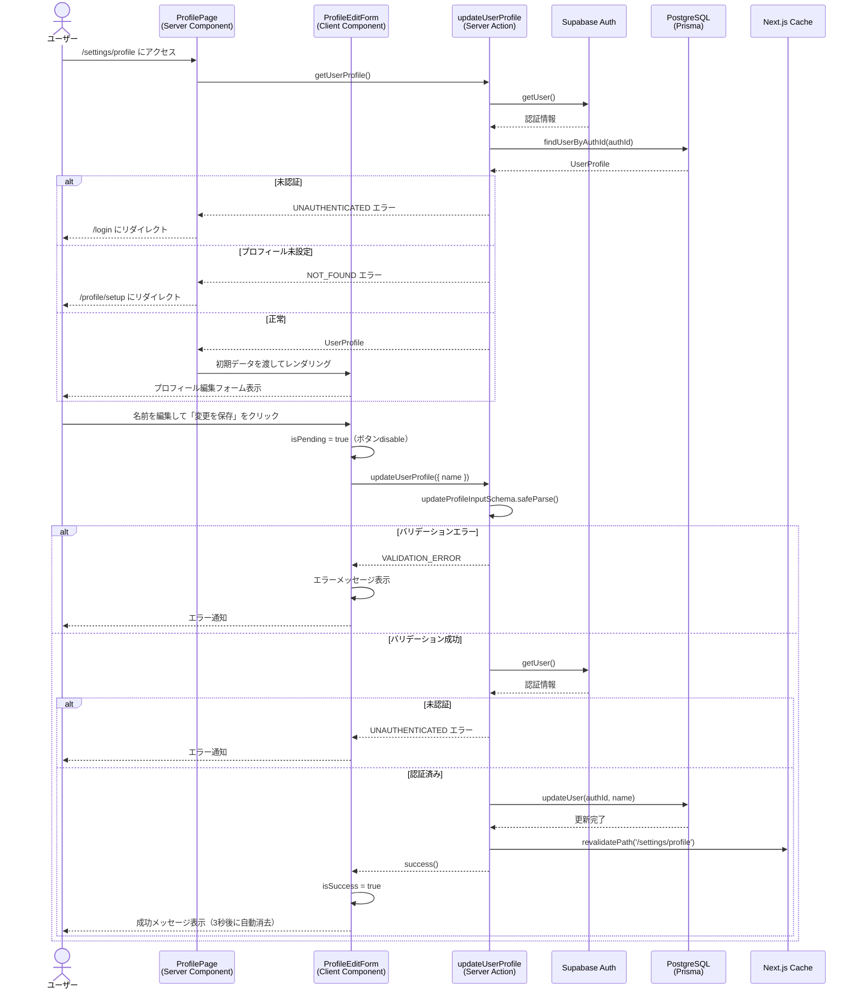

# プロフィール編集

## 概要

認証済みユーザーが自分のプロフィール情報（表示名）を編集する機能。設定画面からアクセスでき、名前の変更とパスワード変更へのナビゲーションを提供する。メールアドレスは読み取り専用で表示のみ。

## 機能仕様

### 目的

- ユーザーが表示名を自由に変更できる
- メールアドレスを確認できる（変更不可）
- パスワード変更へのアクセス導線を提供する
- ユーザー招待機能へのアクセス導線を提供する

### 機能詳細

#### 名前編集
- 表示名を1〜50文字の範囲で変更可能
- 前後の空白は自動的に除去（trim）
- 空白のみの入力は不可
- フォーム送信後に成功/エラーメッセージを表示
- 成功メッセージは3秒後に自動消去

#### メールアドレス表示
- 現在のメールアドレスを読み取り専用で表示
- 変更は不可（disabled フィールド）

#### 最終更新日時表示
- プロフィールの最終更新日時を表示

#### 関連機能へのナビゲーション
- パスワード変更ページへのリンク
- ユーザー招待フォームを同一ページに統合

#### UI/UX
- Emerald カラーで名前フィールドを装飾（UserCircleIcon アイコン）
- Slate カラーでメールアドレスフィールドを装飾（グレーで非活性を明示）
- 送信中はボタンをdisableにしてローディング状態を表示
- 成功・エラーメッセージをフォーム内に表示

### ユーザーフロー

```
1. 設定画面（/settings/profile）にアクセス
   ↓
2. Server Componentがプロフィール情報を取得
   ├─ 未認証 → /login にリダイレクト
   └─ プロフィール未設定 → /profile/setup にリダイレクト
   ↓
3. ProfileEditForm に初期データを渡して表示
   ↓
4. ユーザーが名前フィールドを編集
   ↓
5. 「変更を保存」ボタンをクリック
   ↓
6. Server Action（updateUserProfile）で処理
   ├─ バリデーションエラー → エラーメッセージ表示
   └─ 成功 → 成功メッセージ表示（3秒後に自動消去）
```

## シーケンス図



## 技術仕様

### フロントエンド

#### コンポーネント構成

**ページコンポーネント（Server Component）**
- **ファイル**: `src/app/(auth)/settings/profile/page.tsx`
- **タイプ**: Server Component
- **役割**: プロフィール取得・初期データ提供・リダイレクト制御

**レイアウト**
- **ファイル**: `src/app/(auth)/settings/profile/layout.tsx`
- **タイプ**: Server Component
- **役割**: `AuthLayoutWrapper` でレイアウト統一（タイトル: "プロフィール"、ダッシュボード戻るボタン付き）

**フォームコンポーネント（Client Component）**
- **ファイル**: `src/features/profile/edit/profile-edit-form.tsx`
- **タイプ**: Client Component
- **スタイリング**: Tailwind CSS v4

#### 状態管理

```typescript
// ProfileEditForm 内部の状態
const [name, setName] = useState(initialName)
const [error, setError] = useState<string | null>(null)
const [isSuccess, setIsSuccess] = useState(false)
const [isPending, startTransition] = useTransition()
```

#### 主要な処理フロー

```typescript
const handleSubmit = async (e: FormEvent) => {
  e.preventDefault()
  setError(null)
  setIsSuccess(false)

  startTransition(async () => {
    const result = await updateUserProfile({ name })
    if (!result.ok) {
      setError(result.error.message)
    } else {
      setIsSuccess(true)
      // 3秒後に自動消去
      setTimeout(() => setIsSuccess(false), 3000)
    }
  })
}
```

### バックエンド

#### Server Actions

**ファイル**: `src/features/profile/edit/actions.ts`

| 関数 | シグネチャ | 役割 |
|------|-----------|------|
| `getUserProfile` | `() => Promise<Result<UserProfile>>` | 現在のユーザープロフィール取得 |
| `updateUserProfile` | `(data: { name: string }) => Promise<Result<void>>` | プロフィール名の更新 |

#### バリデーションスキーマ

```typescript
// src/backend/domain/users/validators.ts
const updateProfileInputSchema = z.object({
  name: z
    .string()
    .min(1, '名前を入力してください')
    .max(50, '名前は50文字以内で入力してください')
    .trim()
    .refine((val) => val.length > 0, {
      message: '空白のみの名前は使用できません',
    }),
})
```

#### 処理フロー（updateUserProfile）

1. `updateProfileInputSchema.safeParse(data)` でバリデーション
2. バリデーション失敗時: `VALIDATION_ERROR` を返却
3. `checkUserProfile()` で認証状態・プロフィール存在確認
4. 未認証時: `UNAUTHENTICATED` エラーを返却
5. プロフィール未設定時: `NOT_FOUND` エラーを返却
6. `UserService.updateProfile(authId, { name })` でDB更新
7. `revalidatePath('/settings/profile')` でキャッシュ無効化
8. `success()` を返却

#### 使用ライブラリ

- `zod` - 入力バリデーション
- `next/cache` (`revalidatePath`) - キャッシュ制御
- `@prisma/client` - DB操作

### ビジネスロジック層

#### UserService
- **ファイル**: `src/backend/services/users/user.service.ts`
- `updateProfile(authId, input)` - プロフィール存在確認後に更新

#### UserRepository
- **ファイル**: `src/backend/repositories/user.repository.ts`
- `updateUser(authId, name)` - `prisma.user.update()` でDB更新

### 認証ユーティリティ

- **ファイル**: `src/features/auth/auth-utils.ts`
- `checkUserProfile()` - Supabase Auth確認 + DBプロフィール確認を統合

## データモデル

### User モデル

```prisma
model User {
  id        String   @id @default(uuid())
  authId    String   @unique @map("auth_id")
  email     String   @unique
  name      String?
  createdAt DateTime @default(now()) @map("created_at")
  updatedAt DateTime @updatedAt @map("updated_at")

  @@map("users")
}
```

#### プロフィール編集で操作するフィールド

| フィールド | 型 | 説明 |
|-----------|-----|------|
| `name` | `String?` | 表示名（プロフィール編集で更新対象） |
| `email` | `String` | メールアドレス（表示のみ、変更不可） |
| `updatedAt` | `DateTime` | 最終更新日時（自動更新、フォームに表示） |

## API仕様

### getUserProfile (Server Action)

#### 概要
現在の認証ユーザーのプロフィール情報を取得する。

#### シグネチャ
```typescript
async function getUserProfile(): Promise<Result<UserProfile>>
```

#### 戻り値
```typescript
// 成功
{ ok: true; data: UserProfile }

// 失敗
{ ok: false; error: AppError }
```

#### エラーコード
| コード | メッセージ | 発生条件 |
|--------|-----------|---------|
| `UNAUTHENTICATED` | 認証エラー | 未認証ユーザーのアクセス |
| `NOT_FOUND` | プロフィールが見つかりません | プロフィール未設定 |

---

### updateUserProfile (Server Action)

#### 概要
現在の認証ユーザーの表示名を更新する。

#### シグネチャ
```typescript
async function updateUserProfile(data: { name: string }): Promise<Result<void>>
```

#### パラメータ
| 名前 | 型 | 説明 |
|------|-----|------|
| `data.name` | `string` | 新しい表示名 |

#### バリデーション
| フィールド | 型 | 必須 | バリデーション |
|-----------|-----|------|--------------|
| `name` | `string` | ✓ | 1〜50文字、trim後に空文字不可 |

#### 戻り値
```typescript
// 成功
{ ok: true; data: void }

// 失敗
{ ok: false; error: AppError }
```

#### エラーコード
| コード | メッセージ | 発生条件 |
|--------|-----------|---------|
| `VALIDATION_ERROR` | 名前を入力してください / 名前は50文字以内で入力してください / 空白のみの名前は使用できません | バリデーション失敗 |
| `UNAUTHENTICATED` | 認証エラー | 未認証ユーザー |
| `NOT_FOUND` | プロフィールが見つかりません | プロフィール未設定 |
| `SERVER_ERROR` | サーバーエラー | DB更新失敗 |

#### 処理詳細
1. Zodスキーマでバリデーション実行
2. Supabase Auth でユーザー認証確認
3. DBでプロフィール存在確認
4. Prisma でユーザー名を更新
5. `/settings/profile` のキャッシュを無効化

## テスト

### テストファイル

| ファイル | フレームワーク | 対象 |
|---------|-------------|------|
| `src/features/profile/edit/__tests__/profile-edit-form.test.tsx` | Vitest + React Testing Library | ProfileEditForm コンポーネント |
| `src/features/profile/edit/__tests__/actions.test.ts` | Vitest | Server Actions |

### テストケース（profile-edit-form.test.tsx）

1. **初期表示**
   - メールアドレス、名前、最終更新日時が正しく表示される

2. **入力とバリデーション**
   - 名前の変更が反映される
   - フィールドのクリアが機能する
   - 空白入力の検証
   - maxLength の適用

3. **フォーム送信**
   - Server Action が正しいパラメータで呼び出される

4. **成功メッセージ**
   - 成功メッセージが表示される
   - 適切な variant で表示される

5. **エラーハンドリング**
   - バリデーションエラーの表示
   - サーバーエラーの表示

6. **メッセージ消去**
   - 再送信時に古いメッセージが消える

7. **ローディング状態**
   - 送信中はボタンが disabled になる
   - ローディングテキストが表示される

8. **成功メッセージ自動非表示**
   - 成功メッセージが3秒後に自動消去される

### テストケース（actions.test.ts）

1. **getUserProfile - 正常系**
   - 認証済みユーザーのプロフィールを正常に取得

2. **getUserProfile - エラー系**
   - 未認証ユーザーはエラーを返す
   - プロフィール未設定はエラーを返す

3. **updateUserProfile - 正常系**
   - 有効な名前で正常に更新

4. **updateUserProfile - バリデーション**
   - 空文字はエラーを返す
   - 空白のみはエラーを返す
   - 51文字以上はエラーを返す
   - 50文字はOK
   - 前後の空白は自動削除される

5. **updateUserProfile - エラー系**
   - 未認証ユーザーはエラーを返す
   - プロフィール未設定はエラーを返す
   - データベースエラーはサーバーエラーを返す

## セキュリティ

### 実装されているセキュリティ対策

1. **認証確認**
   - すべての Server Action で `checkUserProfile()` を実行
   - Supabase Auth で有効なセッションを確認

2. **入力バリデーション**
   - Zodスキーマでサーバーサイドバリデーション
   - trimによる空白攻撃の防止

3. **所有権確認**
   - `authId` ベースで更新するため、他ユーザーのプロフィールは変更不可

4. **エラーメッセージ管理**
   - 内部エラー詳細を返さず、安全なメッセージのみ返却

## 配置場所

ProfileEditForm は以下の場所で使用されています：

1. **プロフィール設定ページ**
   - `src/app/(auth)/settings/profile/page.tsx`
   - Server Component として初期データを取得し、Client Component に渡す
