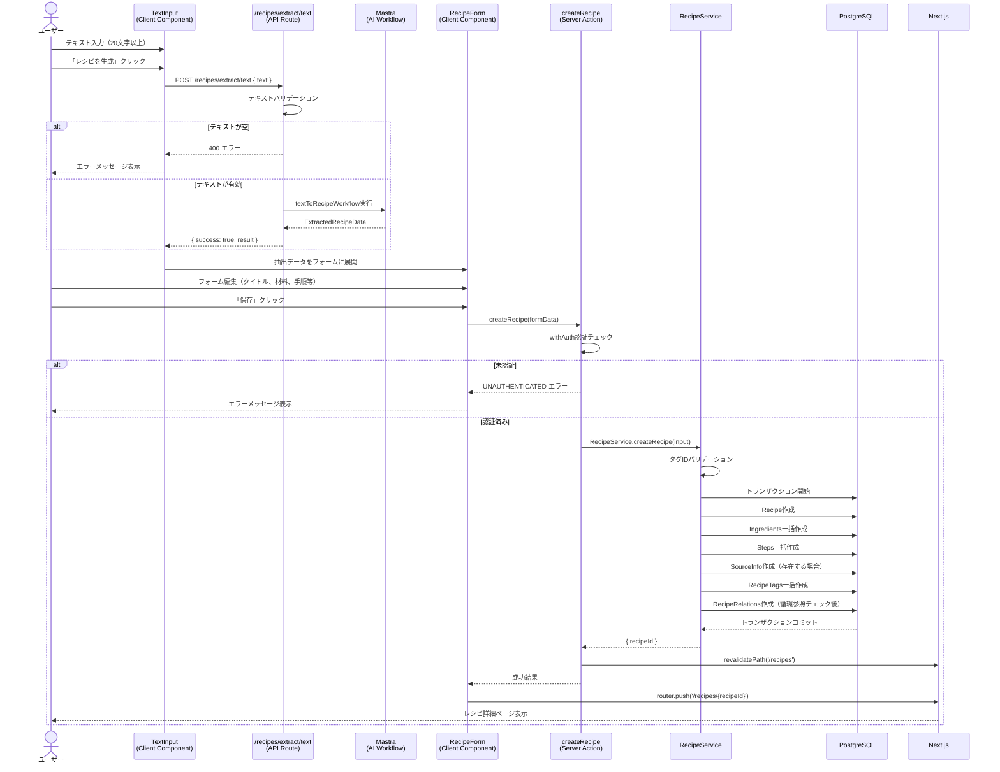

# レシピ作成（テキスト入力）

## 概要

テキストからAIを活用してレシピデータを自動抽出し、レシピとして保存する機能。ユーザーはレシピのテキスト（料理本のテキストやWebサイトからコピーしたテキストなど）を入力すると、AIがタイトル・材料・手順などを構造化データとして抽出し、編集可能なフォームに展開する。

## 機能仕様

### 目的

- テキスト情報からレシピを効率的にデジタル化する
- AIによる自動構造化で手入力の手間を削減する
- 抽出結果をユーザーが編集・補完してから保存できる柔軟性を提供する

### 機能詳細

#### テキスト入力

- テキストエリアにレシピテキストを入力
- 最小20文字のバリデーション（リアルタイム文字数カウント表示）
- 20文字未満の場合、送信ボタンを無効化し警告を表示
- 「レシピを生成」ボタンでAI抽出を実行（ローディング中は「変換中...」表示）

#### AI抽出

- Mastraワークフロー（`textToRecipeWorkflow`）を使用してテキストからレシピデータを抽出
- 抽出データ: タイトル、ソース情報、材料リスト、手順リスト、メモ、タグ

#### レシピフォーム

- AI抽出結果で初期化された編集フォームを表示
- 以下のセクションで構成:
  - **基本情報**: タイトル（必須）、本の名前、ページ番号、参照URL、メモ
  - **タグ**: カテゴリごとにグループ化されたチェックボックス形式（選択時に緑色ハイライト）
  - **材料**: 動的リスト（材料名・分量・メモ）、追加/削除可能（最低1件維持）
  - **サブレシピ**: 既存レシピから選択可能なダイアログ（検索機能付き、最大20件）、分量・メモ設定可
  - **調理手順**: 動的リスト（手順番号・説明・タイマー秒数）、追加/削除可能（最低1件維持）
- 画像URLがある場合はプレビューを表示

#### その他

- キャンセル時は `/recipes` に遷移
- 保存成功時は作成されたレシピの詳細ページ `/recipes/{recipeId}` に遷移
- タイトル未入力時は保存ボタンを無効化

### ユーザーフロー

```
1. レシピアップロードページで「テキスト入力」を選択
   ↓
2. テキストエリアにレシピテキストを入力（20文字以上）
   ↓
3. 「レシピを生成」ボタンをクリック
   ↓
4. AIがテキストからレシピデータを抽出
   ↓
5. 抽出結果がフォームに自動展開される
   ↓
6. ユーザーがフォームを編集・補完（タグ選択、サブレシピ追加など）
   ↓
7. 「保存」ボタンをクリック
   ↓
8. レシピが保存され、詳細ページに遷移
```

## シーケンス図



## 技術仕様

### フロントエンド

#### コンポーネント構成

| コンポーネント | ファイル | タイプ |
|---|---|---|
| RecipeUploadPageContent | `src/features/recipes/upload/recipe-upload-page-content.tsx` | Server Component |
| RecipeUploadContent | `src/features/recipes/upload/recipe-upload-content.tsx` | Client Component |
| TextInput | `src/features/recipes/upload/text-input.tsx` | Client Component |
| RecipeForm | `src/features/recipes/upload/recipe-form.tsx` | Client Component |
| IngredientInput | `src/features/recipes/components/ingredient-input/ingredient-input.tsx` | Client Component |
| StepInput | `src/features/recipes/components/step-input/step-input.tsx` | Client Component |
| ChildRecipeInput | `src/features/recipes/components/child-recipe-input/child-recipe-input.tsx` | Client Component |
| ChildRecipeSelectorDialog | `src/features/recipes/components/child-recipe-input/child-recipe-selector-dialog.tsx` | Client Component |
| FormActions | `src/features/recipes/components/form-actions/form-actions.tsx` | Client Component |

#### 状態管理

`useRecipeForm` カスタムフック（`src/features/recipes/hooks/use-recipe-form.ts`）で一元管理:

```typescript
// 管理する状態
title: string
sourceInfo: SourceInfoFormData | null  // { bookName, pageNumber, url }
ingredients: IngredientFormData[]       // [{ name, unit, notes }]
steps: StepFormData[]                   // [{ instruction, timerSeconds, orderIndex }]
memo: string
selectedTagIds: string[]
childRecipes: ChildRecipeFormData[]     // [{ childRecipeId, title, quantity, notes }]

// 提供する操作
addIngredient(), removeIngredient(index), updateIngredient(index, field, value)
addStep(), removeStep(index), updateStep(index, field, value)
addChildRecipe(item), removeChildRecipe(index), updateChildRecipe(index, field, value)
toggleTag(tagId)
```

#### ステップ管理

`RecipeUploadContent` が4つのステップを管理:
1. `method-selection`: 入力方法選択（テキスト or 画像）
2. `image-upload`: 画像アップロード
3. `text-input`: テキスト入力
4. `form`: レシピフォーム編集

### バックエンド

#### API Route（AI抽出）

- **ファイル**: `src/app/(auth)/recipes/extract/text/route.ts`
- **メソッド**: POST
- **リクエスト**: `{ text: string }`
- **レスポンス**: `{ success: boolean, result?: ExtractedRecipeData, error?: string }`

#### Server Action

- **ファイル**: `src/features/recipes/upload/actions.ts`
- **関数**: `createRecipe(input: CreateRecipeRequest): Promise<Result<CreateRecipeResult>>`
- **認証**: `withAuth` ラッパーによる自動認証チェック

#### サービス層

- **ファイル**: `src/backend/services/recipes/recipe.service.ts`
- **メソッド**: `RecipeService.createRecipe(userId, input)`
- Prismaトランザクション内で全DB操作をアトミックに実行

#### 処理フロー

1. `withAuth`で認証チェック、プロフィールID取得
2. `TagRepository.validateTagIdsForUser` でタグIDの有効性を検証
3. トランザクション開始
4. `RecipeRepository.createRecipe` でレシピ本体を作成
5. `RecipeRepository.createIngredients` で材料を一括作成（`createMany`）
6. `RecipeRepository.createSteps` で手順を一括作成（`createMany`、orderIndex自動設定）
7. `RecipeRepository.createSourceInfo` でソース情報を作成（URLは `sanitizeUrl` でサニタイズ）
8. `RecipeRepository.createRecipeTags` でタグ関係を一括作成
9. `validateAndCreateChildRecipeRelations` でサブレシピ関係を作成（所有権チェック + 循環参照チェック）
10. トランザクションコミット
11. `revalidatePath('/recipes')` と `revalidatePath('/recipes/{recipeId}')` でキャッシュ再検証

### バリデーションスキーマ

**ファイル**: `src/backend/domain/recipes/validators.ts`

```typescript
const createRecipeInputSchema = z.object({
  title: z.string().min(1),                    // 必須
  sourceInfo: z.object({                       // nullable
    bookName: z.string().optional(),
    pageNumber: z.string().optional(),
    url: z.string().optional(),
  }).nullable(),
  ingredients: z.array(z.object({              // 空配列可
    name: z.string().min(1),                   // 必須
    unit: z.string().optional(),
    notes: z.string().optional(),
  })),
  steps: z.array(z.object({                    // 空配列可
    instruction: z.string().min(1),            // 必須
    timerSeconds: z.number().optional(),
    orderIndex: z.number().optional(),
  })),
  memo: z.string().optional(),
  tags: z.array(z.string()),                   // 必須（空配列可）
  childRecipes: z.array(z.object({             // optional
    childRecipeId: z.string().min(1),
    quantity: z.string().max(100),
    notes: z.string().max(500),
  })).optional(),
});
```

## データモデル

### Recipe

```prisma
model Recipe {
  id        String   @id @default(uuid())
  userId    String   @map("user_id")
  title     String
  imageUrl  String?  @map("image_url")
  memo      String?
  createdAt DateTime @default(now()) @map("created_at")
  updatedAt DateTime @updatedAt @map("updated_at")
}
```

### Ingredient

```prisma
model Ingredient {
  id        String   @id @default(uuid())
  recipeId  String   @map("recipe_id")
  name      String
  unit      String?
  notes     String?
  createdAt DateTime @default(now()) @map("created_at")
  updatedAt DateTime @updatedAt @map("updated_at")
}
```

### Step

```prisma
model Step {
  id           String   @id @default(uuid())
  recipeId     String   @map("recipe_id")
  orderIndex   Int      @map("order_index")
  instruction  String
  timerSeconds Int?     @map("timer_seconds")
  createdAt    DateTime @default(now()) @map("created_at")
  updatedAt    DateTime @updatedAt @map("updated_at")
}
```

### SourceInfo

```prisma
model SourceInfo {
  id         String   @id @default(uuid())
  recipeId   String   @map("recipe_id")
  sourceType String?  @map("source_type")
  sourceName String?  @map("source_name")
  sourceUrl  String?  @map("source_url")
  pageNumber String?  @map("page_number")
  createdAt  DateTime @default(now()) @map("created_at")
  updatedAt  DateTime @updatedAt @map("updated_at")
}
```

### RecipeRelation（サブレシピ）

```prisma
model RecipeRelation {
  id             String   @id @default(uuid())
  parentRecipeId String   @map("parent_recipe_id")
  childRecipeId  String   @map("child_recipe_id")
  quantity       String?
  notes          String?
  createdAt      DateTime @default(now()) @map("created_at")
  // UNIQUE制約: (parentRecipeId, childRecipeId)
  // CASCADE削除設定
}
```

### RecipeTag

```prisma
model RecipeTag {
  recipeId  String   @map("recipe_id")
  tagId     String   @map("tag_id")
  createdAt DateTime @default(now()) @map("created_at")
  // 複合主キー: (recipeId, tagId)
  // CASCADE削除設定
}
```

## API仕様

### POST /recipes/extract/text（API Route）

#### 概要
テキストからAIを使ってレシピデータを抽出する。

#### リクエスト
| フィールド | 型 | 必須 | 説明 |
|---|---|---|---|
| text | string | ✓ | レシピテキスト |

#### レスポンス
```typescript
// 成功時
{ success: true, result: ExtractedRecipeData }

// 失敗時
{ success: false, error: string }
```

#### エラーコード
| ステータス | 条件 |
|---|---|
| 400 | テキストが空または未指定 |
| 500 | ワークフロー実行失敗 |

### createRecipe（Server Action）

#### 概要
レシピとその関連データを一括で作成する。

#### シグネチャ
```typescript
async function createRecipe(input: CreateRecipeRequest): Promise<Result<CreateRecipeResult>>
```

#### パラメータ（CreateRecipeRequest）
| 名前 | 型 | 必須 | 説明 |
|---|---|---|---|
| title | string | ✓ | レシピタイトル（1文字以上） |
| sourceInfo | SourceInfoFormData \| null | - | ソース情報 |
| ingredients | IngredientFormData[] | ✓ | 材料リスト（空配列可） |
| steps | StepFormData[] | ✓ | 手順リスト（空配列可） |
| memo | string | - | メモ |
| tags | string[] | ✓ | タグIDリスト（空配列可） |
| childRecipes | ChildRecipeFormData[] | - | サブレシピリスト |

#### 戻り値
```typescript
// 成功時
{ ok: true, data: { recipeId: string } }

// 失敗時
{ ok: false, error: AppError }
```

#### エラーコード
| コード | メッセージ | 発生条件 |
|---|---|---|
| UNAUTHENTICATED | - | 未認証 |
| VALIDATION_ERROR | 無効なタグが含まれています | タグIDが無効 |
| VALIDATION_ERROR | 無効な子レシピが含まれています | サブレシピが他ユーザー所有 |
| VALIDATION_ERROR | 循環参照が検出されました | サブレシピに循環参照あり |
| SERVER_ERROR | レシピの作成に失敗しました | 予期せぬエラー |

## テスト

### テストファイル

| ファイル | フレームワーク | 対象 |
|---|---|---|
| `src/features/recipes/upload/__tests__/recipe-form.test.tsx` | Vitest + React Testing Library | RecipeFormコンポーネント |
| `src/features/recipes/upload/__tests__/text-input.test.tsx` | Vitest + React Testing Library | TextInputコンポーネント |
| `src/backend/services/recipes/__tests__/recipe.service.test.ts` | Vitest | RecipeService |

### テストケース

#### TextInput

1. **初期表示** - テキストエリアと送信ボタンが表示される
2. **文字数バリデーション** - 20文字未満で送信ボタンが無効化、警告表示
3. **正常系** - テキスト送信後、AI抽出結果でコールバック実行
4. **API通信エラー** - エラーメッセージの表示

#### RecipeForm

1. **抽出データの表示** - AI抽出データがフォームに正しく展開される
2. **材料の追加/削除** - 動的な材料リストの操作
3. **手順の追加/削除** - 動的な手順リストの操作
4. **タグ選択** - タグのトグル操作
5. **フォーム送信（正常系）** - 全データが正しく送信される
6. **バリデーションエラー** - タイトル未入力時の保存ボタン無効化
7. **送信エラー** - Server Actionエラー時のメッセージ表示
8. **キャンセル** - `/recipes` への遷移

#### RecipeService

1. **他ユーザーのサブレシピ拒否** - 所有権チェックの検証
2. **循環参照の検出** - BFSによる循環参照検出の検証

## セキュリティ

### 実装されているセキュリティ対策

1. **認証チェック**
   - `withAuth` ラッパーによる自動認証チェック
   - 未認証ユーザーは `UNAUTHENTICATED` エラー

2. **所有権確認**
   - サブレシピの所有権を `validateChildRecipeOwnership` で検証
   - タグの所有権を `validateTagIdsForUser` で検証（ユーザー所有 or システムタグのみ許可）

3. **URLサニタイゼーション**
   - `sanitizeUrl` で http/https スキームのみ許可
   - 不正なURLは `null` に変換（XSS防止）

4. **循環参照防止**
   - BFS（幅優先探索）アルゴリズムで循環を検出
   - 自己参照もチェック

5. **入力バリデーション**
   - Zodスキーマによる厳密な型・制約チェック
   - フロントエンド・バックエンド両方でバリデーション実施

6. **トランザクション管理**
   - 全DB操作をPrismaトランザクション内で実行
   - 部分的な書き込みを防止

## 補足・メモ

- テキスト入力は画像アップロードと並ぶ2つのレシピ作成方法の1つ
- AI抽出は Mastra + AI モデルで実装されており、抽出精度はモデルに依存
- サブレシピ選択ダイアログでは最大20件のレシピを検索可能
- `createMany` による一括INSERTでDB負荷を軽減
- `useRecipeForm` フックはレシピ作成・編集で共通利用されている
