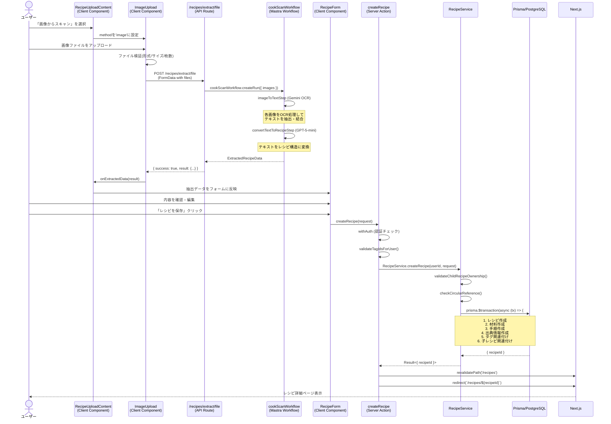
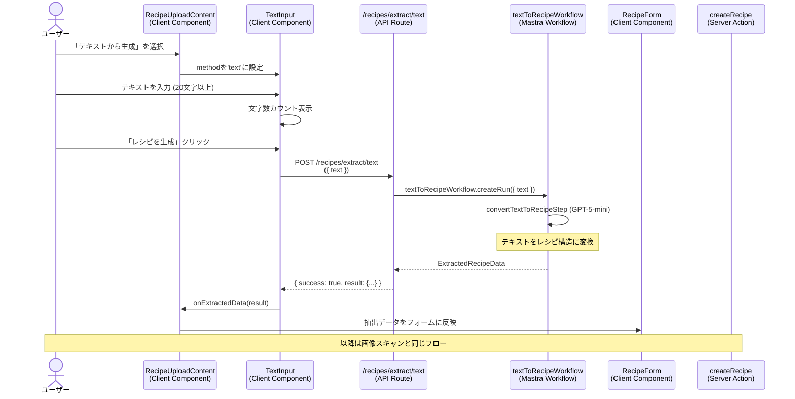
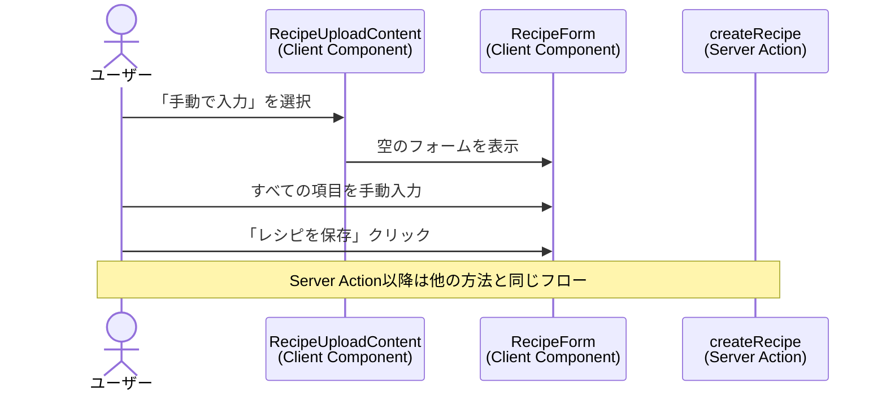

# レシピ作成機能

## 概要

ユーザーが新しいレシピを登録する機能。画像スキャン、テキスト入力、手動入力の3つの入力方法を提供し、AI技術(OCR・テキスト抽出)を活用して手間をかけずにレシピ情報を構造化データとして保存できます。

## 機能仕様

### 目的

- 紙媒体のレシピや料理本のレシピをデジタル化して保存する
- テキスト形式のレシピを構造化データに変換して保存する
- レシピ情報を統一されたフォーマットで管理し、検索性・再利用性を高める
- ユーザーの入力負担を軽減し、素早くレシピを登録できるようにする

### 機能詳細

#### 3つの入力方法

1. **画像からスキャン** (推奨・簡単)
   - 最大5枚の画像をアップロード
   - OCR技術でテキストを抽出 → AI がレシピ構造を自動解析
   - 対応フォーマット: PNG, JPG, GIF, WebP (HEIC非対応)
   - ファイルサイズ: 各画像最大10MB

2. **テキストから生成** (推奨・簡単)
   - テキストエリアにレシピを貼り付け・入力
   - 20文字以上の入力が必要
   - AI がテキストからレシピ構造を自動解析

3. **手動で入力** (詳細な編集が可能)
   - すべての項目を手動で入力
   - 抽出後の編集と同じフォーム

#### レシピデータ構造

- **基本情報**: タイトル(必須)、メモ(任意)
- **出典情報**: 書籍名、ページ番号、URL (すべて任意)
- **材料**: 名前(必須)、単位(任意)、備考(任意) - 最低1つ必要
- **手順**: 説明文(必須)、タイマー秒数(任意) - 最低1つ必要、順序は自動管理
- **タグ**: カテゴリ別のタグから複数選択可能
- **子レシピ**: 他のレシピを材料として参照(数量・備考付き)

#### UI/UX

- **ステップベースのフロー**:
  1. 入力方法選択
  2. 画像アップロード or テキスト入力 (手動入力の場合はスキップ)
  3. フォーム編集
  4. 保存完了

- **戻るボタン**: 前のステップに戻れる
- **リアルタイムプレビュー**: アップロードした画像をプレビュー表示
- **ドラッグ&ドロップ**: 画像を直感的にアップロード
- **クリップボード対応**: Ctrl+V/Cmd+V で画像を貼り付け
- **モバイル対応**: レスポンシブデザインで全デバイス対応

#### その他

- **円環参照チェック**: 子レシピ追加時にA→B→A のような循環を防止
- **所有権チェック**: 子レシピ・タグは自分が所有するもののみ選択可能
- **URL サニタイゼーション**: 出典URLは保存前にサニタイズ処理
- **トランザクション保証**: レシピ作成はPrismaトランザクションでACID保証
- **自動リダイレクト**: 保存後は作成したレシピの詳細ページに遷移

### ユーザーフロー

```
1. ユーザーが /recipes/upload にアクセス
   ↓
2. 入力方法を選択 (画像スキャン/テキスト入力/手動入力)
   ↓
3-A. [画像の場合]
   - 画像ファイルを選択・ドラッグ&ドロップ
   - OCR処理でレシピデータ抽出
   ↓
3-B. [テキストの場合]
   - テキストエリアにレシピを入力
   - AI処理でレシピデータ抽出
   ↓
3-C. [手動の場合]
   - 直接フォームに移動
   ↓
4. フォーム画面で内容を確認・編集
   - 材料の追加・削除・編集
   - 手順の追加・削除・編集
   - タグ選択
   - 出典情報入力
   - 子レシピ追加(任意)
   ↓
5. 「レシピを保存」ボタンをクリック
   ↓
6. バリデーション実行
   ↓
7. Server Action (createRecipe) が実行
   ↓
8. 成功時: レシピ詳細ページ (/recipes/{id}) にリダイレクト
   失敗時: エラーメッセージ表示
```

## シーケンス図

### 画像スキャンからのレシピ作成



### テキスト入力からのレシピ作成



### 手動入力からのレシピ作成



## 技術仕様

### フロントエンド

#### ページコンポーネント

**アップロードページ**
- **ファイル**: `/src/app/(auth)/recipes/upload/page.tsx`
- **タイプ**: Server Component
- **処理**: タグカテゴリを取得して RecipeUploadPageContent に渡す

**ページコンテンツ**
- **ファイル**: `/src/features/recipes/upload/recipe-upload-page-content.tsx`
- **タイプ**: Server Component
- **処理**: `getAllTagsForRecipe()` を呼び出してタグカテゴリをフェッチ

#### コンテナコンポーネント

**RecipeUploadContent**
- **ファイル**: `/src/features/recipes/upload/recipe-upload-content.tsx`
- **タイプ**: Client Component
- **スタイリング**: Tailwind CSS v4

#### 使用コンポーネント
- `MethodSelector` - 入力方法選択
- `ImageUpload` - 画像アップロード
- `TextInput` - テキスト入力
- `RecipeForm` - レシピフォーム
- `Button` - 戻るボタン

#### 状態管理
```typescript
type UploadStep = 'method-selection' | 'image-upload' | 'text-input' | 'form'
type UploadMethod = 'image' | 'text' | 'manual'

const [step, setStep] = useState<UploadStep>('method-selection')
const [selectedMethod, setSelectedMethod] = useState<UploadMethod | null>(null)
const [extractedData, setExtractedData] = useState<ExtractedRecipeData | null>(null)
```

#### 主要な処理フロー
```typescript
// 入力方法選択時
const handleMethodSelect = (method: UploadMethod) => {
  setSelectedMethod(method)
  if (method === 'manual') {
    setStep('form')
  } else if (method === 'image') {
    setStep('image-upload')
  } else {
    setStep('text-input')
  }
}

// 抽出データ受け取り時
const handleExtractedData = (data: ExtractedRecipeData) => {
  setExtractedData(data)
  setStep('form')
}

// 戻るボタン処理
const handleBack = () => {
  if (step === 'form') {
    if (selectedMethod === 'manual') {
      setStep('method-selection')
    } else if (selectedMethod === 'image') {
      setStep('image-upload')
    } else {
      setStep('text-input')
    }
  } else if (step === 'image-upload' || step === 'text-input') {
    setStep('method-selection')
  }
}
```

#### レシピフォームコンポーネント

**RecipeForm**
- **ファイル**: `/src/features/recipes/upload/recipe-form.tsx`
- **タイプ**: Client Component

**状態管理 (useRecipeFormフック)**
```typescript
const {
  // 基本情報
  title, setTitle,
  sourceInfo, setSourceInfo,
  memo, setMemo,

  // 材料
  ingredients,
  addIngredient,
  removeIngredient,
  updateIngredientName,
  updateIngredientUnit,
  updateIngredientNotes,

  // 手順
  steps,
  addStep,
  removeStep,
  updateStepInstruction,
  updateStepTimer,

  // タグ
  selectedTagIds,
  toggleTag,

  // 子レシピ
  childRecipes,
  addChildRecipe,
  removeChildRecipe,
  updateChildRecipeQuantity,
  updateChildRecipeNotes,
} = useRecipeForm({ initialData: extractedData })
```

**サブコンポーネント**
- `IngredientInput` - 材料入力
- `StepInput` - 手順入力
- `ChildRecipeInput` - 子レシピ入力
- `FormActions` - 保存・キャンセルボタン

### バックエンド

#### Server Action
- **ファイル**: `/src/features/recipes/upload/actions.ts`
- **関数**: `async function createRecipe(request: CreateRecipeRequest): Promise<Result<{ recipeId: string }>>`
- **ディレクティブ**: `'use server'`

#### バリデーションスキーマ
```typescript
// /src/backend/domain/recipes/validators.ts

const ingredientInputSchema = z.object({
  name: z.string().min(1, '材料名を入力してください'),
  unit: z.string().optional(),
  notes: z.string().optional(),
})

const stepInputSchema = z.object({
  instruction: z.string().min(1, '手順を入力してください'),
  timerSeconds: z.number().optional(),
  orderIndex: z.number().optional(),
})

const sourceInfoInputSchema = z.object({
  bookName: z.string().optional(),
  pageNumber: z.string().optional(),
  url: z.string().optional(),
}).nullable()

const childRecipeRelationInputSchema = z.object({
  childRecipeId: z.string().min(1),
  quantity: z.string().max(100).optional(),
  notes: z.string().max(500).optional(),
})

const createRecipeInputSchema = z.object({
  title: z.string().min(1, 'タイトルを入力してください'),
  sourceInfo: sourceInfoInputSchema,
  ingredients: z.array(ingredientInputSchema).min(1),
  steps: z.array(stepInputSchema).min(1),
  memo: z.string().optional(),
  tags: z.array(z.string()),
  childRecipes: z.array(childRecipeRelationInputSchema).optional(),
})
```

#### 処理フロー
1. `withAuth` ラッパーで認証チェック
2. タグIDをバリデーション (`validateTagIdsForUser`)
3. `RecipeService.createRecipe()` 呼び出し
   - 子レシピの所有権チェック
   - 円環参照チェック
   - Prismaトランザクション開始
     - レシピ作成
     - 材料一括作成
     - 手順一括作成
     - 出典情報作成
     - タグ関連付け
     - 子レシピ関連付け
   - トランザクションコミット
4. パスの再検証 (`revalidatePath`)
5. レシピ詳細ページへリダイレクト

#### 使用ライブラリ
- `@prisma/client` - ORM
- `zod` - バリデーション
- `next/navigation` - リダイレクト・再検証

### サービス層

#### RecipeService

**ファイル**: `/src/backend/services/recipes/recipe.service.ts`

**主要関数**
```typescript
async function createRecipe(
  userId: string,
  input: CreateRecipeInput
): Promise<CreateRecipeResult> {
  // 子レシピの所有権チェック
  const childRecipeIds = input.childRecipes?.map(cr => cr.childRecipeId) ?? []
  if (childRecipeIds.length > 0) {
    const hasValidOwnership = await validateChildRecipeOwnership(userId, childRecipeIds)
    if (!hasValidOwnership) {
      throw new Error('無効な子レシピが含まれています')
    }
  }

  return await prisma.$transaction(async (tx) => {
    // 1. レシピ作成
    const recipe = await RecipeRepository.createRecipe(
      tx, userId, input.title, input.memo
    )

    // 2. 材料作成
    if (input.ingredients.length > 0) {
      await RecipeRepository.createIngredients(tx, recipe.id, input.ingredients)
    }

    // 3. 手順作成
    if (input.steps.length > 0) {
      await RecipeRepository.createSteps(tx, recipe.id, input.steps)
    }

    // 4. 出典情報作成
    if (input.sourceInfo) {
      const sanitizedUrl = input.sourceInfo.url
        ? sanitizeUrl(input.sourceInfo.url)
        : undefined
      await RecipeRepository.createSourceInfo(
        tx, recipe.id, input.sourceInfo, sanitizedUrl
      )
    }

    // 5. タグ関連付け
    if (input.tags.length > 0) {
      await RecipeRepository.createRecipeTags(tx, recipe.id, input.tags)
    }

    // 6. 子レシピ関連付け
    if (input.childRecipes && input.childRecipes.length > 0) {
      for (const childRecipe of input.childRecipes) {
        // 円環参照チェック
        const isCircular = await checkCircularReference(
          recipe.id,
          childRecipe.childRecipeId
        )
        if (isCircular) {
          throw new Error('レシピの循環参照が検出されました')
        }
      }
      await createRecipeRelations(tx, recipe.id, input.childRecipes)
    }

    return { recipeId: recipe.id }
  })
}
```

### リポジトリ層

#### RecipeRepository

**ファイル**: `/src/backend/repositories/recipe.repository.ts`

**主要関数**
```typescript
// レシピ作成
async function createRecipe(
  tx: Prisma.TransactionClient,
  userId: string,
  title: string,
  memo?: string
): Promise<Recipe>

// 材料一括作成
async function createIngredients(
  tx: Prisma.TransactionClient,
  recipeId: string,
  ingredients: IngredientInput[]
): Promise<void>

// 手順一括作成
async function createSteps(
  tx: Prisma.TransactionClient,
  recipeId: string,
  steps: StepInput[]
): Promise<void>

// 出典情報作成
async function createSourceInfo(
  tx: Prisma.TransactionClient,
  recipeId: string,
  sourceInfo: SourceInfoInput,
  sanitizedUrl?: string
): Promise<void>

// タグ関連付け
async function createRecipeTags(
  tx: Prisma.TransactionClient,
  recipeId: string,
  tagIds: string[]
): Promise<void>
```

#### RecipeRelationRepository

**ファイル**: `/src/backend/repositories/recipe-relation.repository.ts`

**主要関数**
```typescript
// 所有権チェック
async function validateChildRecipeOwnership(
  userId: string,
  childRecipeIds: string[]
): Promise<boolean>

// 円環参照チェック
async function checkCircularReference(
  parentRecipeId: string,
  childRecipeId: string
): Promise<boolean>

// 関連作成
async function createRecipeRelations(
  tx: Prisma.TransactionClient,
  parentRecipeId: string,
  childRecipes: ChildRecipeRelationInput[]
): Promise<void>
```

## データモデル

### Recipe モデル

```prisma
model Recipe {
  id        String   @id @default(uuid())
  userId    String   @map("user_id")
  title     String
  imageUrl  String?  @map("image_url")
  memo      String?
  createdAt DateTime @default(now()) @map("created_at")
  updatedAt DateTime @updatedAt @map("updated_at")

  user                 User                   @relation(fields: [userId], references: [id])
  ingredients          Ingredient[]
  steps                Step[]
  recipeTags           RecipeTag[]
  ocrProcessingHistory OcrProcessingHistory?
  recipeVersions       RecipeVersion[]
  sourceInfo           SourceInfo[]
  childRecipes         RecipeRelation[]       @relation("ParentRecipe")
  parentRecipes        RecipeRelation[]       @relation("ChildRecipe")

  @@map("recipes")
}
```

### Ingredient モデル

```prisma
model Ingredient {
  id        String   @id @default(uuid())
  recipeId  String   @map("recipe_id")
  name      String
  unit      String?
  notes     String?
  createdAt DateTime @default(now()) @map("created_at")
  updatedAt DateTime @updatedAt @map("updated_at")

  recipe Recipe @relation(fields: [recipeId], references: [id], onDelete: Cascade)

  @@map("ingredients")
}
```

### Step モデル

```prisma
model Step {
  id            String   @id @default(uuid())
  recipeId      String   @map("recipe_id")
  orderIndex    Int      @map("order_index")
  instruction   String
  timerSeconds  Int?     @map("timer_seconds")
  createdAt     DateTime @default(now()) @map("created_at")
  updatedAt     DateTime @updatedAt @map("updated_at")

  recipe Recipe @relation(fields: [recipeId], references: [id], onDelete: Cascade)

  @@map("steps")
}
```

### SourceInfo モデル

```prisma
model SourceInfo {
  id         String   @id @default(uuid())
  recipeId   String   @map("recipe_id")
  sourceType String   @map("source_type")
  sourceName String?  @map("source_name")
  sourceUrl  String?  @map("source_url")
  pageNumber String?  @map("page_number")
  createdAt  DateTime @default(now()) @map("created_at")
  updatedAt  DateTime @updatedAt @map("updated_at")

  recipe Recipe @relation(fields: [recipeId], references: [id], onDelete: Cascade)

  @@map("source_infos")
}
```

### RecipeRelation モデル (子レシピ関連)

```prisma
model RecipeRelation {
  id              String   @id @default(uuid())
  parentRecipeId  String   @map("parent_recipe_id")
  childRecipeId   String   @map("child_recipe_id")
  quantity        String?
  notes           String?
  createdAt       DateTime @default(now()) @map("created_at")

  parentRecipe Recipe @relation("ParentRecipe", fields: [parentRecipeId], references: [id], onDelete: Cascade)
  childRecipe  Recipe @relation("ChildRecipe", fields: [childRecipeId], references: [id], onDelete: Cascade)

  @@map("recipe_relations")
}
```

## API仕様

### createRecipe (Server Action)

#### 概要
新しいレシピを作成するServer Action

#### シグネチャ
```typescript
async function createRecipe(
  request: CreateRecipeRequest
): Promise<Result<{ recipeId: string }>>
```

#### パラメータ
| 名前 | 型 | 説明 |
|------|------|------|
| request | CreateRecipeRequest | レシピ作成リクエスト |

#### CreateRecipeRequest フィールド
| フィールド名 | 型 | 必須 | バリデーション |
|------------|------|------|--------------|
| title | string | ✓ | 1文字以上 |
| sourceInfo | SourceInfoFormData \| null |  | 各フィールド任意 |
| ingredients | IngredientFormData[] | ✓ | 1個以上、各材料のnameが1文字以上 |
| steps | StepFormData[] | ✓ | 1個以上、各手順のinstructionが1文字以上 |
| memo | string |  | 任意 |
| tags | string[] |  | ユーザー所有のタグIDのみ |
| childRecipes | ChildRecipeFormData[] |  | ユーザー所有のレシピIDのみ、円環参照禁止 |

#### 戻り値
```typescript
// 成功時
Result<{ recipeId: string }> = {
  ok: true,
  data: { recipeId: string }
}

// 失敗時
Result<{ recipeId: string }> = {
  ok: false,
  error: {
    code: ErrorCode,
    message: string,
    details?: Record<string, unknown>
  }
}
```

#### エラーコード
| コード | メッセージ | 発生条件 |
|--------|-----------|---------|
| UNAUTHENTICATED | 認証が必要です | 未ログイン |
| VALIDATION_ERROR | バリデーションエラー | 入力データが不正 |
| FORBIDDEN | 無効なタグが含まれています | 他人のタグを指定 |
| FORBIDDEN | 無効な子レシピが含まれています | 他人のレシピを子レシピに指定 |
| CONFLICT | レシピの循環参照が検出されました | 子レシピが円環参照を引き起こす |
| SERVER_ERROR | サーバーエラーが発生しました | データベースエラー等 |

#### 処理詳細
1. `withAuth` で認証チェック (未ログインは UNAUTHENTICATED)
2. タグIDをバリデーション (`validateTagIdsForUser`)
3. `RecipeService.createRecipe(userId, request)` 呼び出し
   - 子レシピの所有権チェック
   - 円環参照チェック
   - Prisma トランザクション内で:
     - レシピ作成
     - 材料一括作成
     - 手順一括作成
     - 出典情報作成
     - タグ関連付け
     - 子レシピ関連付け
4. 成功時: `/recipes` と `/recipes/{id}` のキャッシュを再検証
5. レシピ詳細ページ (`/recipes/{recipeId}`) へリダイレクト

## テスト

### テストファイル
- **ファイル**: `/src/features/recipes/upload/__tests__/recipe-form.test.tsx`
- **フレームワーク**: Vitest + React Testing Library

### テストケース

1. **初期表示テスト**
   - 抽出データがフォームに正しく反映されること
   - 画像プレビューが表示されること

2. **材料操作テスト**
   - 材料の追加
   - 材料の削除
   - 材料名・単位・備考の更新
   - 最後の1つは削除できないこと

3. **手順操作テスト**
   - 手順の追加
   - 手順の削除
   - 手順内容・タイマーの更新
   - 最後の1つは削除できないこと

4. **タグ選択テスト**
   - タグの選択
   - タグの選択解除

5. **フォーム送信テスト**
   - タイトル必須のバリデーション
   - 材料必須のバリデーション
   - 手順必須のバリデーション
   - 正常なデータでの送信成功
   - エラー時のメッセージ表示

6. **ナビゲーションテスト**
   - キャンセルボタンでレシピ一覧に戻る

## セキュリティ

### 実装されているセキュリティ対策

1. **認証チェック**
   - すべてのServer ActionでwithAuthラッパーを使用
   - 未認証ユーザーはUNAUTHENTICATEDエラー

2. **所有権チェック**
   - タグは自分が所有するもののみ使用可能
   - 子レシピは自分が所有するもののみ参照可能
   - 他人のリソースを不正使用できない

3. **入力バリデーション**
   - Zodスキーマによる厳密なバリデーション
   - SQLインジェクション対策 (Prisma ORM使用)
   - XSS対策 (Reactの自動エスケープ)

4. **URLサニタイゼーション**
   - 出典URLは保存前に `sanitizeUrl` 関数で処理
   - 悪意のあるURLを無害化

5. **トランザクション保証**
   - Prismaトランザクションでデータ整合性を保証
   - 部分的な保存を防止

6. **円環参照チェック**
   - 子レシピ追加時に循環参照を検出
   - データ構造の破損を防止

7. **ファイルアップロード検証**
   - クライアント側で形式・サイズ・枚数を制限
   - 悪意のあるファイルアップロードを防止

## 配置場所

RecipeFormは以下の場所で使用されています:

1. **レシピアップロードページ**
   - `/src/features/recipes/upload/recipe-upload-content.tsx`
   - 新規レシピ作成時のフォーム

2. **レシピ編集ページ**
   - `/src/features/recipes/edit/recipe-edit-form.tsx`
   - 既存レシピ編集時のフォーム (ほぼ同じUI)
