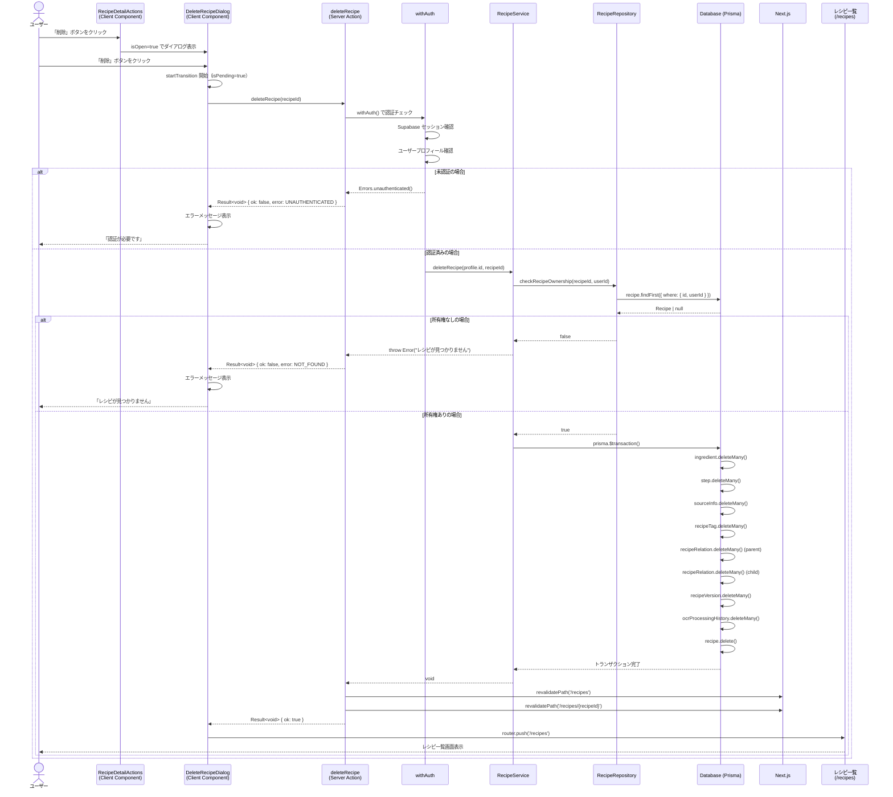

# レシピ削除

## 概要

レシピ詳細画面から、ユーザーが所有するレシピを削除する機能。確認ダイアログを表示することで誤削除を防止し、削除時はレシピ本体と関連する全データ（材料、手順、タグ、バージョン履歴など）をトランザクション内で一括削除する。

## 機能仕様

### 目的

- ユーザーが不要になったレシピを削除できるようにする
- 誤削除を防止するための確認ダイアログを提供する
- レシピに紐づく全関連データを整合性を保って削除する

### 機能詳細

#### 削除確認ダイアログ

- 削除ボタンクリックで確認ダイアログを表示
- ダイアログにはレシピタイトルを表示し、削除対象を明示
- 「この操作は取り消すことができません」という警告メッセージを表示
- キャンセルボタンで操作を中断できる

#### 削除処理

- 削除ボタンクリック後、Server Actionでレシピを削除
- 削除成功後はレシピ一覧画面（`/recipes`）へリダイレクト
- 削除失敗時はダイアログ内にエラーメッセージを表示

#### カスケード削除

レシピ本体の削除に伴い、以下の関連データをトランザクション内で一括削除：

1. Ingredient（材料）
2. Step（手順）
3. SourceInfo（ソース情報）
4. RecipeTag（レシピタグ）
5. RecipeRelation（親レシピとして参照）
6. RecipeRelation（子レシピとして参照）
7. RecipeVersion（レシピバージョン）
8. OcrProcessingHistory（OCR処理履歴）
9. Recipe（レシピ本体）

#### UI/UX

- 削除ボタンは `danger-ghost` バリアントで視覚的に危険操作を示す
- 確認ダイアログは赤系グラデーションヘッダーで警告感を演出
- 削除処理中はボタンをdisableにし、「削除中...」テキストで状態を表示
- Radix UI の Dialog コンポーネントでアクセシブルなダイアログを実装

### ユーザーフロー

```
1. レシピ詳細画面（/recipes/[id]）を開く
   ↓
2. アクションバーの「削除」ボタンをクリック
   ↓
3. 削除確認ダイアログが表示される
   （レシピタイトル・警告メッセージを確認）
   ↓
4a. 「キャンセル」ボタンまたはESCキーでダイアログを閉じる → 操作終了
    ↓
4b. 「削除」ボタンをクリック
   ↓
5. Server Actionでレシピを削除
   ↓
6a. 削除失敗 → ダイアログ内にエラーメッセージを表示
    ↓
6b. 削除成功 → レシピ一覧画面（/recipes）へリダイレクト
```

## シーケンス図



## 技術仕様

### フロントエンド

#### コンポーネント構成

- **ファイル**: `src/features/recipes/detail/recipe-detail-actions.tsx`
- **タイプ**: Client Component
- **役割**: 編集・ダウンロード・削除ボタンを表示するアクションバー

- **ファイル**: `src/features/recipes/delete/delete-recipe-dialog.tsx`
- **タイプ**: Client Component
- **役割**: 削除確認ダイアログ

#### 使用コンポーネント

- `Dialog`, `DialogContent`, `DialogHeader`, `DialogTitle`, `DialogDescription`, `DialogFooter` - Radix UI ベースのダイアログ
- `Button` - キャンセル/削除ボタン（`secondary` / `danger` バリアント）
- `Alert` - 警告・エラーメッセージ表示
- アイコン: `WarningIcon`, `TrashIcon`

#### 状態管理

```typescript
// DeleteRecipeDialog
const [error, setError] = useState<string | null>(null)
const [isPending, startTransition] = useTransition()
const router = useRouter()
```

#### 主要な処理フロー

```typescript
const handleDelete = async () => {
  startTransition(async () => {
    try {
      const result = await deleteRecipe(recipeId)
      if (isSuccess(result)) {
        router.push('/recipes')
        handleClose()
      } else {
        setError(result.error.message)
      }
    } catch {
      setError('エラーが発生しました')
    }
  })
}
```

### バックエンド

#### Server Action

- **ファイル**: `src/features/recipes/delete/actions.ts`
- **関数**: `deleteRecipe(recipeId: string): Promise<Result<void>>`
- **ディレクティブ**: `'use server'`

#### 処理フロー

1. `withAuth()` でユーザー認証・プロフィール確認
2. `RecipeService.deleteRecipe(profile.id, recipeId)` を呼び出し
3. 成功時: `revalidatePath` でキャッシュ無効化、`success(undefined)` を返却
4. レシピ未発見時: `Errors.notFound('レシピ')` を返却
5. その他エラー時: `Errors.server('レシピの削除に失敗しました')` を返却

#### 使用ライブラリ

- `next/cache` - `revalidatePath` によるキャッシュ無効化
- `@/utils/result` - Result型によるエラーハンドリング
- `@/utils/server-action` - `withAuth` 認証ラッパー

### サービス層

#### ファイル

- `src/backend/services/recipes/recipe.service.ts`

#### 主要関数

```typescript
export async function deleteRecipe(userId: string, recipeId: string): Promise<void> {
  const hasOwnership = await RecipeRepository.checkRecipeOwnership(recipeId, userId)
  if (!hasOwnership) {
    throw new Error('レシピが見つかりません')
  }
  await prisma.$transaction(async (tx) => {
    await RecipeRepository.deleteRecipe(tx, recipeId)
  })
}
```

### リポジトリ層

#### ファイル

- `src/backend/repositories/recipe.repository.ts`

#### 主要関数

```typescript
// 所有権チェック
export async function checkRecipeOwnership(recipeId: string, userId: string): Promise<boolean>

// 関連データ削除（ingredient, step, sourceInfo, recipeTag, recipeRelation(parent)）
export async function deleteRelatedData(tx: TransactionClient, recipeId: string): Promise<void>

// レシピ削除（関連データ含む全削除）
export async function deleteRecipe(tx: TransactionClient, recipeId: string): Promise<void>
```

## データモデル

### Recipe モデル（削除対象）

```prisma
model Recipe {
  id        String   @id @default(uuid())
  userId    String   @map("user_id")
  title     String
  imageUrl  String?  @map("image_url")
  memo      String?
  createdAt DateTime @default(now()) @map("created_at")
  updatedAt DateTime @updatedAt @map("updated_at")

  user                 User                  @relation(fields: [userId], references: [id])
  ingredients          Ingredient[]
  steps                Step[]
  recipeTags           RecipeTag[]
  ocrProcessingHistory OcrProcessingHistory?
  recipeVersions       RecipeVersion[]
  sourceInfo           SourceInfo[]
  childRecipes         RecipeRelation[]      @relation("ParentRecipe")
  parentRecipes        RecipeRelation[]      @relation("ChildRecipe")

  @@map("recipes")
}
```

### RecipeRelation モデル（カスケード削除対象）

```prisma
model RecipeRelation {
  id             String   @id @default(uuid())
  parentRecipeId String   @map("parent_recipe_id")
  childRecipeId  String   @map("child_recipe_id")
  quantity       String?
  notes          String?
  createdAt      DateTime @default(now()) @map("created_at")

  parentRecipe Recipe @relation("ParentRecipe", fields: [parentRecipeId], references: [id], onDelete: Cascade)
  childRecipe  Recipe @relation("ChildRecipe", fields: [childRecipeId], references: [id], onDelete: Cascade)

  @@unique([parentRecipeId, childRecipeId])
  @@map("recipe_relations")
}
```

#### 削除対象テーブル一覧

| テーブル | 削除方法 | 備考 |
|---------|---------|------|
| `ingredients` | `deleteMany` | レシピに紐づく材料 |
| `steps` | `deleteMany` | レシピに紐づく手順 |
| `source_infos` | `deleteMany` | レシピのソース情報 |
| `recipe_tags` | `deleteMany` | レシピのタグ関係 |
| `recipe_relations` | `deleteMany` | 親レシピとして参照 |
| `recipe_relations` | `deleteMany` | 子レシピとして参照 |
| `recipe_versions` | `deleteMany` | レシピのバージョン履歴 |
| `ocr_processing_history` | `deleteMany` | OCR処理履歴 |
| `recipes` | `delete` | レシピ本体 |

## API仕様

### deleteRecipe (Server Action)

#### 概要

認証済みユーザーが所有するレシピを削除する。削除成功後はレシピ一覧・詳細ページのキャッシュを無効化する。

#### シグネチャ

```typescript
async function deleteRecipe(recipeId: string): Promise<Result<void>>
```

#### パラメータ

| 名前 | 型 | 説明 |
|------|------|------|
| `recipeId` | `string` | 削除するレシピのUUID |

#### 戻り値

```typescript
type Result<void> =
  | { ok: true; data: undefined }
  | { ok: false; error: AppError }
```

#### エラーコード

| コード | メッセージ | 発生条件 |
|--------|-----------|---------|
| `UNAUTHENTICATED` | 「認証が必要です」 | 未ログイン |
| `UNAUTHENTICATED` | 「プロフィール設定が必要です」 | プロフィール未設定 |
| `NOT_FOUND` | 「レシピが見つかりません」 | レシピが存在しないか、他ユーザーのレシピ |
| `SERVER_ERROR` | 「レシピの削除に失敗しました」 | サーバーエラー |

#### 処理詳細

1. `withAuth()` でSupabaseセッションを確認
2. ユーザープロフィールの存在確認
3. `RecipeService.deleteRecipe(profile.id, recipeId)` を呼び出し
4. `checkRecipeOwnership` でレシピの所有権を確認
5. トランザクション内で関連データを順次削除
6. レシピ本体を削除
7. `revalidatePath('/recipes')` でレシピ一覧のキャッシュを無効化
8. `revalidatePath('/recipes/{recipeId}')` で詳細ページのキャッシュを無効化
9. `success(undefined)` を返却

## テスト

### テストファイル

- **ファイル**: `src/features/recipes/delete/__tests__/delete-recipe-dialog.test.tsx`
- **フレームワーク**: Vitest + React Testing Library

- **ファイル**: `src/backend/services/recipes/__tests__/recipe.service.test.ts`
- **フレームワーク**: Vitest

### テストケース

#### delete-recipe-dialog.test.tsx

1. **表示制御**
   - `isOpen=true` でダイアログが表示される
   - `isOpen=false` でダイアログが非表示になる

2. **削除成功**
   - 削除ボタンクリック後、`deleteRecipe` が正しい引数で呼ばれる
   - 削除成功時に `/recipes` へリダイレクトされる

3. **削除失敗**
   - Server Action がエラーを返した場合、ダイアログ内にエラーメッセージが表示される

4. **キャンセル操作**
   - キャンセルボタンクリックでダイアログが閉じる
   - ESCキーでダイアログが閉じる

5. **ローディング状態**
   - 削除処理中はキャンセル・削除ボタンがdisableになる
   - 削除処理中は「削除中...」テキストが表示される

#### recipe.service.test.ts

1. **正常系: レシピ削除**
   - `checkRecipeOwnership` が正しい引数で呼ばれる
   - `prisma.$transaction` が実行される
   - `RecipeRepository.deleteRecipe` がトランザクション内で呼ばれる

2. **異常系: 所有権なし**
   - `checkRecipeOwnership` が `false` を返した場合にエラーが投げられる
   - `prisma.$transaction` が呼ばれないことを確認

## セキュリティ

### 実装されているセキュリティ対策

1. **認証チェック**
   - `withAuth()` ラッパーで全Server Actionに認証チェックを実施
   - 未認証ユーザーは `UNAUTHENTICATED` エラーで弾く

2. **認可チェック（所有権確認）**
   - `checkRecipeOwnership(recipeId, userId)` でレシピの所有者を確認
   - 他ユーザーのレシピは「見つかりません」エラーとして返し、存在自体を秘匿

3. **トランザクション管理**
   - `prisma.$transaction()` で削除処理を原子的に実行
   - 途中でエラーが発生した場合は全削除をロールバック

## 配置場所

`DeleteRecipeDialog` は以下の場所で使用されています：

1. **レシピ詳細アクションバー**
   - `src/features/recipes/detail/recipe-detail-actions.tsx`
   - レシピ詳細画面の編集・ダウンロード・削除ボタンを束ねるコンポーネント内

2. **レシピ詳細ページ**
   - `src/app/(auth)/recipes/[id]/page.tsx`
   - `RecipeDetailServerContent` を通して間接的に配置
