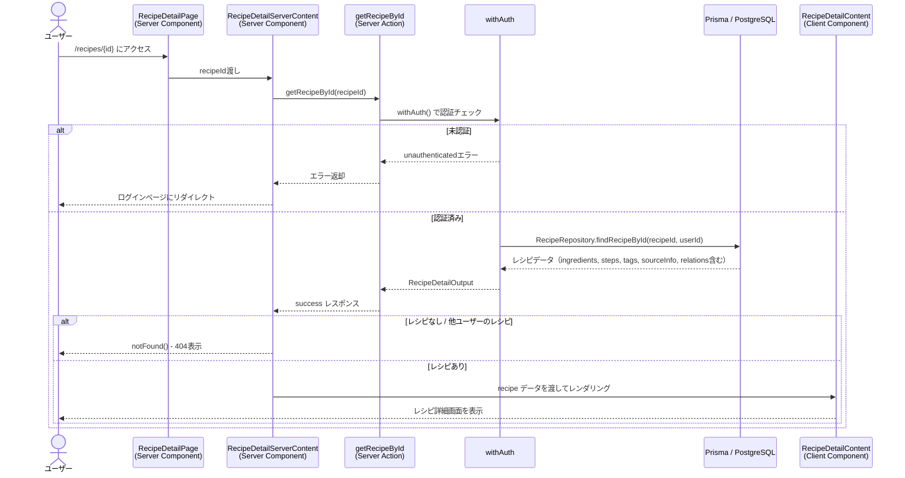
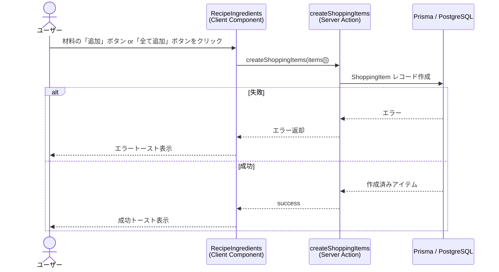
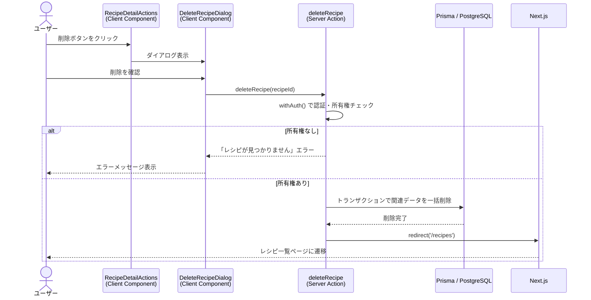

# レシピ詳細

## 概要

登録済みのレシピの詳細情報を表示する機能。材料・手順・タグ・ソース情報などを一覧表示し、調理タイマーや買い物リスト連携などの調理支援機能を提供する。

## 機能仕様

### 目的

- 登録したレシピの全情報を確認できる
- 調理中にタイマーを使いながら手順を追える
- 材料を買い物リストに転送して買い物を効率化する
- 関連レシピ（サブレシピ・親レシピ）へのナビゲーションを提供する

### 機能詳細

#### レシピ情報表示

- **タイトル** - レシピ名と作成日付
- **画像** - アップロードされた料理画像
- **メモ** - 自由記述のメモ
- **タグ** - カテゴリ別グループ化して表示
- **ソース情報** - 本・URL・ページ番号などの出典情報

#### 材料セクション

- 材料名・分量・単位・ノートを一覧表示
- 材料を個別または一括で買い物リストに追加可能
- 空の場合は「材料が登録されていません」メッセージを表示

#### 調理手順セクション

- `orderIndex` 順に手順を表示
- タイマー秒数が設定されたステップには専用タイマーを表示
- タイマーはページ遷移後も動作継続（localStorage永続化）

#### 調理タイマー機能

- 画面上部にアクティブなタイマーを一覧表示
- 複数タイマーを同時管理（開始・一時停止・再開・リセット）
- タイマー終了時にブラウザ通知
- 24時間以上経過したタイマーは自動削除

#### サブレシピ・親レシピセクション

- サブレシピとして使用されている場合、親レシピへのリンクを表示
- サブレシピが設定されている場合、子レシピへのリンクを表示

#### アクション

- **編集ボタン** - `/recipes/{id}/edit` に遷移
- **ダウンロードボタン** - レシピをJPG画像としてダウンロード（dom-to-jpeg）
- **削除ボタン** - 確認ダイアログ後にレシピを削除

#### UI/UX

- レスポンシブレイアウト：モバイルは縦積み、lg以上は左1カラム・右2カラムのグリッド
- CookingTimerManager は `dynamic import` + `ssr: false` でクライアントサイドのみレンダリング
- ローディング状態は `loading.tsx` で管理
- 見つからないレシピは `not-found.tsx` で404表示

### ユーザーフロー

```
1. レシピ一覧から対象レシピをクリック
   ↓
2. `/recipes/{id}` に遷移
   ↓
3. Server Componentがレシピデータを取得・表示
   ↓
4. ユーザーが詳細を確認
   ├── 調理手順のタイマーを開始
   ├── 材料を買い物リストに追加
   ├── 関連レシピに移動
   ├── 編集ページに遷移
   ├── JPG形式でダウンロード
   └── 削除確認ダイアログから削除
```

## シーケンス図



### 買い物リスト追加フロー



### 削除フロー



## 技術仕様

### フロントエンド

#### コンポーネント構成

| コンポーネント | ファイルパス | タイプ | 役割 |
|---|---|---|---|
| RecipeDetailPage | `src/app/(auth)/recipes/[id]/page.tsx` | Server Component | ルーティング、Suspenseラッパー |
| RecipeDetailServerContent | `src/features/recipes/detail/recipe-detail-server-content.tsx` | Server Component | データ取得・認可チェック |
| RecipeDetailContent | `src/features/recipes/detail/recipe-detail-content.tsx` | Client Component | レイアウト・状態管理 |
| CookingTimerManager | `src/features/recipes/detail/cooking-timer-manager.tsx` | Client Component (SSR=false) | アクティブタイマー一覧 |
| RecipeIngredients | `src/features/recipes/detail/recipe-ingredients.tsx` | Client Component | 材料表示・買い物リスト連携 |
| RecipeSteps | `src/features/recipes/detail/recipe-steps.tsx` | Client Component | 調理手順表示 |
| StepTimer | `src/features/recipes/detail/step-timer.tsx` | Client Component | 個別ステップタイマー |
| RecipeImageSection | `src/features/recipes/detail/recipe-image-section.tsx` | Client Component | 画像表示 |
| RecipeSourceInfo | `src/features/recipes/detail/recipe-source-info.tsx` | Client Component | ソース情報表示 |
| RecipeMemo | `src/features/recipes/detail/recipe-memo.tsx` | Client Component | メモ表示 |
| RecipeTagsSection | `src/features/recipes/detail/recipe-tags-section.tsx` | Client Component | タグ表示（カテゴリ別） |
| RecipeChildRecipesSection | `src/features/recipes/detail/recipe-child-recipes-section.tsx` | Client Component | サブレシピリンク |
| RecipeParentRecipesSection | `src/features/recipes/detail/recipe-parent-recipes-section.tsx` | Client Component | 親レシピリンク |
| RecipeDetailActions | `src/features/recipes/detail/recipe-detail-actions.tsx` | Client Component | 編集・ダウンロード・削除 |
| DeleteRecipeDialog | `src/features/recipes/delete/delete-recipe-dialog.tsx` | Client Component | 削除確認ダイアログ |

#### 状態管理

タイマー状態はJotai atomsで管理し、localStorageに永続化する。

```typescript
// timer-atoms.ts
type PersistedTimerState = {
  stepId: string
  recipeId: string
  recipeTitle: string
  stepNumber: number
  instruction: string
  totalSeconds: number
  startedAt: number
  elapsedSeconds: number
  runningSinceSeconds: number | null // 実行中ならタイムスタンプ、停止中はnull
}

// グローバルタイマー状態
const timerStatesAtom: Atom<Record<string, PersistedTimerState>>
// レシピごとのタイマー状態
const recipeTimerStatesAtomFamily: AtomFamily<string, PersistedTimerState[]>
// 全停止アクション
const stopAllTimersAtomFamily: AtomFamily<string, void>
// 古いタイマー削除
const cleanupOldTimerStatesAtom: Atom<void>
```

#### ユーティリティ関数

```typescript
// src/features/recipes/detail/utils.ts

// メモのフォーマット
formatMemo(memo: string | null | undefined): string

// ソース情報の取得（配列から最初の有効なソースを返す）
getSourceInfo(sourceInfoArray: SourceInfo[]): SourceInfoDisplay | null

// タグをカテゴリ別にグループ化
groupTagsByCategory(recipeTags): Map<categoryId, { name: string, tags: Tag[] }>
```

### バックエンド

#### Server Action

- **ファイル**: `src/features/recipes/detail/actions.ts`
- **ディレクティブ**: `'use server'`

#### 処理フロー（データ取得）

1. `withAuth()` で認証チェック（未認証時はエラー返却）
2. `RecipeService.getRecipeById(recipeId, userId)` を呼び出し
3. `RecipeRepository.findRecipeById(recipeId, userId)` でPrismaクエリ実行
4. 取得結果を `RecipeDetailOutput` 型で返却

#### Prismaクエリ（include）

```typescript
include: {
  ingredients: { orderBy: { createdAt: 'asc' } },
  steps: { orderBy: { orderIndex: 'asc' } },
  recipeTags: {
    include: {
      tag: { include: { category: true } }
    }
  },
  sourceInfo: true,
  childRecipes: { include: { childRecipe: true } },
  parentRecipes: { include: { parentRecipe: true } },
}
```

#### 使用ライブラリ

- `Prisma` - データベースアクセス
- `Zod` - 入力バリデーション
- `dom-to-jpeg` - JPGダウンロード機能

## データモデル

### Recipe モデル

```prisma
model Recipe {
  id        String   @id @default(uuid())
  userId    String   @map("user_id")
  title     String
  imageUrl  String?  @map("image_url")
  memo      String?
  createdAt DateTime @default(now()) @map("created_at")
  updatedAt DateTime @updatedAt @map("updated_at")

  user          User
  ingredients   Ingredient[]
  steps         Step[]
  recipeTags    RecipeTag[]
  sourceInfo    SourceInfo[]
  childRecipes  RecipeRelation[] @relation("ParentRecipe")
  parentRecipes RecipeRelation[] @relation("ChildRecipe")
  versions      RecipeVersion[]
}
```

### Ingredient モデル

```prisma
model Ingredient {
  id        String   @id @default(uuid())
  recipeId  String   @map("recipe_id")
  name      String
  unit      String?
  notes     String?
  createdAt DateTime @map("created_at")
  updatedAt DateTime @updatedAt @map("updated_at")
}
```

### Step モデル

```prisma
model Step {
  id           String   @id @default(uuid())
  recipeId     String   @map("recipe_id")
  orderIndex   Int      @map("order_index")
  instruction  String
  timerSeconds Int?     @map("timer_seconds")
  createdAt    DateTime @map("created_at")
  updatedAt    DateTime @updatedAt @map("updated_at")
}
```

### RecipeRelation モデル

```prisma
model RecipeRelation {
  id             String   @id @default(uuid())
  parentRecipeId String   @map("parent_recipe_id")
  childRecipeId  String   @map("child_recipe_id")
  quantity       String?
  notes          String?
  createdAt      DateTime @map("created_at")

  @@unique([parentRecipeId, childRecipeId])
}
```

### SourceInfo モデル

```prisma
model SourceInfo {
  id          String   @id @default(uuid())
  recipeId    String   @map("recipe_id")
  sourceType  String?  @map("source_type")
  sourceName  String?  @map("source_name")
  sourceUrl   String?  @map("source_url")
  pageNumber  String?  @map("page_number")
  createdAt   DateTime @map("created_at")
  updatedAt   DateTime @updatedAt @map("updated_at")
}
```

## API仕様

### getRecipeById (Server Action)

#### 概要

指定したレシピIDのレシピ詳細データを取得する。認証済みかつ所有者のみアクセス可能。

#### シグネチャ

```typescript
async function getRecipeById(recipeId: string): Promise<ActionResult<RecipeDetailOutput>>
```

#### パラメータ

| 名前 | 型 | 説明 |
|------|------|------|
| recipeId | `string` | 取得対象のレシピID（UUID） |

#### 戻り値

```typescript
type RecipeDetailOutput = {
  id: string
  userId: string
  title: string
  imageUrl: string | null
  memo: string | null
  createdAt: Date
  updatedAt: Date
  ingredients: Ingredient[]
  steps: Step[]
  recipeTags: RecipeTagWithCategory[]
  sourceInfo: SourceInfo[]
  childRecipes: ChildRecipeRelation[]
  parentRecipes: ParentRecipeRelation[]
}
```

#### エラーコード

| コード | メッセージ | 発生条件 |
|--------|-----------|---------|
| UNAUTHENTICATED | 未認証エラー | ログインしていない場合 |
| NOT_FOUND | レシピが見つかりません | 存在しないID・他ユーザーのレシピ |

#### 処理詳細

1. `withAuth()` で認証チェック
2. `RecipeService.getRecipeById(recipeId, userId)` 呼び出し
3. `RecipeRepository.findRecipeById(recipeId, userId)` でDBクエリ
4. レシピが存在しない場合は `NOT_FOUND` エラーを返却
5. 正常取得時は `{ success: true, data: RecipeDetailOutput }` を返却

---

### deleteRecipe (Server Action)

#### 概要

指定したレシピを削除する。認証済みかつ所有者のみ実行可能。

#### シグネチャ

```typescript
async function deleteRecipe(recipeId: string): Promise<ActionResult<void>>
```

#### パラメータ

| 名前 | 型 | 説明 |
|------|------|------|
| recipeId | `string` | 削除対象のレシピID（UUID） |

#### 処理詳細

1. `withAuth()` で認証チェック
2. `RecipeRepository.checkRecipeOwnership(recipeId, userId)` で所有権確認
3. Prismaトランザクションで関連データを一括削除
   - `RecipeTag`（CASCADE削除）
   - `RecipeRelation`（CASCADE削除）
   - `Ingredient`, `Step`, `SourceInfo` 等
4. `redirect('/recipes')` でレシピ一覧に遷移

#### エラーコード

| コード | メッセージ | 発生条件 |
|--------|-----------|---------|
| UNAUTHENTICATED | 未認証エラー | ログインしていない場合 |
| NOT_FOUND | レシピが見つかりません | 存在しないID・他ユーザーのレシピ |

## テスト

### テストファイル

- **ディレクトリ**: `src/features/recipes/detail/__tests__/`
- **フレームワーク**: Vitest + React Testing Library

### テストケース

1. **CookingTimerManager**
   - アクティブタイマーの表示
   - 全停止機能

2. **StepTimer**
   - 初期状態（開始ボタン表示）
   - 実行中（一時停止・リセット）
   - 一時停止中（再開・リセット）
   - 終了状態（完了メッセージ表示）
   - プログレスバー表示
   - 時間フォーマット（mm:ss）

3. **timer-atoms** (`atoms/__tests__/timer-atoms.test.ts`)
   - 24時間以上経過したタイマーの自動削除
   - 複数レシピ混在時の処理
   - localStorage永続化

4. **RecipeIngredients**
   - 材料表示（単位・ノート）
   - 買い物リスト個別追加
   - 買い物リスト一括追加
   - ローディング状態
   - 空状態メッセージ

5. **RecipeDetailActions**
   - 編集ボタンの動作
   - 削除ダイアログの表示
   - ダウンロードボタンの動作

6. **その他コンポーネント**
   - `recipe-steps.test.tsx` - 手順表示・タイマー表示
   - `recipe-tags-section.test.tsx` - タグ表示・カテゴリグループ化
   - `recipe-source-info.test.tsx` - URL検証・リンク生成
   - `recipe-image-section.test.tsx` - 画像表示
   - `recipe-child-recipes-section.test.tsx` - サブレシピリンク
   - `recipe-parent-recipes-section.test.tsx` - 親レシピリンク
   - `recipe-memo.test.tsx` - メモ表示

## セキュリティ

### 実装されているセキュリティ対策

1. **認証必須**
   - `withAuth()` ラッパーで全Server Actionを保護
   - 未認証ユーザーはログインページにリダイレクト

2. **ユーザー所有権チェック**
   - `RecipeRepository.checkRecipeOwnership(recipeId, userId)` で削除・更新前に確認
   - 他ユーザーのレシピは「レシピが見つかりません」として404扱い

3. **外部URL検証**
   - `sanitizeUrl()` で外部リンクのURL検証・サニタイズ
   - XSS対策

4. **認証レイアウト**
   - `AuthLayoutWrapper` で認証状態をページレベルで確認

## 配置場所

RecipeDetailServerContent は以下の場所で使用されています：

1. **レシピ詳細ページ**
   - `src/app/(auth)/recipes/[id]/page.tsx`
   - Suspenseラッパーと組み合わせて使用
