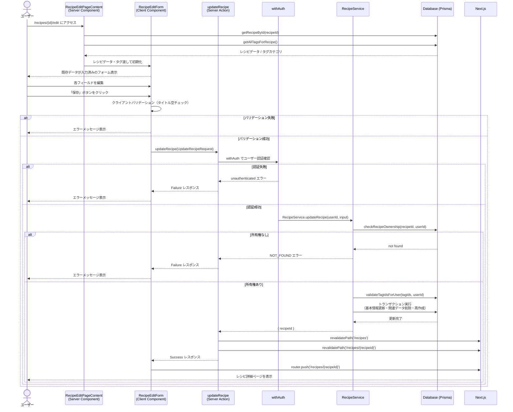

# レシピ編集

## 概要

既存のレシピを編集する機能。タイトル、材料、手順、ソース情報、タグ、子レシピ（サブレシピ）、メモなどを更新できる。認証済みユーザーが自分のレシピのみ編集可能。

## 機能仕様

### 目的

- 登録済みレシピの情報を修正・更新できるようにする
- 材料・手順の追加・削除・変更を柔軟に行えるようにする
- タグや子レシピの関連付けを管理できるようにする

### 機能詳細

#### 編集可能な項目
- **レシピタイトル**（必須、最大100文字）
- **ソース情報**（本の名前・ページ番号・参照URL）
- **材料**（名前・単位・備考、複数登録、追加・削除可能）
- **手順**（説明・タイマー秒数、複数登録、順序管理）
- **メモ**（最大1000文字）
- **タグ**（カテゴリ別チェックボックスで複数選択）
- **子レシピ**（サブレシピの関連付け、数量・備考付き）

#### UI/UX
- 既存データを初期値としてフォームに事前入力
- 画像がある場合はプレビュー表示
- 材料・手順は最低1件必須（canDelete制御）
- タグはカテゴリごとにグループ化されたチェックボックス方式
- フォーム送信中はローディング状態でボタンを無効化
- モバイル・デスクトップ両対応のレスポンシブなフォームアクション
- レイアウトヘッダーに詳細画面への戻るリンクを配置

#### その他
- 子レシピはダイアログ（ChildRecipeSelectorDialog）で選択
- 手順のorderIndexは自動的に再計算される
- URLはサニタイズ処理を経て保存される
- 更新後、レシピ一覧と詳細ページのキャッシュを無効化

### ユーザーフロー

```
1. レシピ詳細ページから編集ボタンをクリック
   ↓
2. /recipes/{id}/edit へ遷移
   ↓
3. RecipeEditPageContent が getRecipeById / getAllTagsForRecipe を並行実行
   ↓
4. RecipeEditForm に既存データが初期値として設定される
   ↓
5. ユーザーが各フィールドを編集
   ↓
6. 「保存」ボタンをクリック
   ↓
7. クライアント側でタイトルの空チェック
   ↓
8. updateRecipe Server Action を呼び出し
   ↓
9. [成功] → /recipes/{id} へリダイレクト
   [失敗] → エラーメッセージ表示、isSubmitting を false に戻す
```

## シーケンス図



## 技術仕様

### フロントエンド

#### コンポーネント構成

| コンポーネント | ファイル | タイプ |
|-------------|---------|--------|
| RecipeEditPage | `src/app/(auth)/recipes/[id]/edit/page.tsx` | Server Component |
| RecipeEditPageContent | `src/features/recipes/edit/recipe-edit-page-content.tsx` | Server Component |
| RecipeEditForm | `src/features/recipes/edit/recipe-edit-form.tsx` | Client Component |
| BasicInfoSection | `src/features/recipes/components/basic-info-section.tsx` | Client Component |
| TagSection | `src/features/recipes/components/tag-section.tsx` | Client Component |
| IngredientSection | `src/features/recipes/components/ingredient-section.tsx` | Client Component |
| StepSection | `src/features/recipes/components/step-section.tsx` | Client Component |
| ChildRecipeSection | `src/features/recipes/components/child-recipe-section.tsx` | Client Component |
| FormActions | `src/features/recipes/components/form-actions/index.tsx` | Client Component |

#### 状態管理

`useRecipeForm` カスタムフック（`src/features/recipes/hooks/use-recipe-form.ts`）で一元管理。

```typescript
// 管理する状態
- title: string                    // レシピタイトル
- sourceInfo: SourceInfoFormData   // ソース情報
- ingredients: IngredientFormData[] // 材料リスト
- steps: StepFormData[]            // 手順リスト
- memo: string                     // メモ
- selectedTagIds: string[]         // 選択済みタグID
- childRecipes: ChildRecipeItem[]  // 子レシピ
- isSubmitting: boolean            // 送信中フラグ
- error: string | null             // エラーメッセージ
- isChildRecipeDialogOpen: boolean // 子レシピ選択ダイアログ表示状態
```

#### 主要な処理フロー（フォーム送信）

```typescript
const handleSubmit = async () => {
  if (!title.trim()) {
    setError('タイトルを入力してください')
    return
  }
  setIsSubmitting(true)

  const request: UpdateRecipeRequest = {
    recipeId,
    title,
    sourceInfo,
    ingredients,
    steps: steps.map((step, index) => ({ ...step, orderIndex: index })),
    memo,
    tags: selectedTagIds,
    childRecipes,
  }

  const result = await updateRecipe(request)
  if (isSuccess(result)) {
    router.push(`/recipes/${recipeId}`)
  } else {
    setError(result.error.message)
    setIsSubmitting(false)
  }
}
```

### バックエンド

#### Server Action

- **ファイル**: `src/features/recipes/edit/actions.ts`
- **関数**: `updateRecipe(request: UpdateRecipeRequest): Promise<Result<{ recipeId: string }>>`
- **ディレクティブ**: `'use server'`

#### バリデーションスキーマ

```typescript
// src/backend/domain/recipes/validators.ts
export const updateRecipeInputSchema = z.object({
  recipeId: z.string().min(1, 'レシピIDが必要です'),
  title: z.string()
    .min(1, 'タイトルを入力してください')
    .max(100, 'タイトルは100文字以内で入力してください'),
  sourceInfo: sourceInfoInputSchema.nullable(),
  ingredients: z.array(ingredientInputSchema),
  steps: z.array(stepInputSchema.extend({ orderIndex: z.number() })),
  memo: z.string().max(1000, 'メモは1000文字以内').optional(),
  tags: z.array(z.string()),
  childRecipes: z.array(childRecipeRelationInputSchema).optional(),
})

// 個別スキーマ
// ingredientInputSchema: name(1-100文字), unit(0-50文字), notes(0-200文字)
// stepInputSchema: instruction(1-1000文字), timerSeconds(正数), orderIndex(オプション)
// sourceInfoInputSchema: bookName(0-200文字), pageNumber(0-20文字), url(0-2000文字)
// childRecipeRelationInputSchema: childRecipeId(必須), quantity(0-100文字), notes(0-500文字)
```

#### 処理フロー（Service層）

1. `withAuth` で認証確認
2. `RecipeRepository.checkRecipeOwnership()` で所有権確認
3. `TagRepository.validateTagIdsForUser()` でタグIDのバリデーション
4. Prisma トランザクション内で以下を実行：
   - レシピ基本情報の更新（title, memo）
   - 既存の関連データを一括削除（材料、手順、ソース情報、タグ、子レシピ）
   - 新しい材料を一括作成
   - 新しい手順を一括作成
   - 新しいソース情報を作成（URLサニタイズあり）
   - 新しいレシピタグを作成
   - 新しい子レシピ関係を作成（循環参照チェックあり）
5. `revalidatePath` でキャッシュ無効化

## データモデル

### Recipe モデル

```prisma
model Recipe {
  id        String   @id @default(uuid())
  userId    String   @map("user_id")
  title     String
  imageUrl  String?  @map("image_url")
  memo      String?
  createdAt DateTime @default(now()) @map("created_at")
  updatedAt DateTime @updatedAt @map("updated_at")

  user                 User
  ingredients          Ingredient[]
  steps                Step[]
  recipeTags           RecipeTag[]
  ocrProcessingHistory OcrProcessingHistory?
  recipeVersions       RecipeVersion[]
  sourceInfo           SourceInfo[]
  childRecipes         RecipeRelation[] @relation("ParentRecipe")
  parentRecipes        RecipeRelation[] @relation("ChildRecipe")
}
```

### 関連モデル（更新対象）

| モデル | フィールド | 説明 |
|-------|----------|------|
| Ingredient | name, unit, notes | 材料（削除・再作成） |
| Step | orderIndex, instruction, timerSeconds | 手順（削除・再作成） |
| SourceInfo | sourceType, sourceName, sourceUrl, pageNumber | ソース情報（削除・再作成） |
| RecipeTag | recipeId, tagId | タグ関連付け（削除・再作成） |
| RecipeRelation | parentRecipeId, childRecipeId, quantity, notes | 子レシピ関係（削除・再作成） |

## API仕様

### updateRecipe (Server Action)

#### 概要
認証済みユーザーが自分のレシピを更新するServer Action。トランザクションで全関連データを削除・再作成する。

#### シグネチャ
```typescript
async function updateRecipe(
  request: UpdateRecipeRequest
): Promise<Result<{ recipeId: string }>>
```

#### パラメータ

| 名前 | 型 | 説明 |
|------|------|------|
| request | UpdateRecipeRequest | 更新内容 |

#### UpdateRecipeRequest の構造

| フィールド名 | 型 | 必須 | バリデーション |
|------------|------|------|--------------|
| recipeId | string | ✓ | 1文字以上 |
| title | string | ✓ | 1〜100文字 |
| sourceInfo | SourceInfoFormData \| null | | bookName(0-200), pageNumber(0-20), url(0-2000) |
| ingredients | IngredientFormData[] | ✓ | name(1-100), unit(0-50), notes(0-200) |
| steps | StepFormData[] | ✓ | instruction(1-1000), timerSeconds(正数) |
| memo | string | | 最大1000文字 |
| tags | string[] | ✓ | タグID配列 |
| childRecipes | ChildRecipeFormData[] | | childRecipeId(必須), quantity(0-100), notes(0-500) |

#### 戻り値
```typescript
type Result<{ recipeId: string }> =
  | { ok: true; data: { recipeId: string } }
  | { ok: false; error: AppError }
```

#### エラーコード

| コード | メッセージ | 発生条件 |
|--------|-----------|---------|
| UNAUTHENTICATED | 認証が必要です | 未ログイン、またはプロフィール未設定 |
| NOT_FOUND | 見つかりません | レシピが存在しない、または他ユーザーのレシピ |
| VALIDATION_ERROR | バリデーションエラー | 入力値がスキーマに違反 |
| SERVER_ERROR | サーバーエラーが発生しました | 予期しないエラー |

#### 処理詳細
1. `withAuth` で認証状態を確認（Supabase Auth + プロフィール確認）
2. `updateRecipeInputSchema` でZodバリデーション実施
3. `RecipeService.updateRecipe(userId, input)` を呼び出し
4. Service内で所有権チェック・タグバリデーション・トランザクション処理
5. 成功時: `revalidatePath('/recipes')` と `revalidatePath('/recipes/{recipeId}')` を実行
6. `Result<{ recipeId: string }>` を返す

## テスト

### テストファイル
- **ファイル**: `src/features/recipes/edit/__tests__/recipe-edit-form.test.tsx`
- **フレームワーク**: Vitest + React Testing Library

### テストケース

1. **初期表示 - レシピのタイトルが表示される**
   - 既存レシピデータが正しく初期値として表示されること

2. **初期表示 - 材料が表示される**
   - 既存材料リストが正しくレンダリングされること

3. **初期表示 - 手順が表示される**
   - 既存手順リストが正しくレンダリングされること

4. **初期表示 - メモが表示される**
   - 既存メモが正しく表示されること

5. **初期表示 - ソース情報が表示される**
   - 既存ソース情報が正しく表示されること

6. **初期表示 - タグが読み込まれて選択状態が反映される**
   - 既存タグの選択状態が正しく反映されること

7. **初期表示 - 画像が表示される**
   - imageUrl がある場合にプレビュー画像が表示されること

## セキュリティ

### 実装されているセキュリティ対策

1. **認証チェック（withAuth）**
   - `src/utils/server-action/with-auth.ts`
   - すべてのServer Actionは `withAuth` ラッパーで保護
   - Supabase Auth によるセッション確認
   - プロフィール未設定ユーザーはアクセス不可

2. **所有権チェック**
   - `RecipeRepository.checkRecipeOwnership(recipeId, userId)` で確認
   - 他ユーザーのレシピは NOT_FOUND として扱い、存在有無を漏らさない

3. **入力バリデーション**
   - Zodスキーマ（`updateRecipeInputSchema`）によるサーバー側バリデーション
   - 文字数制限によるバッファオーバーフロー防止

4. **URLサニタイズ**
   - ソース情報のURLはサニタイズ処理を経て保存
   - XSS攻撃の防止

5. **Prismaによる安全なクエリ**
   - ORMを使用することでSQLインジェクション防止

## 配置場所

RecipeEditFormは以下の場所で使用されています：

1. **レシピ編集ページ**
   - `src/features/recipes/edit/recipe-edit-page-content.tsx`
   - Server Componentからレシピデータとタグカテゴリを受け取り表示

2. **ルート定義**
   - `src/app/(auth)/recipes/[id]/edit/page.tsx`
   - 認証ガード付きのレイアウト（`(auth)` グループ）内に配置
