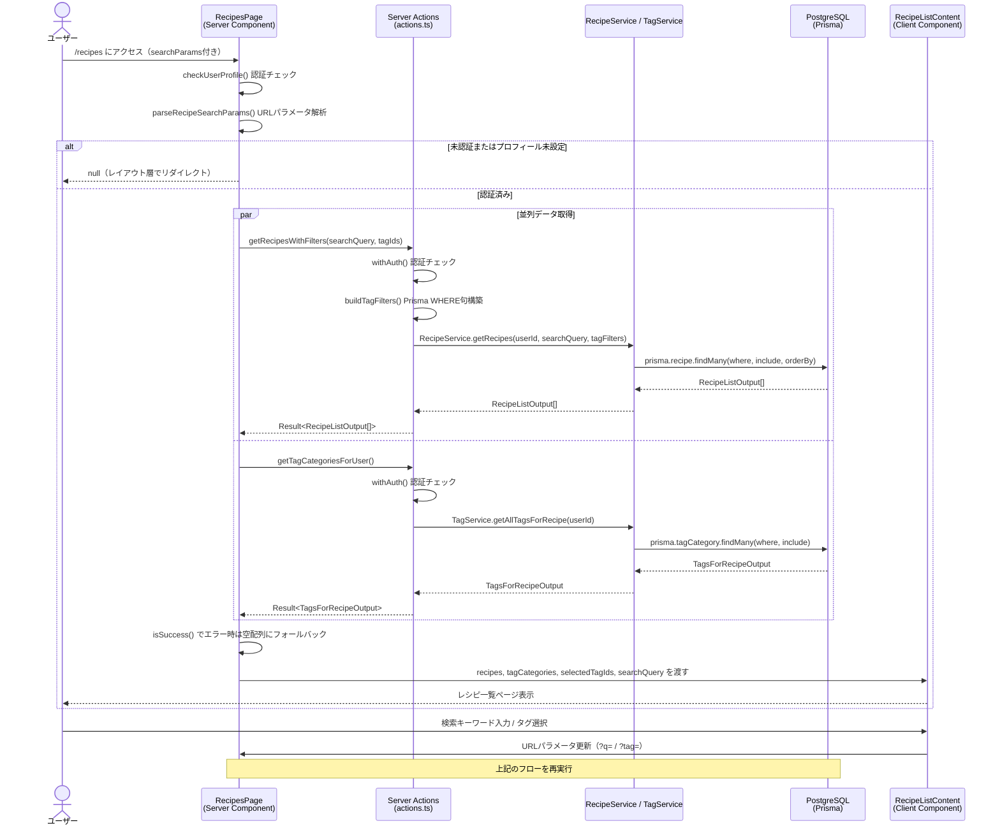

# レシピ一覧

## 概要

認証ユーザーが保存済みのレシピをグリッド形式で一覧表示する機能。レシピ名による検索とタグによるフィルタリングをURLパラメータで管理し、Server Componentでサーバー側にてデータを取得・レンダリングする。

## 機能仕様

### 目的

- 保存済みレシピを一覧で確認できるようにする
- レシピ名の部分一致検索でレシピを素早く見つける
- タグを複数選択してAND条件でレシピを絞り込む
- アクティブなタイマーがあるレシピをバナーで通知する

### 機能詳細

#### レシピグリッド表示
- 3カラムのグリッドレイアウトでレシピカードを表示
- 各カードに表示する情報：
  - レシピ画像（`imageUrl`がある場合のみ。ホバーで1.05倍スケール、グラデーションオーバーレイ）
  - レシピタイトル（ホバーでエメラルド色に変化）
  - 材料数（クリップボードアイコン + 数字 + "品目"）
  - タグ（最大3個表示、4個以上は"+N"と表示、アンバーカラー背景）
  - 作成日（日本語フォーマット: "YYYY年M月D日"、クロックアイコン付き）
- カード全体がレシピ詳細ページへのリンク（`/recipes/[id]`）

#### 統計バー
- 保存レシピ数の表示（"📖 保存レシピ数: {count}"）
- "レシピをスキャン"ボタン（`/recipes/new`へのリンク）

#### アクティブタイマーバナー
- タイマーが起動中のレシピがある場合にのみ表示
- 対象レシピへの直接リンクを表示

#### 検索機能
- URLクエリパラメータ `?q=検索キーワード` で管理
- レシピタイトルの部分一致・大文字小文字区別なし（`mode: 'insensitive'`）
- 前後の空白をトリム
- 空文字列では検索ボタンが無効化
- Enterキーまたは検索ボタンクリックで実行
- クリアボタンで検索をリセット
- 他のURLパラメータを保持したまま検索を更新
- 検索結果件数を表示

#### タグフィルター
- URLクエリパラメータ `?tag=id1&tag=id2` で管理（複数選択）
- タグカテゴリー別にグループ化して表示
- 複数タグの同時選択可能（AND条件）
- 選択状態をチェックマークと背景色で視覚的に表示
- "フィルタークリア"ボタンで全フィルター解除
- タグが存在しないカテゴリーは非表示
- 選択中のタグ数を表示

#### 空状態の表示
- フィルターなしの場合: "レシピがまだありません" + "レシピをスキャン"ボタン
- 検索クエリのみの場合: 検索ワードを含むメッセージ
- タグのみの場合: タグ選択に関するメッセージ
- 検索＋タグの場合: 両方の条件を含むメッセージ
- 条件がある場合は"すべてクリア"ボタンを表示

#### UI/UX
- URLパラメータベースの状態管理（ブラウザの戻る/進む対応、URL共有可能）
- ページ全体のローディングは `loading.tsx` + `PageLoading` コンポーネント
- `RecipeSearch` と `TagFilter` は個別にSuspenseでラップ（フォールバックは `null`）

### ユーザーフロー

```
1. /recipes にアクセス
   ↓
2. Server Componentがレシピ一覧とタグカテゴリーを並列取得
   ↓
3. レシピ一覧ページを表示（グリッド + 統計バー + 検索 + フィルター）
   ↓
4a. レシピ名を入力して検索
    URLに ?q= を追加 → Server Componentが再フェッチ → フィルタ適用された一覧表示
   ↓
4b. タグをクリックしてフィルタリング
    URLに ?tag= を追加 → Server Componentが再フェッチ → フィルタ適用された一覧表示
   ↓
5. レシピカードをクリック → /recipes/[id] へ遷移
```

## シーケンス図



## 技術仕様

### フロントエンド

#### コンポーネント構成
- **ファイル**: `src/app/(auth)/recipes/page.tsx`
- **タイプ**: Server Component（async）
- **スタイリング**: Tailwind CSS v4

#### 使用コンポーネント
| コンポーネント | ファイル | タイプ | 用途 |
|---|---|---|---|
| `RecipeListContent` | `src/features/recipes/list/recipe-list-content.tsx` | Client Component | 一覧コンテナ（Suspenseラップ） |
| `RecipeGrid` | `src/features/recipes/list/recipe-grid.tsx` | Client Component | グリッド表示 |
| `RecipeSearch` | `src/features/recipes/list/recipe-search.tsx` | Client Component | 検索フォーム |
| `TagFilter` | `src/features/recipes/list/tag-filter.tsx` | Client Component | タグフィルター |
| `RecipeStatsBar` | `src/features/recipes/list/recipe-stats-bar.tsx` | Client Component | 統計バー |
| `RecipeEmptyState` | `src/features/recipes/list/recipe-empty-state.tsx` | Client Component | 空状態表示 |
| `ActiveTimerBanner` | `src/features/recipes/list/active-timer-banner.tsx` | Client Component | タイマーバナー |
| `AuthLayoutWrapper` | `src/components/layouts/auth-layout-wrapper.tsx` | - | 認証済みレイアウト |
| `PageContainer` | `src/components/layouts/page-container.tsx` | - | ページコンテナ |
| `BackToDashboardLink` | `src/components/navigation/back-to-dashboard-link.tsx` | - | ダッシュボードリンク |
| `PageLoading` | - | - | ページローディング（loading.tsx） |

#### URLパラメータ管理
```typescript
type SearchParams = Promise<{ tag?: string | string[]; q?: string }>
```

### バックエンド

#### Server Actions
- **ファイル**: `src/features/recipes/list/actions.ts`
- **ディレクティブ**: `'use server'`

| 関数名 | シグネチャ | 概要 |
|---|---|---|
| `getRecipesWithFilters` | `(searchQuery: string, tagIds: string[]) => Promise<Result<RecipeListOutput[]>>` | フィルタ条件付きレシピ取得 |
| `getTagCategoriesForUser` | `() => Promise<Result<TagsForRecipeOutput>>` | タグカテゴリー取得 |

#### ユーティリティ
- **ファイル**: `src/features/recipes/list/utils.ts`

| 関数名 | シグネチャ | 概要 |
|---|---|---|
| `parseRecipeSearchParams` | `(searchParams) => { tagIds, searchQuery }` | URLパラメータの解析 |
| `buildTagFilters` | `(tagIds: string[]) => Prisma.RecipeWhereInput[] \| undefined` | Prisma WHERE句の構築 |

#### 処理フロー（getRecipesWithFilters）
1. `withAuth()` で認証チェック・ユーザープロフィール取得
2. `buildTagFilters()` でタグIDをPrisma `AND` 条件に変換
3. `RecipeService.getRecipes()` でレシピ取得
4. 成功時: `success(recipes)` を返す
5. 例外時: `failure(Errors.server('レシピの取得に失敗しました'))` を返す

#### 使用ライブラリ
- `prisma` - ORMクライアント
- `withAuth` (`src/utils/server-action`) - 認証ラッパー
- `Result` / `success` / `failure` / `Errors` (`src/utils/result`) - エラーハンドリング

### Prismaクエリ詳細

#### レシピ取得 (`findRecipesByUser`)
```typescript
prisma.recipe.findMany({
  where: {
    userId,
    ...(searchQuery && {
      title: { contains: searchQuery, mode: 'insensitive' },
    }),
    ...(tagFilters && { AND: tagFilters }),
  },
  include: {
    ingredients: true,
    recipeTags: {
      include: { tag: true },
    },
  },
  orderBy: { createdAt: 'desc' },
})
```

#### タグフィルタークエリ構造
```typescript
// tagIds = ['tag1', 'tag2'] の場合
AND: [
  { recipeTags: { some: { tagId: 'tag1' } } },
  { recipeTags: { some: { tagId: 'tag2' } } },
]
// 両方のタグを持つレシピのみが返される（AND条件）
```

#### タグカテゴリー取得 (`findTagCategoriesByUser`)
```typescript
prisma.tagCategory.findMany({
  where: {
    OR: [
      { isSystem: true },
      { userId },
    ],
  },
  include: {
    tags: { orderBy: { name: 'asc' } },
  },
  orderBy: { createdAt: 'asc' },
})
```

## データモデル

### RecipeListOutput 型（一覧表示用）

```typescript
type RecipeListOutput = {
  id: string
  title: string
  imageUrl: string | null
  createdAt: Date
  ingredients: Array<{ id: string; name: string; unit: string | null; notes: string | null; recipeId: string; createdAt: Date; updatedAt: Date }>
  recipeTags: Array<{
    tagId: string
    tag: {
      id: string
      name: string
    }
  }>
}
```

### 関連テーブル
- `recipes` - レシピ本体
- `ingredients` - 材料（材料数カウントに使用）
- `recipe_tags` - レシピとタグの中間テーブル
- `tags` - タグ
- `tag_categories` - タグカテゴリー

## API仕様

### getRecipesWithFilters (Server Action)

#### 概要
フィルタ条件（検索クエリ・タグID）に基づいて、認証ユーザーのレシピ一覧を取得する。

#### シグネチャ
```typescript
async function getRecipesWithFilters(
  searchQuery: string,
  tagIds: string[]
): Promise<Result<RecipeListOutput[]>>
```

#### パラメータ
| 名前 | 型 | 説明 |
|------|------|------|
| `searchQuery` | `string` | レシピタイトルの部分一致検索キーワード（空文字列の場合はフィルタなし） |
| `tagIds` | `string[]` | フィルタリングするタグIDの配列（空配列の場合はフィルタなし） |

#### 戻り値
```typescript
// 成功時
{ ok: true; data: RecipeListOutput[] }

// 失敗時
{ ok: false; error: AppError }
```

#### エラーコード
| コード | メッセージ | 発生条件 |
|--------|-----------|---------|
| `UNAUTHENTICATED` | - | 未認証またはプロフィール未設定 |
| `SERVER_ERROR` | `'レシピの取得に失敗しました'` | DBエラーなど予期しない例外 |

---

### getTagCategoriesForUser (Server Action)

#### 概要
認証ユーザーが利用可能なタグカテゴリー（システム共通 + ユーザー作成）とタグを取得する。

#### シグネチャ
```typescript
async function getTagCategoriesForUser(): Promise<Result<TagsForRecipeOutput>>
```

#### 戻り値
```typescript
// 成功時
{ ok: true; data: TagsForRecipeOutput }

// 失敗時
{ ok: false; error: AppError }
```

#### エラーコード
| コード | メッセージ | 発生条件 |
|--------|-----------|---------|
| `UNAUTHENTICATED` | - | 未認証またはプロフィール未設定 |
| `SERVER_ERROR` | `'タグカテゴリの取得に失敗しました'` | DBエラーなど予期しない例外 |

## テスト

### テストファイル
- **フレームワーク**: Vitest + React Testing Library

| テストファイル | テスト数 | 主なテスト内容 |
|---|---|---|
| `recipe-list-content.test.tsx` | 7 | レシピ/空状態の表示、統計バー、フィルター条件 |
| `recipe-grid.test.tsx` | 11 | カード表示、リンク、画像、材料数、タグ、作成日フォーマット |
| `recipe-search.test.tsx` | 19+ | 初期表示、検索入力、検索実行、クリア、結果カウント、URL同期 |
| `tag-filter.test.tsx` | 10 | タグ表示、選択/解除、複数選択、クリアボタン、空カテゴリー非表示 |
| `recipe-empty-state.test.tsx` | 8 | フィルタなし/あり/検索のみ/タグのみ/両方の空状態メッセージ |
| `recipe-stats-bar.test.tsx` | 8 | レシピ数表示（0/1/複数）、スキャンボタン |
| `utils.test.ts` | 12+ | parseRecipeSearchParams、buildTagFilters |

## セキュリティ

### 実装されているセキュリティ対策

1. **認証チェック**
   - `checkUserProfile()` でページアクセス時に認証を確認
   - `withAuth()` ラッパーで各Server Actionの認証を統一管理

2. **ユーザー所有権の確認**
   - Prismaクエリに `userId` を必ず含め、他ユーザーのデータを返さない

3. **入力値の無害化**
   - 検索クエリは `trim()` で前後の空白を除去
   - PrismaのParameterized Queryを使用するためSQLインジェクション対策済み

## 配置場所

レシピ一覧ページは以下の場所でアクセスされます：

1. **ダッシュボード**
   - ダッシュボードページからのナビゲーションリンク

2. **直接アクセス**
   - `src/app/(auth)/recipes/page.tsx`
   - パス: `/recipes`
   - 認証済みユーザーのみアクセス可能（`(auth)` ルートグループ）
