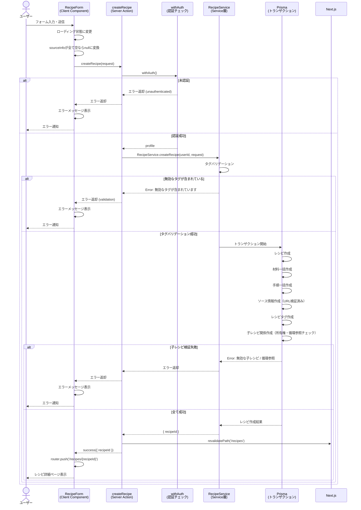

# レシピ手動作成機能

## 概要

CookScanアプリケーションのレシピ手動作成機能は、ユーザーがフォームを使って直接レシピ情報を入力・登録するための機能です。タイトル、材料、調理手順、タグ、サブレシピ、ソース情報（料理本・URL）など、レシピに必要な情報を包括的に入力でき、Prismaトランザクションによるデータ整合性を保証しながらレシピを作成します。

## 機能仕様

### 目的

- ユーザーが手動でレシピ情報を入力し、データベースに保存できるようにする
- 材料、調理手順、タグ、サブレシピなど、レシピの多面的な情報を一括で登録する
- 料理本やWebサイトなどの出典情報を紐づけて管理する

### 機能詳細

#### 基本情報入力
- レシピタイトル（必須）
- ソース情報（すべて任意）
  - 本の名前
  - ページ番号
  - 参照URL
- メモ（任意、テキストエリア）

#### タグ選択
- カテゴリ別にグループ化されたタグをチェックボックス形式で複数選択可能
- 選択されたタグは視覚的にハイライト表示（緑背景＋チェックアイコン）
- システムタグとユーザー作成タグの両方が表示される

#### 材料入力
- 材料名（必須）、分量（任意）、メモ（任意）の3フィールド
- 動的に追加・削除が可能（最低1つは必須）
- 1つしかない場合は削除ボタンが無効化される
- デスクトップとモバイルでレスポンシブなレイアウト

#### サブレシピ入力
- ダイアログから既存レシピを検索・選択して追加
- 分量（任意、最大100文字）とメモ（任意、最大500文字）を設定可能
- 循環参照チェック・自己参照チェック機能あり
- サブレシピ未追加の場合は「サブレシピが追加されていません」と表示

#### 調理手順入力
- 手順の説明（必須、テキストエリア）とタイマー秒数（任意、数値）
- 手順番号は自動採番（orderIndex管理）
- 動的に追加・削除が可能（最低1つは必須）
- 削除時にorderIndexを自動再調整

#### UI/UX
- レスポンシブデザイン対応（デスクトップ・モバイル）
- タイトル未入力時は保存ボタンが無効化される
- 送信中はローディング状態を表示
- エラー時はフォーム上部にAlertコンポーネントで表示
- キャンセルボタンでレシピ一覧（`/recipes`）に遷移
- 画像アップロード・テキスト入力からの抽出データがある場合は初期値として反映

#### その他
- OCR・テキスト入力からの抽出データを初期値として受け取り可能（`extractedData` props）
- アップロード画像がある場合は画像プレビューを表示

### ユーザーフロー

```
1. ユーザーがレシピ作成ページ (/recipes/upload) にアクセス
   ↓
2. 作成方法として「手動作成」を選択
   ↓
3. RecipeFormが表示される
   ↓
4. 基本情報（タイトル、ソース情報、メモ）を入力
   ↓
5. タグを選択（任意）
   ↓
6. 材料を入力（追加・削除可能）
   ↓
7. サブレシピを追加（任意、ダイアログから検索・選択）
   ↓
8. 調理手順を入力（追加・削除可能）
   ↓
9. 「レシピを保存」ボタンをクリック
   ↓
10. Server Action (createRecipe) を呼び出し
    ├─ 認証チェック失敗 → エラーメッセージ表示
    ├─ バリデーション失敗 → エラーメッセージ表示
    └─ 成功
       ↓
11. レシピ詳細ページ (/recipes/{recipeId}) へリダイレクト
```

## シーケンス図



## 技術仕様

### フロントエンド

#### コンポーネント構成
- **ファイル**: `src/features/recipes/upload/recipe-form.tsx`
- **タイプ**: Client Component (`'use client'`)
- **スタイリング**: Tailwind CSS v4

#### 使用コンポーネント
- `Input` - テキスト入力フィールド
- `Textarea` - テキストエリア（メモ、手順の説明）
- `Card`, `CardHeader`, `CardContent` - セクションレイアウト
- `Alert` - エラーメッセージ表示
- `IngredientInput` - 材料入力コンポーネント
- `StepInput` - 手順入力コンポーネント
- `ChildRecipeInput` - サブレシピ入力コンポーネント
- `ChildRecipeSelectorDialog` - サブレシピ検索・選択ダイアログ
- `FormActions` - 送信・キャンセルボタン
- アイコン: `CameraIcon`, `InfoCircleIcon`, `TagIcon`, `BookOpenIcon`, `DocumentIcon`, `LinkIcon`, `DocumentTextIcon`, `CheckSolidIcon`, `BeakerIcon`, `PlusIcon`, `ClipboardListIcon`, `FolderIcon`

#### 状態管理
```typescript
// RecipeForm コンポーネント
const [isSubmitting, setIsSubmitting] = useState(false) // 送信中状態
const [error, setError] = useState<string | null>(null) // エラーメッセージ
const [isChildRecipeDialogOpen, setIsChildRecipeDialogOpen] = useState(false) // ダイアログ開閉

// useRecipeForm カスタムフック（状態管理とロジックを統一）
const {
  title, setTitle,
  sourceInfo, setSourceInfo,
  ingredients,  // IngredientFormData[]
  steps,        // StepFormData[]
  memo, setMemo,
  selectedTagIds,
  childRecipes, // ChildRecipeItem[]
  addIngredient, removeIngredient, updateIngredient,
  addStep, removeStep, updateStep,
  addChildRecipe, removeChildRecipe, updateChildRecipe,
  toggleTag,
} = useRecipeForm({ initialData: { ... } })
```

#### 主要な処理フロー
```typescript
const handleSubmit = async (e: React.FormEvent) => {
  e.preventDefault()
  setError(null)
  setIsSubmitting(true)

  try {
    const result = await createRecipe({
      title,
      sourceInfo: sourceInfo.bookName || sourceInfo.pageNumber || sourceInfo.url
        ? sourceInfo : null,
      ingredients,
      steps,
      memo,
      tags: selectedTagIds,
      childRecipes: childRecipes.map(cr => ({
        childRecipeId: cr.childRecipeId,
        quantity: cr.quantity || undefined,
        notes: cr.notes || undefined,
      })),
    })

    if (isSuccess(result)) {
      router.push(`/recipes/${result.data.recipeId}`)
    } else {
      setError(result.error.message)
      setIsSubmitting(false)
    }
  } catch (err) {
    setError('エラーが発生しました')
    setIsSubmitting(false)
  }
}
```

### バックエンド

#### Server Action
- **ファイル**: `src/features/recipes/upload/actions.ts`
- **関数**: `createRecipe(request: CreateRecipeRequest): Promise<Result<{ recipeId: string }>>`
- **ディレクティブ**: `'use server'`

#### バリデーションスキーマ
```typescript
// src/backend/domain/recipes/validators.ts

export const createRecipeInputSchema = z.object({
  title: z.string().min(1, 'タイトルを入力してください'),
  sourceInfo: z.object({
    bookName: z.string().optional(),
    pageNumber: z.string().optional(),
    url: z.string().optional(),
  }).nullable(),
  ingredients: z.array(z.object({
    name: z.string().min(1, '材料名を入力してください'),
    unit: z.string().optional(),
    notes: z.string().optional(),
  })),
  steps: z.array(z.object({
    instruction: z.string().min(1, '手順を入力してください'),
    timerSeconds: z.number().optional(),
    orderIndex: z.number().optional(),
  })),
  memo: z.string().optional(),
  tags: z.array(z.string()),
  childRecipes: z.array(z.object({
    childRecipeId: z.string().min(1, '子レシピを選択してください'),
    quantity: z.string().max(100, '分量は100文字以内').optional(),
    notes: z.string().max(500, 'メモは500文字以内').optional(),
  })).optional(),
})
```

#### 処理フロー
1. `withAuth()` で認証チェック（Supabase Auth）
2. `RecipeService.createRecipe()` を呼び出し
3. タグのバリデーション（ユーザーが使用可能なタグか確認）
4. Prismaトランザクション開始
   - レシピ本体を作成
   - 材料を一括作成
   - 手順を一括作成
   - ソース情報を作成（URL検証済み）
   - レシピタグを作成
   - 子レシピ関係を作成（所有権・循環参照チェック）
5. トランザクションコミット
6. `revalidatePath('/recipes')` でキャッシュ再検証
7. 成功結果（`{ recipeId }`）を返却

#### 使用ライブラリ
- `zod` - バリデーション
- `@prisma/client` - データベース操作・トランザクション管理
- `next/cache` - キャッシュ再検証

### カスタムフック

#### ファイル
- `src/features/recipes/hooks/use-recipe-form.ts`

#### 主要関数
```typescript
export function useRecipeForm(options: UseRecipeFormOptions = {}): {
  // 状態: title, sourceInfo, ingredients, steps, memo, selectedTagIds, childRecipes
  // Setters: setTitle, setSourceInfo, setIngredients, setSteps, setMemo, setSelectedTagIds, setChildRecipes
  // 材料操作: addIngredient, removeIngredient, updateIngredient
  // 手順操作: addStep, removeStep, updateStep (タイマーのNaNチェック含む)
  // サブレシピ操作: addChildRecipe, removeChildRecipe, updateChildRecipe
  // タグ操作: toggleTag
}
```

レシピ作成フォーム・編集フォームで共通して使用される状態管理とロジックを提供するカスタムフック。手順の`orderIndex`自動管理やタイマー入力のNaNチェックなどを統一的に処理する。

### URL検証ユーティリティ

#### ファイル
- `src/utils/url-validation.ts`

#### 主要関数
```typescript
export function sanitizeUrl(url: string | null | undefined): string | null
// http/https プロトコルのみ許可。javascript:, data:, file: 等は拒否
```

## データモデル

### Recipe モデル

```prisma
model Recipe {
  id        String   @id @default(uuid())
  userId    String
  title     String
  imageUrl  String?
  memo      String?
  createdAt DateTime @default(now())
  updatedAt DateTime @updatedAt

  user              User                 @relation(fields: [userId], references: [id])
  ingredients       Ingredient[]
  steps             Step[]
  recipeTags        RecipeTag[]
  ocrProcessingHistory OcrProcessingHistory?
  recipeVersions    RecipeVersion[]
  sourceInfos       SourceInfo[]
  parentRelations   RecipeRelation[]     @relation("ParentRecipe")
  childRelations    RecipeRelation[]     @relation("ChildRecipe")
}
```

#### 関連テーブル
- `ingredients` - 材料（name, unit, notes）
- `steps` - 調理手順（orderIndex, instruction, timerSeconds）
- `source_infos` - ソース情報（sourceType, sourceName, sourceUrl, pageNumber）
- `recipe_tags` - レシピタグ中間テーブル
- `recipe_relations` - レシピ親子関係（parentRecipeId, childRecipeId, quantity, notes）

#### 主要制約
- カスケード削除設定（レシピ削除時に関連データも削除）
- 親子レシピの組み合わせにユニーク制約
- 外部キー制約（参照整合性）

## API仕様

### createRecipe (Server Action)

#### 概要
手動入力されたレシピデータをデータベースに保存する

#### シグネチャ
```typescript
async function createRecipe(request: CreateRecipeRequest): Promise<Result<{ recipeId: string }>>
```

#### パラメータ
| 名前 | 型 | 説明 |
|------|------|------|
| request | CreateRecipeRequest | レシピ作成リクエストデータ |

#### CreateRecipeRequest フィールド
| フィールド名 | 型 | 必須 | バリデーション |
|------------|------|------|--------------|
| title | string | ✓ | 1文字以上 |
| sourceInfo | SourceInfoInput \| null | | 全フィールド空ならnull |
| sourceInfo.bookName | string | | |
| sourceInfo.pageNumber | string | | |
| sourceInfo.url | string | | http/httpsのみ許可 |
| ingredients | IngredientInput[] | ✓ | 各材料のnameは1文字以上 |
| steps | StepInput[] | ✓ | 各手順のinstructionは1文字以上 |
| memo | string | | |
| tags | string[] | ✓ | ユーザー使用可能なタグIDのみ |
| childRecipes | ChildRecipeInput[] | | 所有権・循環参照チェック |

#### 戻り値
```typescript
Result<{ recipeId: string }> =
  | { ok: true; data: { recipeId: string } }
  | { ok: false; error: { code: string; message: string } }
```

#### エラーコード
| コード | メッセージ | 発生条件 |
|--------|-----------|---------|
| UNAUTHENTICATED | 認証が必要です | 未ログイン状態 |
| UNAUTHENTICATED | プロフィール設定が必要です | プロフィール未設定 |
| VALIDATION | 無効なタグが含まれています | 使用不可能なタグIDが指定された |
| VALIDATION | 無効な子レシピが含まれています | 他ユーザーのレシピをサブレシピに指定 |
| VALIDATION | 循環参照が検出されました。子レシピの設定を見直してください | サブレシピの循環参照 |
| SERVER | レシピの作成に失敗しました | その他のサーバーエラー |

#### 処理詳細
1. `withAuth()` で認証チェック（Supabase Auth + プロフィール確認）
2. `RecipeService.createRecipe()` を呼び出し
3. タグIDのバリデーション（ユーザーが所有/使用可能か確認）
4. Prismaトランザクション内で以下を実行:
   - レシピ本体を作成
   - 材料を一括作成
   - 手順を一括作成（orderIndex付き）
   - ソース情報を作成（URLは`sanitizeUrl()`で検証）
   - レシピタグ関連を作成
   - 子レシピ関係を作成（所有権チェック → BFSによる循環参照チェック）
5. `revalidatePath('/recipes')` でキャッシュ再検証
6. 成功結果 `{ recipeId }` を返却

## テスト

### テストファイル
- **ファイル**: `src/features/recipes/upload/__tests__/recipe-form.test.tsx`
- **フレームワーク**: Vitest + React Testing Library

### テストケース

1. **正常系：抽出されたデータでフォームが表示される**
   - extractedDataのタイトル、ソース情報、メモがフォームに反映されることを確認

2. **正常系：imageUrlが提供された場合に画像プレビューが表示される**
   - 画像プレビューの表示とsrc属性を確認

3. **正常系：抽出されたデータから材料が表示される**
   - 材料名、分量、メモが正しく表示されることを確認

4. **正常系：抽出されたデータから手順が表示される**
   - 手順の説明とタイマー秒数が正しく表示されることを確認

5. **正常系：タグカテゴリが読み込まれ表示される**
   - カテゴリ名とタグ名が表示されることを確認

6. **正常系：タグを選択・解除できる**
   - チェックボックスのトグル動作を確認

7. **正常系：新しい材料を追加できる**
   - 「材料を追加」ボタンで入力欄が増えることを確認

8. **正常系：材料が2つ以上ある場合に材料を削除できる**
   - 削除ボタンで材料が削除されることを確認

9. **異常系：材料が1つしかない場合、削除ボタンが無効化される**
   - 最低1材料の制約を確認

10. **正常系：新しい手順を追加できる**
    - 「手順を追加」ボタンで入力欄が増えることを確認

11. **正常系：手順が2つ以上ある場合に手順を削除できる**
    - 削除ボタンで手順が削除されることを確認

12. **正常系：ユーザー入力で材料フィールドが更新される**
    - 材料名の編集が反映されることを確認

13. **正常系：ユーザー入力で手順フィールドが更新される**
    - 手順の説明の編集が反映されることを確認

14. **正常系：正しいデータでフォームを送信し、成功時にナビゲートする**
    - Server Actionが正しいデータで呼ばれ、レシピ詳細ページに遷移することを確認

15. **異常系：送信エラー時にアラートが表示される**
    - エラーメッセージがAlertコンポーネントで表示されることを確認

16. **異常系：タイトルが空の場合、送信ボタンが無効化される**
    - タイトル必須バリデーションを確認

17. **正常系：キャンセルボタンをクリックするとレシピ一覧ページにナビゲートする**
    - `/recipes` へのナビゲーションを確認

18. **正常系：すべての出典フィールドが空の場合、sourceInfoがnullで送信される**
    - sourceInfoのnull変換ロジックを確認

19. **正常系：選択されたタグとともにフォームを送信する**
    - タグIDが正しくリクエストに含まれることを確認

## セキュリティ

### 実装されているセキュリティ対策

1. **認証チェック（withAuth）**
   - すべてのServer Actionで`withAuth()`による認証チェックを実施
   - Supabase Authによるセキュアな認証
   - プロフィール未設定の場合もエラーを返却

2. **タグ所有権チェック**
   - `TagRepository.validateTagIdsForUser()` でユーザーが使用可能なタグのみ許可
   - システムタグとユーザー作成タグの両方を検証

3. **子レシピ所有権チェック**
   - `RecipeRelationRepository.validateChildRecipeOwnership()` で自分のレシピのみサブレシピに追加可能

4. **循環参照チェック**
   - BFSアルゴリズムでサブレシピの循環参照を検出
   - 自己参照（自分自身をサブレシピに設定）も防止

5. **URL検証（sanitizeUrl）**
   - http/httpsプロトコルのみ許可
   - 危険なプロトコル（javascript:, data:, file: 等）を拒否

6. **トランザクション管理**
   - すべてのDB操作はPrismaトランザクション内で実行
   - エラー発生時は自動的にロールバック

7. **XSS対策**
   - Reactの自動エスケープ機能を活用
   - ユーザー入力は常にエスケープされて表示

## 配置場所

RecipeFormは以下の場所で使用されています：

1. **レシピ作成ページ**
   - `src/app/(auth)/recipes/upload/page.tsx`
   - RecipeUploadContent内で手動作成方法が選択された場合に表示

2. **レシピアップロードフロー**
   - `src/features/recipes/upload/recipe-upload-content.tsx`
   - 手動作成・画像アップロード・テキスト入力の3つの方法から選択後、RecipeFormが表示される
