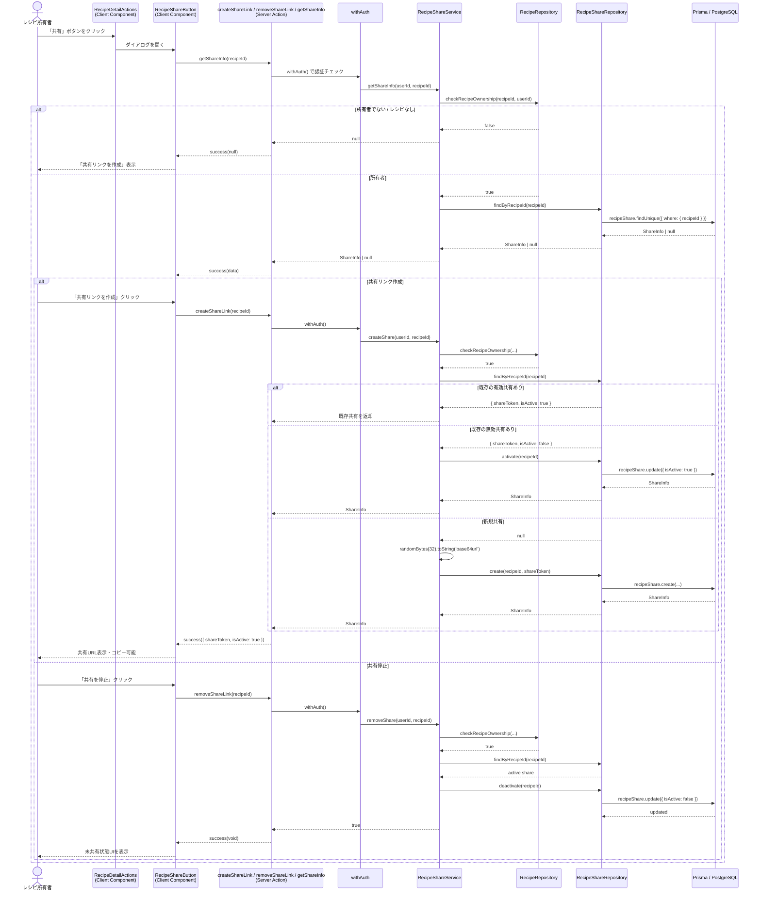
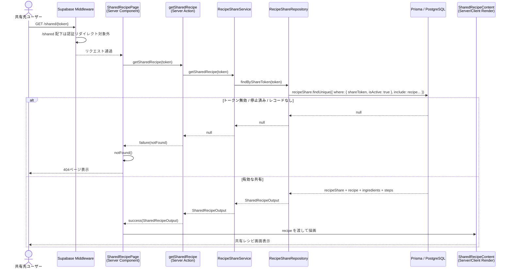

# レシピ共有

## 概要

レシピ詳細画面から共有リンクを発行し、未ログインユーザーを含む第三者にレシピを閲覧してもらう機能。共有リンクは停止（無効化）でき、再度共有を開始した場合は既存トークンを再有効化して再利用する。

## 機能仕様

### 目的

- レシピ所有者が簡単にレシピを外部共有できるようにする
- 共有対象には閲覧に必要な最小限の情報のみを公開する
- 共有リンクをいつでも停止できるようにする

### 機能詳細

#### 共有リンク作成・停止（レシピ所有者）

- レシピ詳細画面のアクションバーに「共有」ボタンを表示
- 共有ダイアログを開くと、現在の共有状態を取得して表示
- 未共有時は「共有リンクを作成」ボタンを表示
- 共有中は共有URL表示、コピー、共有停止を表示
- 共有停止はレコード削除ではなく `isActive=false` に更新（無効化）
- 共有再開時に既存共有レコードがあれば、同じトークンを再有効化して再利用

#### 公開ページ（共有先ユーザー）

- URL: `/shared/[token]`
- 未認証アクセスを許可（Supabase middleware の認証除外）
- 表示対象は共有用に限定された情報のみ
- 表示項目: タイトル、画像、材料、手順（タイマー秒数表示を含む）
- 非表示項目: メモ、タグ、ソース情報、編集/削除などの操作
- 無効トークン・停止済み共有・存在しない共有は `notFound()` で404表示

#### UI/UX

- 共有操作はモーダルダイアログ内で完結
- コピー成功時はボタン表示を「コピー済み」に2秒間切り替え
- 共有URLは読み取り専用の入力欄に表示
- 共有ページは専用レイアウト（中央寄せ・最大幅制限）で表示

### ユーザーフロー

```
1. レシピ詳細画面（/recipes/[id]）を開く
   ↓
2. アクションバーの「共有」ボタンをクリック
   ↓
3. 共有ダイアログが開き、共有状態を取得
   ↓
4a. 未共有の場合: 「共有リンクを作成」をクリック
    ↓
5a. サーバーで共有トークンを作成（または既存トークンを再有効化）
    ↓
6a. 共有URLが表示され、コピー可能になる
    ↓
7a. URLを共有相手へ送る

4b. 共有中の場合: 共有URLをコピー
    ↓
5b. 必要に応じて「共有を停止」をクリック
    ↓
6b. 共有リンクが無効化される

8. 共有相手が `/shared/[token]` にアクセス
   ↓
9a. 有効な共有: 公開レシピページを表示
9b. 無効/停止/不存在: 404ページを表示
```

## シーケンス図

### 共有リンク作成・停止（所有者）



### 共有ページ閲覧（未認証可）



## 技術仕様

### フロントエンド

#### コンポーネント構成

| コンポーネント | ファイルパス | タイプ | 役割 |
|---|---|---|---|
| RecipeShareButton | `src/features/recipes/share/recipe-share-button.tsx` | Client Component | 共有ダイアログ、共有作成/停止/コピーUI |
| SharedRecipePage | `src/app/(shared)/shared/[token]/page.tsx` | Server Component | 共有トークンで公開レシピ取得、404制御 |
| SharedRecipeContent | `src/features/recipes/share/shared-recipe-content.tsx` | Component | 共有レシピの公開表示 |
| SharedLayout | `src/app/(shared)/layout.tsx` | Server Component | 公開ページ用レイアウト |
| RecipeDetailActions | `src/features/recipes/detail/recipe-detail-actions.tsx` | Client Component | 共有ボタンの配置元 |

#### 使用コンポーネント

- `Dialog`, `DialogContent`, `DialogHeader`, `DialogTitle`, `DialogDescription` - 共有ダイアログ
- `Button` - 共有作成、コピー、共有停止ボタン
- アイコン: `LinkIcon`, `CheckIcon`
- `next/image` - 共有レシピ画像表示

#### 状態管理

```typescript
const [isOpen, setIsOpen] = useState(false)
const [isLoading, setIsLoading] = useState(false)
const [shareToken, setShareToken] = useState<string | null>(null)
const [isActive, setIsActive] = useState(false)
const [copied, setCopied] = useState(false)
```

#### 主要な処理フロー

```typescript
// ダイアログを開いた時だけ共有状態を取得
useEffect(() => {
  if (isOpen) fetchShareInfo()
}, [isOpen, fetchShareInfo])

// 共有URLはクライアントで origin を組み立てる
const shareUrl = shareToken ? `${window.location.origin}/shared/${shareToken}` : ''
```

### バックエンド

#### Server Action（所有者向け）

- **ファイル**: `src/features/recipes/share/actions.ts`
- **関数**:
  - `createShareLink(recipeId: string): Promise<Result<ShareInfoOutput>>`
  - `removeShareLink(recipeId: string): Promise<Result<void>>`
  - `getShareInfo(recipeId: string): Promise<Result<ShareInfoOutput | null>>`
- **ディレクティブ**: `'use server'`

#### Server Action（公開ページ向け）

- **ファイル**: `src/features/recipes/share/public-actions.ts`
- **関数**: `getSharedRecipe(token: string): Promise<Result<SharedRecipeOutput>>`
- **ディレクティブ**: `'use server'`

#### 処理フロー

1. 所有者向け操作は `withAuth()` で認証・プロフィール確認
2. `RecipeRepository.checkRecipeOwnership()` で所有権を確認
3. 共有作成時は既存共有レコードの有無と `isActive` 状態を判定
4. 新規作成時のみ `randomBytes(32).toString('base64url')` でトークン生成
5. 共有停止時は `recipeShare` レコードを削除せず `isActive=false`
6. 公開ページ向け取得は認証不要で `shareToken + isActive=true` を条件に検索

#### 使用ライブラリ

- `crypto` (`randomBytes`) - 共有トークン生成
- `@prisma/client` - `recipe_shares` 参照/更新
- `@/utils/result` - Result型レスポンス
- `@/utils/server-action/with-auth` - 所有者向け操作の認証ラッパー

### リポジトリ層

#### ファイル

- `src/backend/repositories/recipe-share.repository.ts`

#### 主要関数

```typescript
findByShareToken(shareToken: string): Promise<SharedRecipeOutput | null>
findByRecipeId(recipeId: string): Promise<ShareInfoOutput | null>
create(recipeId: string, shareToken: string): Promise<ShareInfoOutput>
deactivate(recipeId: string): Promise<void>
activate(recipeId: string): Promise<ShareInfoOutput>
```

### ミドルウェア

#### ファイル

- `src/lib/supabase/middleware.ts`

#### 役割

- `/shared` 配下へのアクセスをログインリダイレクト対象から除外し、公開ページ閲覧を許可する

## データモデル

### RecipeShare モデル

```prisma
model RecipeShare {
  id         String   @id @default(uuid())
  recipeId   String   @unique @map("recipe_id")
  shareToken String   @unique @map("share_token")
  isActive   Boolean  @default(true) @map("is_active")
  createdAt  DateTime @default(now()) @map("created_at")
  updatedAt  DateTime @updatedAt @map("updated_at")

  recipe Recipe @relation(fields: [recipeId], references: [id], onDelete: Cascade)

  @@map("recipe_shares")
}
```

#### 関連フィールド

- `recipeId`: `Recipe` との1対1関係（1レシピにつき1共有レコード）
- `shareToken`: 公開URLに埋め込むユニークトークン
- `isActive`: 共有中かどうかの有効フラグ

## API仕様

### createShareLink (Server Action)

#### 概要

レシピ所有者が共有リンクを作成する。既存共有がある場合は状態に応じて再利用/再有効化する。

#### シグネチャ

```typescript
async function createShareLink(recipeId: string): Promise<Result<ShareInfoOutput>>
```

#### パラメータ

| 名前 | 型 | 説明 |
|------|------|------|
| recipeId | string | 共有対象レシピID |

#### 戻り値

```typescript
type ShareInfoOutput = {
  shareToken: string
  isActive: boolean
}
```

#### エラーコード

| コード | メッセージ | 発生条件 |
|--------|-----------|---------|
| UNAUTHENTICATED | 認証が必要です | 未ログイン |
| NOT_FOUND | レシピが見つかりません | 所有者でない / レシピ不存在 |

### removeShareLink (Server Action)

#### 概要

共有リンクを停止（無効化）する。

#### シグネチャ

```typescript
async function removeShareLink(recipeId: string): Promise<Result<void>>
```

#### パラメータ

| 名前 | 型 | 説明 |
|------|------|------|
| recipeId | string | 対象レシピID |

#### エラーコード

| コード | メッセージ | 発生条件 |
|--------|-----------|---------|
| UNAUTHENTICATED | 認証が必要です | 未ログイン |
| NOT_FOUND | 共有リンクが見つかりません | 共有未作成 / 既に停止済み / 所有者でない |

### getShareInfo (Server Action)

#### 概要

レシピ詳細画面の共有ダイアログ表示時に、共有状態を取得する。

#### シグネチャ

```typescript
async function getShareInfo(recipeId: string): Promise<Result<ShareInfoOutput | null>>
```

### getSharedRecipe (Server Action)

#### 概要

共有トークンから公開用レシピ情報を取得する（認証不要）。

#### シグネチャ

```typescript
async function getSharedRecipe(token: string): Promise<Result<SharedRecipeOutput>>
```

## セキュリティ

### 実装されているセキュリティ対策

1. **所有権チェック**
   - 共有作成/停止/共有状態取得は `RecipeRepository.checkRecipeOwnership()` を通す

2. **推測困難なトークン**
   - `randomBytes(32).toString('base64url')` で高エントロピーなトークンを生成

3. **公開情報の最小化**
   - 公開ページではタイトル・画像・材料・手順のみを返却し、メモ/タグ/ソース情報は返さない

4. **無効化フラグによる公開停止**
   - `isActive=false` の共有は公開取得クエリで除外される

## 配置場所

`RecipeShareButton` は以下の場所で使用されています：

1. **レシピ詳細画面のアクションバー**
   - `src/features/recipes/detail/recipe-detail-actions.tsx`
   - 共有・編集・ダウンロード・削除ボタンと並列に表示
