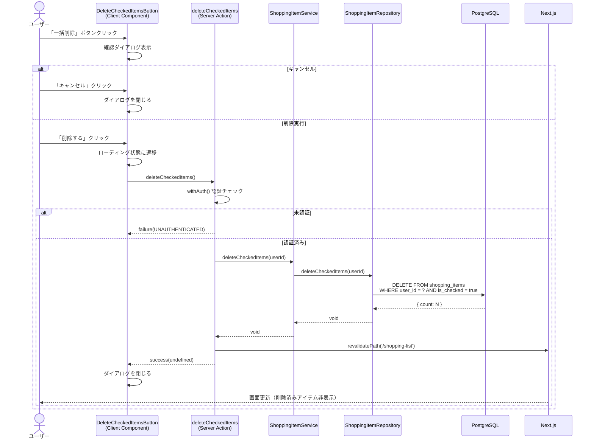

# 買い物リスト一括削除

## 概要

チェック済み（購入済み）の買い物アイテムをまとめて削除する機能。買い物リスト画面の「購入済み」セクションに表示される一括削除ボタンから、確認ダイアログを経て削除を実行する。

## 機能仕様

### 目的

- 購入済みアイテムを一括で削除し、買い物リストを整理する
- 個別削除の手間を省き、操作効率を向上させる

### 機能詳細

#### 一括削除の対象
- `isChecked: true`（チェック済み）のアイテムのみが削除対象
- 未チェックのアイテムは削除されない

#### 削除確認ダイアログ
- 削除前に確認ダイアログを表示し、誤操作を防止する
- ダイアログタイトル: 「購入済みアイテムを削除」
- 確認メッセージ: 「チェック済みのアイテムをすべて削除しますか？」
- 「キャンセル」「削除する」の2つのアクションを提供

#### UI/UX
- 一括削除ボタンはチェック済みアイテムが1件以上ある場合のみ表示
- ボタンスタイル: `danger-ghost`バリアント（小サイズ）、TrashIconアイコン付き
- 削除処理中はボタンがdisabledになり「削除中...」と表示
- 削除成功後、ダイアログが自動的に閉じる
- 削除失敗時はダイアログを開いたまま維持（再試行可能）

### ユーザーフロー

```
1. 買い物リスト画面を表示
   ↓
2. 「購入済み」セクションの「一括削除」ボタンをクリック
   ↓
3. 確認ダイアログが表示される
   ↓
4a. 「削除する」をクリック → チェック済みアイテムが全件削除される → ダイアログが閉じる
4b. 「キャンセル」をクリック → ダイアログが閉じる（削除なし）
```

## シーケンス図



## 技術仕様

### フロントエンド

#### コンポーネント構成
- **ファイル**: `src/features/shopping-list/components/delete-checked-items-button.tsx`
- **タイプ**: Client Component（`'use client'`）
- **スタイリング**: Tailwind CSS

#### 使用コンポーネント
- `Button` - 一括削除ボタン、ダイアログ内のキャンセル・削除ボタン
- `Dialog`（Radix UI） - 確認ダイアログ
- アイコン: `TrashIcon`, `WarningIcon`

#### 状態管理
```typescript
const [isOpen, setIsOpen] = useState(false)        // ダイアログの開閉
const [isPending, startTransition] = useTransition() // 削除処理の非同期状態
```

#### 配置場所
- `src/features/shopping-list/components/shopping-list-content.tsx`
- チェック済みアイテムセクションのヘッダー部分に配置
- 表示条件: `checkedItems.length > 0`

### バックエンド

#### Server Action
- **ファイル**: `src/features/shopping-list/actions.ts`
- **関数**: `deleteCheckedItems(): Promise<Result<void>>`
- **ディレクティブ**: `'use server'`

#### バリデーション
- 専用のZodスキーマなし（パラメータ不要のため）
- ユーザーIDは認証時に自動取得

#### 処理フロー
1. `withAuth`で認証チェック・ユーザープロフィール取得
2. `ShoppingItemService.deleteCheckedItems(userId)`を呼び出し
3. `revalidatePath('/shopping-list')`でキャッシュ無効化
4. `success(undefined)`を返却

#### サービス層
- **ファイル**: `src/backend/services/shopping-items/shopping-item.service.ts`
- リポジトリ層への委譲のみ

#### リポジトリ層
- **ファイル**: `src/backend/repositories/shopping-item.repository.ts`
- `prisma.shoppingItem.deleteMany({ where: { userId, isChecked: true } })`
- 単一クエリで一括削除（トランザクション不要）

## データモデル

### ShoppingItem モデル

```prisma
model ShoppingItem {
  id           String   @id @default(uuid())
  userId       String   @map("user_id")
  name         String
  memo         String?
  isChecked    Boolean  @default(false) @map("is_checked")
  displayOrder Int      @map("display_order")
  createdAt    DateTime @default(now()) @map("created_at")
  updatedAt    DateTime @updatedAt @map("updated_at")

  user User @relation(fields: [userId], references: [id])

  @@map("shopping_items")
}
```

#### 一括削除に関連するフィールド
- `userId`: ユーザーIDによるフィルタリング（認可の基盤）
- `isChecked`: 削除対象の識別子（`true`のアイテムのみ削除）

## API仕様

### deleteCheckedItems (Server Action)

#### 概要
チェック済みの買い物アイテムを一括削除する。

#### シグネチャ
```typescript
async function deleteCheckedItems(): Promise<Result<void>>
```

#### パラメータ
なし（ユーザーIDは認証から自動取得）

#### 戻り値
```typescript
type Result<void> =
  | { type: 'success'; data: undefined }
  | { type: 'failure'; error: AppError }
```

#### エラーコード
| コード | メッセージ | 発生条件 |
|--------|-----------|---------|
| `UNAUTHENTICATED` | 認証が必要です | 未ログイン状態 |
| `UNAUTHENTICATED` | プロフィール設定が必要です | プロフィール未設定 |
| `SERVER_ERROR` | チェック済みアイテムの削除に失敗しました | DB操作失敗等 |

#### 処理詳細
1. `withAuth`で認証チェック（未認証の場合はエラー返却）
2. `ShoppingItemService.deleteCheckedItems(profile.id)`を呼び出し
3. リポジトリ層で`deleteMany`を実行（`userId` AND `isChecked: true`）
4. `revalidatePath('/shopping-list')`でキャッシュ無効化
5. `success(undefined)`を返却

## テスト

### テストファイル

#### UIコンポーネントテスト
- **ファイル**: `src/features/shopping-list/components/__tests__/delete-checked-items-button.test.tsx`
- **フレームワーク**: Vitest + React Testing Library

#### テストケース
1. **一括削除ボタンが表示される**
2. **ボタンクリックでダイアログが表示される**
3. **キャンセルボタンでダイアログが閉じる**
4. **削除ボタンクリックでdeleteCheckedItemsが呼ばれる**
5. **削除成功後、ダイアログが閉じる**
6. **削除中は両ボタンがdisabledになる**

#### サービス層テスト
- **ファイル**: `src/backend/services/shopping-items/__tests__/shopping-item.service.test.ts`

#### テストケース
1. **チェック済みアイテムを一括削除できる** - リポジトリへの正しい引数渡しを検証

#### 統合テスト
- **ファイル**: `src/features/shopping-list/components/__tests__/shopping-list-content.test.tsx`

#### テストケース
1. **チェック済みアイテムがある場合、一括削除ボタンが表示される**

## セキュリティ

### 実装されているセキュリティ対策

1. **認証チェック**
   - `withAuth`ヘルパーによるSupabaseセッション検証
   - 未認証ユーザーは即座にエラー返却

2. **認可（ユーザー所有権の確認）**
   - ユーザーIDは`profile.id`から自動取得（ユーザー入力不可）
   - リポジトリ層のクエリに`userId`条件を含むため、他ユーザーのアイテムは削除不可

3. **多層防御**
   - 認証（withAuth） → ユーザーID自動注入 → クエリレベルの絞り込み
