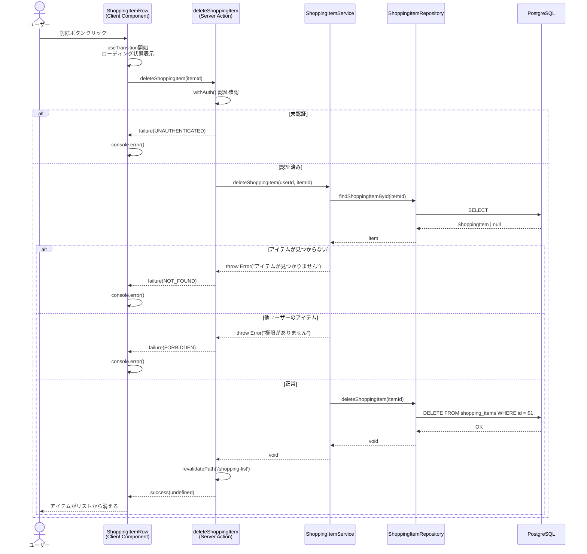
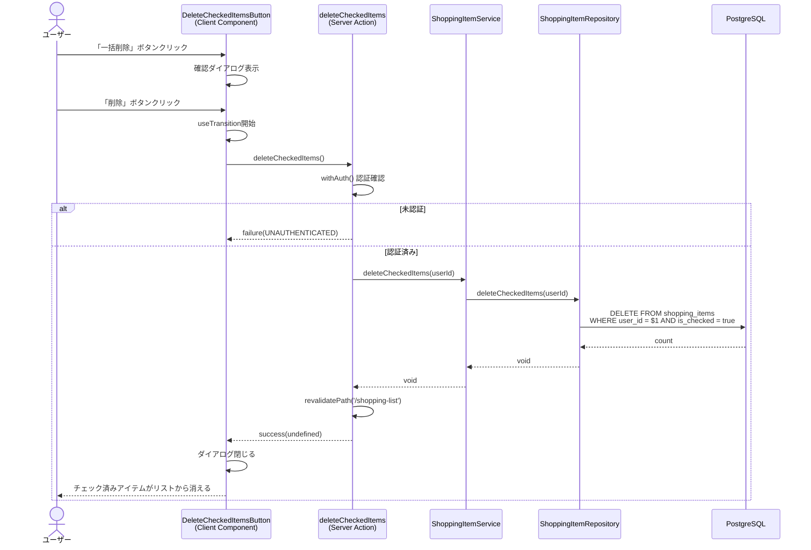

# 買い物リスト削除

## 概要

買い物リストのアイテムを削除する機能。個別削除とチェック済みアイテムの一括削除の2種類を提供する。

## 機能仕様

### 目的

- 不要になった買い物アイテムをリストから削除する
- 購入済み（チェック済み）のアイテムをまとめて削除し、リストを整理する

### 機能詳細

#### 個別削除

- 各アイテム行の右側にある削除ボタン（ゴミ箱アイコン）をクリックして削除
- 確認ダイアログなし（即座に削除実行）
- 削除中はボタンがローディング状態になる

#### チェック済み一括削除

- 購入済みセクションのヘッダーに「一括削除」ボタンを表示（チェック済みアイテムが1件以上ある場合のみ）
- クリックすると確認ダイアログを表示
- ダイアログで「削除」を押すと、チェック済みアイテムをすべて削除

#### UI/UX

- 個別削除ボタン: `danger-ghost`バリアント、アイコンのみ、`aria-label="削除"`
- 一括削除ボタン: `danger-ghost`バリアント、`sm`サイズ、ゴミ箱アイコン＋テキスト
- 確認ダイアログ: 赤〜オレンジのグラデーションヘッダー、警告アイコン付き
- 削除中のローディング状態表示（個別: ボタンスピナー、一括: ボタン disabled）

### ユーザーフロー

#### 個別削除

```
1. 買い物リスト画面を表示
   ↓
2. 対象アイテムの削除ボタン（ゴミ箱アイコン）をクリック
   ↓
3. 削除ボタンがローディング状態になる
   ↓
4. Server Actionで削除処理実行
   ↓
5. revalidatePathでページ更新、アイテムがリストから消える
```

#### チェック済み一括削除

```
1. 買い物リスト画面の購入済みセクションを表示
   ↓
2. 「一括削除」ボタンをクリック
   ↓
3. 確認ダイアログが表示される
   ↓
4. 「削除」ボタンをクリック
   ↓
5. Server Actionで一括削除処理実行
   ↓
6. ダイアログが閉じ、revalidatePathでページ更新
```

## シーケンス図

### 個別削除



### チェック済み一括削除



## 技術仕様

### フロントエンド

#### コンポーネント構成

| ファイル | タイプ | 役割 |
|---------|--------|------|
| `src/features/shopping-list/components/shopping-item-row.tsx` | Client Component | 個別アイテム行（削除ボタン含む） |
| `src/features/shopping-list/components/delete-checked-items-button.tsx` | Client Component | チェック済み一括削除ボタン＋確認ダイアログ |
| `src/features/shopping-list/components/shopping-list-content.tsx` | Client Component | メインリスト（一括削除ボタンの配置） |
| `src/app/(auth)/shopping-list/page.tsx` | Server Component | ページ（初期データ取得） |

#### 状態管理

```typescript
// 個別削除 - shopping-item-row.tsx
const [isDeletePending, startDeleteTransition] = useTransition()

// 一括削除 - delete-checked-items-button.tsx
const [isOpen, setIsOpen] = useState(false)  // ダイアログ表示状態
const [isPending, startTransition] = useTransition()
```

#### 主要な処理フロー

```typescript
// 個別削除 - shopping-item-row.tsx
const handleDelete = () => {
  startDeleteTransition(async () => {
    const result = await deleteShoppingItem(item.id)
    if (!isSuccess(result)) {
      console.error('Failed to delete item:', result.error.message)
    }
  })
}

// 一括削除 - delete-checked-items-button.tsx
const handleDelete = () => {
  startTransition(async () => {
    const result = await deleteCheckedItems()
    if (isSuccess(result)) {
      setIsOpen(false)
    }
  })
}
```

### バックエンド

#### Server Action

- **ファイル**: `src/features/shopping-list/actions.ts`
- **ディレクティブ**: `'use server'`

| 関数 | シグネチャ |
|------|-----------|
| `deleteShoppingItem` | `(itemId: string) => Promise<Result<void>>` |
| `deleteCheckedItems` | `() => Promise<Result<void>>` |

#### Service層

- **ファイル**: `src/backend/services/shopping-items/shopping-item.service.ts`

| 関数 | 処理内容 |
|------|---------|
| `deleteShoppingItem(userId, itemId)` | 存在確認→所有権確認→削除 |
| `deleteCheckedItems(userId)` | チェック済みアイテム一括削除 |

#### Repository層

- **ファイル**: `src/backend/repositories/shopping-item.repository.ts`

| 関数 | Prisma操作 |
|------|-----------|
| `deleteShoppingItem(itemId)` | `prisma.shoppingItem.delete({ where: { id } })` |
| `deleteCheckedItems(userId)` | `prisma.shoppingItem.deleteMany({ where: { userId, isChecked: true } })` |

#### 処理フロー（個別削除）

1. `withAuth()`で認証確認
2. `ShoppingItemService.deleteShoppingItem(userId, itemId)`呼び出し
3. `findShoppingItemById(itemId)`でアイテム存在確認
4. `item.userId !== userId`で所有権確認
5. `deleteShoppingItem(itemId)`で物理削除
6. `revalidatePath('/shopping-list')`でキャッシュ無効化

#### 処理フロー（一括削除）

1. `withAuth()`で認証確認
2. `ShoppingItemService.deleteCheckedItems(userId)`呼び出し
3. `deleteMany({ where: { userId, isChecked: true } })`で一括物理削除
4. `revalidatePath('/shopping-list')`でキャッシュ無効化

## データモデル

### ShoppingItem モデル

```prisma
model ShoppingItem {
  id           String   @id @default(uuid())
  userId       String   @map("user_id")
  name         String
  memo         String?
  isChecked    Boolean  @default(false) @map("is_checked")
  displayOrder Int      @map("display_order")
  createdAt    DateTime @default(now()) @map("created_at")
  updatedAt    DateTime @updatedAt @map("updated_at")

  user User @relation(fields: [userId], references: [id])

  @@map("shopping_items")
}
```

#### 削除関連フィールド

- `id`: UUIDベースのPK（削除対象の特定に使用）
- `userId`: 所有権確認に使用
- `isChecked`: 一括削除の条件フィルタに使用

## API仕様

### deleteShoppingItem (Server Action)

#### 概要

指定したIDの買い物アイテムを削除する。

#### シグネチャ

```typescript
async function deleteShoppingItem(itemId: string): Promise<Result<void>>
```

#### パラメータ

| 名前 | 型 | 説明 |
|------|------|------|
| itemId | string | 削除対象のアイテムID (UUID) |

#### 戻り値

```typescript
Result<void>  // success(undefined) | failure(AppError)
```

#### エラーコード

| コード | メッセージ | 発生条件 |
|--------|-----------|---------|
| UNAUTHENTICATED | 認証が必要です | 未認証状態でのアクセス |
| NOT_FOUND | アイテムが見つかりません | 存在しないIDを指定 |
| FORBIDDEN | このアイテムを削除する権限がありません | 他ユーザーのアイテムを指定 |
| SERVER_ERROR | 買い物アイテムの削除に失敗しました | その他のサーバーエラー |

### deleteCheckedItems (Server Action)

#### 概要

認証ユーザーのチェック済み買い物アイテムをすべて削除する。

#### シグネチャ

```typescript
async function deleteCheckedItems(): Promise<Result<void>>
```

#### パラメータ

なし（認証ユーザーのIDは`withAuth()`から取得）

#### 戻り値

```typescript
Result<void>  // success(undefined) | failure(AppError)
```

#### エラーコード

| コード | メッセージ | 発生条件 |
|--------|-----------|---------|
| UNAUTHENTICATED | 認証が必要です | 未認証状態でのアクセス |
| SERVER_ERROR | チェック済みアイテムの削除に失敗しました | その他のサーバーエラー |

## テスト

### テストファイル

| ファイル | フレームワーク | テスト対象 |
|---------|--------------|-----------|
| `src/backend/services/shopping-items/__tests__/shopping-item.service.test.ts` | Vitest | Service層の削除ロジック |
| `src/features/shopping-list/components/__tests__/shopping-item-row.test.tsx` | Vitest + React Testing Library | 削除ボタンUI操作 |

### テストケース

#### Service層

1. **自分のアイテムを削除できる**
   - 権限確認後、正常に削除が実行される

2. **アイテムが見つからない場合はエラーを投げる**
   - "アイテムが見つかりません" エラーが発生

3. **他ユーザーのアイテムは削除できない**
   - "このアイテムを削除する権限がありません" エラーが発生

4. **チェック済みアイテムを一括削除できる**
   - `deleteCheckedItems(userId)`が正常に実行される

#### UI層

1. **削除ボタンをクリックするとdeleteShoppingItemが呼ばれる**
   - 正しいitemIdでServer Actionが呼び出される

## セキュリティ

### 実装されているセキュリティ対策

1. **認証チェック**
   - `withAuth()`ラッパーでSupabase認証状態とプロフィール存在を確認
   - 未認証の場合は`UNAUTHENTICATED`エラーを返却

2. **所有権チェック（個別削除）**
   - Service層でDBから取得したアイテムの`userId`と認証ユーザーのIDを比較
   - 不一致の場合は`FORBIDDEN`エラーを返却

3. **所有権チェック（一括削除）**
   - `deleteMany()`のWHERE条件に`userId`を含めることで、自分のアイテムのみ削除対象にする

4. **SQLインジェクション対策**
   - Prisma ORMの型安全なクエリビルダーにより防止

5. **UUIDベースのID**
   - 予測困難なUUIDを使用し、ID推測による不正アクセスを防止

## 配置場所

### 個別削除ボタン

- `src/features/shopping-list/components/shopping-item-row.tsx`
- 各アイテム行の右側アクションエリア（編集ボタンの右隣）

### 一括削除ボタン

- `src/features/shopping-list/components/shopping-list-content.tsx`
- 購入済みセクションのヘッダー部分（チェック済みアイテムが存在する場合のみ表示）

## 補足・メモ

- 削除は物理削除（論理削除ではない）
- 個別削除には確認ダイアログがない（即座に削除実行）
- 一括削除のみ確認ダイアログあり
- 削除時のOptimistic Updateは未実装（チェック状態のOptimistic Updateは実装済み）
- UI層のエラー通知は`console.error()`のみ（Toast等のユーザー通知なし）
