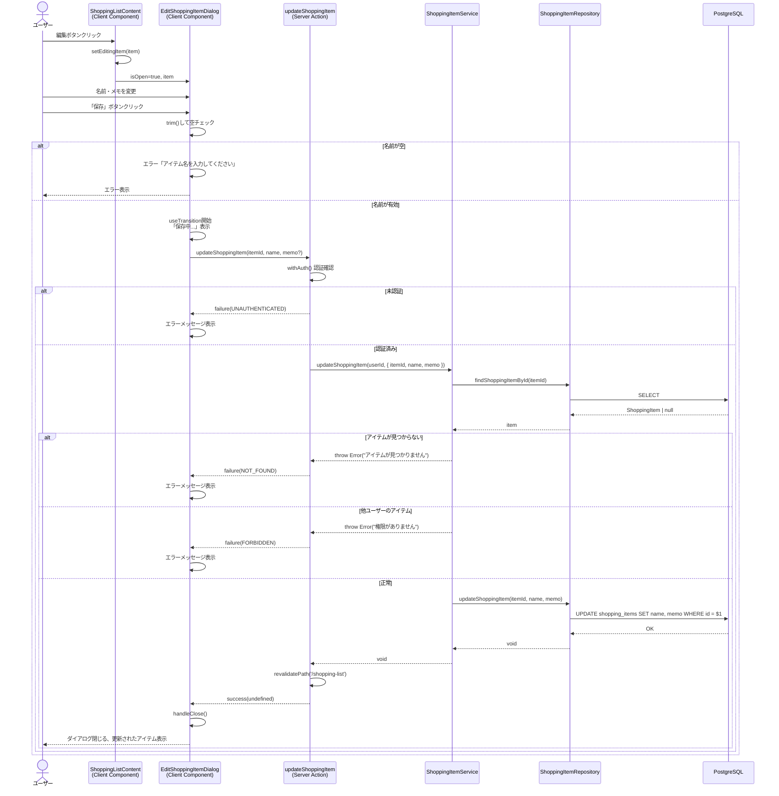
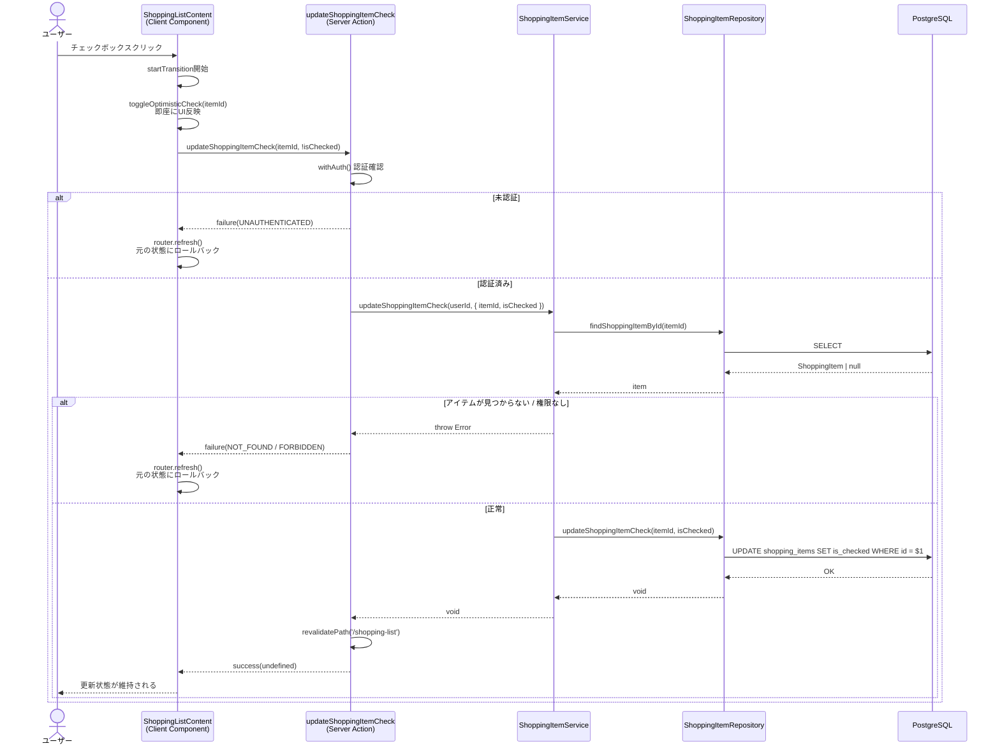
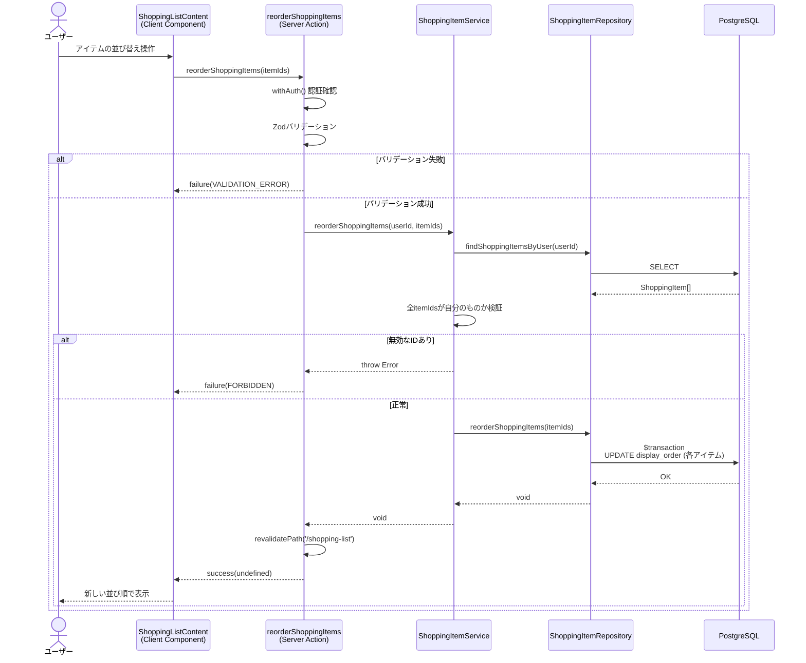

# 買い物リスト更新

## 概要

買い物リストのアイテムを更新する機能。アイテム名・メモの編集、チェック状態の切り替え、並び順の変更の3種類を提供する。チェック状態の切り替えにはOptimistic Updateを採用し、即座にUIに反映される。

## 機能仕様

### 目的

- 買い物アイテムの名前やメモを修正する
- アイテムの購入済み/未購入の状態を切り替える
- アイテムの表示順序を変更する

### 機能詳細

#### アイテム編集（名前・メモ）

- 各アイテム行の編集ボタン（鉛筆アイコン）をクリックすると編集ダイアログが開く
- ダイアログ内でアイテム名とメモを変更可能
- アイテム名は必須、メモは任意
- `key={item.id}`によるダイアログの再マウントで、異なるアイテム編集時にフォーム状態を確実にリセット

#### チェック状態の切り替え

- アイテム行のチェックボックスをクリックして購入済み/未購入を切り替え
- `useOptimistic`によるOptimistic Updateで即座にUIに反映
- サーバー処理失敗時は`router.refresh()`で自動ロールバック
- チェック済みアイテムは「購入済み」セクションに移動し、打ち消し線で表示

#### 並び順の変更

- アイテムIDの配列を送信して一括で表示順序を更新
- トランザクションで一括更新し、整合性を保証

#### UI/UX

- 編集ダイアログ: emerald〜tealのグラデーションヘッダー、鉛筆アイコン付き
- チェックボックス: カスタムUI（緑色）、チェック済みは打ち消し線表示
- 保存中のローディング状態表示（「保存中...」テキスト、ボタンdisabled）
- フォームのautoFocusでアイテム名入力欄に自動フォーカス

#### その他

- 編集ダイアログのエラーはダイアログ内にインライン表示
- チェック切り替えのエラーは`router.refresh()`によるサイレントロールバック

### ユーザーフロー

#### アイテム編集

```
1. 買い物リスト画面を表示
   ↓
2. 対象アイテムの編集ボタン（鉛筆アイコン）をクリック
   ↓
3. 編集ダイアログが開き、現在の名前・メモが表示される
   ↓
4. 名前やメモを変更して「保存」ボタンをクリック
   ↓
5. Server Actionで更新処理実行
   ↓
6. 成功: ダイアログが閉じ、revalidatePathでページ更新
   失敗: ダイアログ内にエラーメッセージ表示
```

#### チェック状態の切り替え

```
1. 買い物リスト画面を表示
   ↓
2. アイテムのチェックボックスをクリック
   ↓
3. Optimistic Updateで即座にUI反映（チェック状態トグル）
   ↓
4. Server Actionでサーバー側の状態を更新
   ↓
5. 成功: そのまま反映維持
   失敗: router.refresh()で元の状態にロールバック
```

## シーケンス図

### アイテム編集



### チェック状態の切り替え



### 並び順の変更



## 技術仕様

### フロントエンド

#### コンポーネント構成

| ファイル | タイプ | 役割 |
|---------|--------|------|
| `src/features/shopping-list/components/shopping-list-content.tsx` | Client Component | メインリスト（チェック切り替え、編集ダイアログ管理） |
| `src/features/shopping-list/components/edit-shopping-item-dialog.tsx` | Client Component | 編集ダイアログ（名前・メモの更新フォーム） |
| `src/features/shopping-list/components/shopping-item-row.tsx` | Client Component | 個別アイテム行（チェックボックス、編集ボタン） |
| `src/app/(auth)/shopping-list/page.tsx` | Server Component | ページ（初期データ取得） |

#### 状態管理

```typescript
// チェック切り替え（Optimistic Update） - shopping-list-content.tsx
const [optimisticItems, toggleOptimisticCheck] = useOptimistic(
  items,
  (state, itemId: string) =>
    state.map((item) =>
      item.id === itemId ? { ...item, isChecked: !item.isChecked } : item
    )
)
const [isCheckPending, startTransition] = useTransition()

// 編集対象アイテム管理 - shopping-list-content.tsx
const [editingItem, setEditingItem] = useState<ShoppingItemOutput | null>(null)

// 編集フォーム - edit-shopping-item-dialog.tsx (EditShoppingItemForm)
const [name, setName] = useState(item.name)
const [memo, setMemo] = useState(item.memo || '')
const [error, setError] = useState<string | null>(null)
const [isPending, startTransition] = useTransition()
```

#### 主要な処理フロー

```typescript
// チェック切り替え（Optimistic Update） - shopping-list-content.tsx
const handleToggleCheck = (itemId: string) => {
  const item = optimisticItems.find((i) => i.id === itemId)
  if (!item) return
  startTransition(async () => {
    toggleOptimisticCheck(itemId)  // 即座にUI更新
    const result = await updateShoppingItemCheck(itemId, !item.isChecked)
    if (!isSuccess(result)) {
      router.refresh()  // 失敗時にロールバック
    }
  })
}

// アイテム編集 - edit-shopping-item-dialog.tsx
const handleSubmit = (e: React.FormEvent) => {
  e.preventDefault()
  const trimmedName = name.trim()
  if (!trimmedName) {
    setError('アイテム名を入力してください')
    return
  }
  startTransition(async () => {
    const result = await updateShoppingItem(item.id, trimmedName, memo.trim() || undefined)
    if (isSuccess(result)) {
      handleClose()
    } else {
      setError(result.error.message)
    }
  })
}
```

### バックエンド

#### Server Action

- **ファイル**: `src/features/shopping-list/actions.ts`
- **ディレクティブ**: `'use server'`

| 関数 | シグネチャ |
|------|-----------|
| `updateShoppingItem` | `(itemId: string, name: string, memo?: string) => Promise<Result<void>>` |
| `updateShoppingItemCheck` | `(itemId: string, isChecked: boolean) => Promise<Result<void>>` |
| `reorderShoppingItems` | `(itemIds: string[]) => Promise<Result<void>>` |

#### バリデーションスキーマ

```typescript
// 更新 - validators.ts
const updateShoppingItemInputSchema = z.object({
  itemId: z.string().min(1, 'アイテムIDが必要です'),
  name: z.string().min(1, 'アイテム名を入力してください'),
  memo: z.string().optional(),
})

// チェック状態更新
const updateShoppingItemCheckInputSchema = z.object({
  itemId: z.string().min(1, 'アイテムIDが必要です'),
  isChecked: z.boolean(),
})

// 並び順更新
const reorderShoppingItemsInputSchema = z.object({
  itemIds: z.array(z.string().min(1)).min(1, '並び替えるアイテムが必要です'),
})
```

#### Service層

- **ファイル**: `src/backend/services/shopping-items/shopping-item.service.ts`

| 関数 | 処理内容 |
|------|---------|
| `updateShoppingItem(userId, input)` | 存在確認→所有権確認→名前・メモ更新 |
| `updateShoppingItemCheck(userId, input)` | 存在確認→所有権確認→チェック状態更新 |
| `reorderShoppingItems(userId, itemIds)` | 全アイテム取得→所有権一括確認→トランザクションで並び順更新 |

#### Repository層

- **ファイル**: `src/backend/repositories/shopping-item.repository.ts`

| 関数 | Prisma操作 |
|------|-----------|
| `updateShoppingItem(itemId, name, memo?)` | `prisma.shoppingItem.update({ where: { id }, data: { name, memo } })` |
| `updateShoppingItemCheck(itemId, isChecked)` | `prisma.shoppingItem.update({ where: { id }, data: { isChecked } })` |
| `reorderShoppingItems(itemIds)` | `prisma.$transaction()` で各アイテムの`displayOrder`を更新 |

#### 処理フロー（アイテム編集）

1. `withAuth()`で認証確認
2. `ShoppingItemService.updateShoppingItem(userId, { itemId, name, memo })`呼び出し
3. `findShoppingItemById(itemId)`でアイテム存在確認
4. `item.userId !== userId`で所有権確認
5. `updateShoppingItem(itemId, name, memo)`で更新
6. `revalidatePath('/shopping-list')`でキャッシュ無効化

#### 処理フロー（チェック状態切り替え）

1. `withAuth()`で認証確認
2. `ShoppingItemService.updateShoppingItemCheck(userId, { itemId, isChecked })`呼び出し
3. `findShoppingItemById(itemId)`でアイテム存在確認
4. `item.userId !== userId`で所有権確認
5. `updateShoppingItemCheck(itemId, isChecked)`で更新
6. `revalidatePath('/shopping-list')`でキャッシュ無効化

#### 処理フロー（並び順変更）

1. `withAuth()`で認証確認
2. Zodスキーマでバリデーション
3. `ShoppingItemService.reorderShoppingItems(userId, itemIds)`呼び出し
4. `findShoppingItemsByUser(userId)`でユーザーの全アイテム取得
5. 送信された`itemIds`が全て自分のアイテムか検証
6. `$transaction`で各アイテムの`displayOrder`を更新
7. `revalidatePath('/shopping-list')`でキャッシュ無効化

## データモデル

### ShoppingItem モデル

```prisma
model ShoppingItem {
  id           String   @id @default(uuid())
  userId       String   @map("user_id")
  name         String
  memo         String?
  isChecked    Boolean  @default(false) @map("is_checked")
  displayOrder Int      @map("display_order")
  createdAt    DateTime @default(now()) @map("created_at")
  updatedAt    DateTime @updatedAt @map("updated_at")

  user User @relation(fields: [userId], references: [id])

  @@map("shopping_items")
}
```

#### 更新関連フィールド

- `name`: アイテム名（編集で更新対象）
- `memo`: メモ（編集で更新対象、null許可）
- `isChecked`: チェック状態（チェック切り替えで更新対象）
- `displayOrder`: 表示順序（並び順変更で更新対象）
- `userId`: 所有権確認に使用
- `updatedAt`: `@updatedAt`で更新時に自動更新

## API仕様

### updateShoppingItem (Server Action)

#### 概要

指定したIDの買い物アイテムの名前・メモを更新する。

#### シグネチャ

```typescript
async function updateShoppingItem(itemId: string, name: string, memo?: string): Promise<Result<void>>
```

#### パラメータ

| 名前 | 型 | 必須 | 説明 |
|------|------|------|------|
| itemId | string | ✓ | 更新対象のアイテムID (UUID) |
| name | string | ✓ | 新しいアイテム名 |
| memo | string | | 新しいメモ（未指定時はnullに設定） |

#### 戻り値

```typescript
Result<void>  // success(undefined) | failure(AppError)
```

#### エラーコード

| コード | メッセージ | 発生条件 |
|--------|-----------|---------|
| UNAUTHENTICATED | 認証が必要です | 未認証状態でのアクセス |
| NOT_FOUND | アイテムが見つかりません | 存在しないIDを指定 |
| FORBIDDEN | 権限がありません | 他ユーザーのアイテムを指定 |
| SERVER_ERROR | 買い物アイテムの更新に失敗しました | その他のサーバーエラー |

### updateShoppingItemCheck (Server Action)

#### 概要

指定したIDの買い物アイテムのチェック状態を更新する。

#### シグネチャ

```typescript
async function updateShoppingItemCheck(itemId: string, isChecked: boolean): Promise<Result<void>>
```

#### パラメータ

| 名前 | 型 | 必須 | 説明 |
|------|------|------|------|
| itemId | string | ✓ | 更新対象のアイテムID (UUID) |
| isChecked | boolean | ✓ | 新しいチェック状態 |

#### 戻り値

```typescript
Result<void>  // success(undefined) | failure(AppError)
```

#### エラーコード

| コード | メッセージ | 発生条件 |
|--------|-----------|---------|
| UNAUTHENTICATED | 認証が必要です | 未認証状態でのアクセス |
| NOT_FOUND | アイテムが見つかりません | 存在しないIDを指定 |
| FORBIDDEN | 権限がありません | 他ユーザーのアイテムを指定 |
| SERVER_ERROR | 買い物アイテムの更新に失敗しました | その他のサーバーエラー |

### reorderShoppingItems (Server Action)

#### 概要

買い物アイテムの表示順序を一括で更新する。

#### シグネチャ

```typescript
async function reorderShoppingItems(itemIds: string[]): Promise<Result<void>>
```

#### パラメータ

| 名前 | 型 | 必須 | 説明 |
|------|------|------|------|
| itemIds | string[] | ✓ | 新しい表示順序でのアイテムID配列 |

#### 戻り値

```typescript
Result<void>  // success(undefined) | failure(AppError)
```

#### エラーコード

| コード | メッセージ | 発生条件 |
|--------|-----------|---------|
| UNAUTHENTICATED | 認証が必要です | 未認証状態でのアクセス |
| VALIDATION_ERROR | 並び替えるアイテムが必要です | 空の配列を指定 |
| FORBIDDEN | 権限がありません | 他ユーザーのアイテムIDを含む |
| SERVER_ERROR | 並び順の更新に失敗しました | その他のサーバーエラー |

## テスト

### テストファイル

| ファイル | フレームワーク | テスト対象 |
|---------|--------------|-----------|
| `src/features/shopping-list/components/__tests__/edit-shopping-item-dialog.test.tsx` | Vitest + React Testing Library | 編集ダイアログUI |
| `src/features/shopping-list/components/__tests__/shopping-list-content.test.tsx` | Vitest + React Testing Library | チェック切り替え（Optimistic Update含む） |
| `src/features/shopping-list/components/__tests__/shopping-item-row.test.tsx` | Vitest + React Testing Library | アイテム行の編集ボタン |
| `src/backend/services/shopping-items/__tests__/shopping-item.service.test.ts` | Vitest | Service層の更新ロジック |

### テストケース

#### 編集ダイアログ (14ケース)

1. **表示制御**
   - `isOpen=true`でダイアログが表示される
   - `isOpen=false`でダイアログが非表示
   - 初期値にアイテムの名前・メモが設定される
   - memoがnullでもエラーなく表示

2. **更新操作**
   - 名前を変更して保存するとupdateShoppingItemが呼ばれる
   - 成功時にonCloseが呼ばれる
   - 失敗時にエラーメッセージがダイアログ内に表示される
   - 名前が空の場合は保存ボタンがdisabled

3. **キャンセル操作**
   - キャンセルボタンでダイアログが閉じる
   - ESCキーでダイアログが閉じる

4. **ローディング状態**
   - 保存中は両ボタンがdisabled
   - 「保存中...」テキストが表示される

#### チェック切り替え (2ケース)

1. **チェックボックスクリックでupdateShoppingItemCheckが呼ばれる**
2. **失敗時にrouter.refreshが呼ばれる（ロールバック）**

#### Service層

1. **自分のアイテムの名前・メモを更新できる**
2. **アイテムが見つからない場合はエラーを投げる**
3. **他ユーザーのアイテムは更新できない**
4. **チェック状態を更新できる**
5. **並び順を一括更新できる**
6. **無効なアイテムIDが含まれる場合はエラーを投げる**

## セキュリティ

### 実装されているセキュリティ対策

1. **認証チェック**
   - `withAuth()`ラッパーでSupabase認証状態とプロフィール存在を確認
   - 未認証の場合は`UNAUTHENTICATED`エラーを返却

2. **所有権チェック（個別更新）**
   - Service層でDBから取得したアイテムの`userId`と認証ユーザーのIDを比較
   - 不一致の場合は`FORBIDDEN`エラーを返却

3. **所有権チェック（並び順更新）**
   - ユーザーの全アイテムを取得し、送信されたIDが全て自分のアイテムであることを検証
   - 他ユーザーのアイテムIDが含まれる場合は`FORBIDDEN`エラーを返却

4. **入力バリデーション**
   - Zodスキーマによるサーバーサイドバリデーション
   - フロントエンドでも`trim()`後の空文字チェック

5. **SQLインジェクション対策**
   - Prisma ORMの型安全なクエリビルダーにより防止

## 配置場所

### 編集ボタン

- `src/features/shopping-list/components/shopping-item-row.tsx`
- 各アイテム行の右側アクションエリア（削除ボタンの左隣）

### 編集ダイアログ

- `src/features/shopping-list/components/shopping-list-content.tsx`
- `editingItem`がnon-nullの場合にレンダリング

### チェックボックス

- `src/features/shopping-list/components/shopping-item-row.tsx`
- 各アイテム行の左側

## 補足・メモ

- 編集ダイアログは`key={item.id}`による再マウントパターンを使用（useEffect+setStateの代わり）
- チェック切り替えのみOptimistic Update実装済み（編集・並び順変更はOptimistic Updateなし）
- memoフィールドは空文字の場合`undefined`に変換され、リポジトリ層で`null`として保存される
- 並び順更新はPrisma `$transaction`で一括更新し、部分更新を防止
