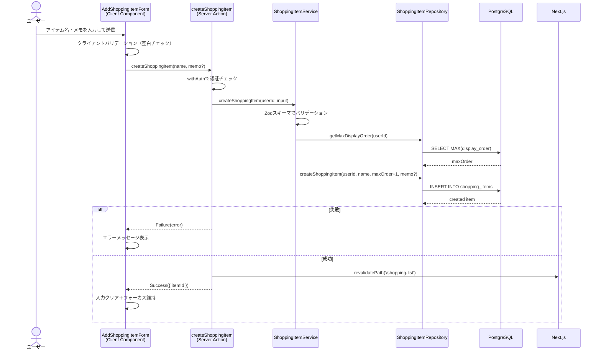
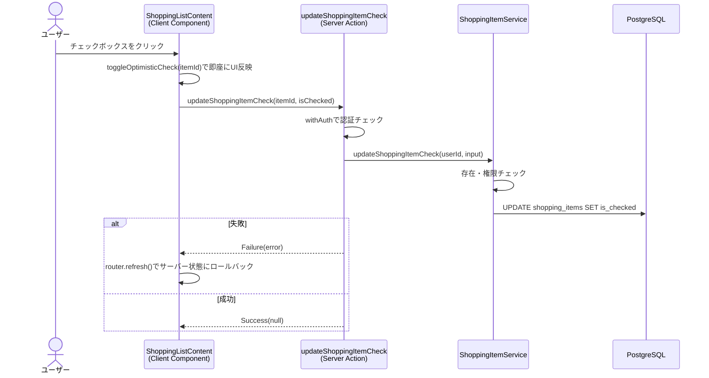

# 買い物リスト

## 概要

買い物リストは、ユーザーが買い物に必要なアイテムを管理するための機能。アイテムの追加・編集・削除・チェック（購入済みマーク）を行い、買い物の進捗を視覚的に確認できる。チェック操作にはOptimistic Updateを採用し、即座にUIへ反映されるスムーズな操作感を実現している。

## 機能仕様

### 目的

- 買い物に必要なアイテムを一覧で管理する
- 購入済みアイテムをチェックして進捗を把握する
- アイテムにメモを付けて補足情報を記録する

### 機能詳細

#### アイテム管理（CRUD）
- **追加**: アイテム名（必須）とメモ（任意）を入力して追加。displayOrderは自動採番（既存の最大値+1）
- **編集**: ダイアログ形式で名前・メモを編集。keyプロップによる再マウントでuseEffectを不要にしたクリーンな実装
- **削除**: 個別削除と、チェック済みアイテムの一括削除（確認ダイアログ付き）
- **チェック**: チェックボックスで購入済みをマーク。useOptimisticで即座にUI反映、エラー時はrouter.refreshでロールバック

#### 並び替え
- バックエンドにreorderShoppingItems APIが実装済み（トランザクションで一貫性保証）
- フロントエンドのドラッグ&ドロップUIは未実装

#### UI/UX
- 未チェック/チェック済みの2セクションに分離表示
- チェック済みアイテムはグレー＋打ち消し線で視覚的に区別
- 統計バー（合計件数・残り件数・購入済み件数）を表示
- アイテムが0件の場合は空状態メッセージを表示
- 追加フォームは成功後に入力クリア＋フォーカス維持
- メモ入力はトグルで表示切替

### ユーザーフロー

```
1. 買い物リストページにアクセス
   ↓
2. アイテム名（＋任意でメモ）を入力して追加
   ↓
3. 買い物中にチェックボックスで購入済みマーク
   ↓
4. 必要に応じてアイテムの編集・削除
   ↓
5. チェック済みアイテムを一括削除してリストをリセット
```

## シーケンス図

### アイテム追加



### チェック操作（Optimistic Update）



## 技術仕様

### フロントエンド

#### コンポーネント構成

| コンポーネント | ファイル | タイプ | 役割 |
|---|---|---|---|
| ShoppingListPage | `src/app/(auth)/shopping-list/page.tsx` | Server Component | ページ。データ取得してContentに渡す |
| ShoppingListContent | `src/features/shopping-list/components/shopping-list-content.tsx` | Client Component | メインコンテナ。Optimistic Update管理 |
| AddShoppingItemForm | `src/features/shopping-list/components/add-shopping-item-form.tsx` | Client Component | アイテム追加フォーム |
| ShoppingItemRow | `src/features/shopping-list/components/shopping-item-row.tsx` | Client Component | アイテム行（チェック・編集・削除） |
| EditShoppingItemDialog | `src/features/shopping-list/components/edit-shopping-item-dialog.tsx` | Client Component | 編集ダイアログ（Radix UI Dialog） |
| DeleteCheckedItemsButton | `src/features/shopping-list/components/delete-checked-items-button.tsx` | Client Component | チェック済み一括削除ボタン |
| ShoppingListStatsBar | `src/features/shopping-list/components/shopping-list-stats-bar.tsx` | Client Component | 統計表示バー |
| ShoppingListEmptyState | `src/features/shopping-list/components/shopping-list-empty-state.tsx` | Client Component | 空状態表示 |

#### 状態管理
- **useOptimistic**: チェック操作の即時UI反映
- **useTransition**: 削除・送信時のローディング状態管理
- **useState**: 編集ダイアログの開閉、フォーム入力値
- Jotai atomsは未使用（Server Componentからprops経由でデータ取得）

### バックエンド

#### Server Actions
- **ファイル**: `src/features/shopping-list/actions.ts`
- 全アクションで`withAuth`による認証チェック
- 全更新系操作で`revalidatePath('/shopping-list')`を実行
- Result型（Success/Failure）で統一されたエラーハンドリング

| 関数名 | 用途 |
|---|---|
| `getShoppingItems()` | アイテム一覧取得 |
| `createShoppingItem(name, memo?)` | アイテム作成 |
| `updateShoppingItem(itemId, name, memo?)` | アイテム更新 |
| `updateShoppingItemCheck(itemId, isChecked)` | チェック状態更新 |
| `deleteShoppingItem(itemId)` | アイテム削除 |
| `reorderShoppingItems(itemIds)` | 並び替え |
| `deleteCheckedItems()` | チェック済み一括削除 |

#### バリデーションスキーマ
- **ファイル**: `src/backend/domain/shopping-items/validators.ts`

```typescript
createShoppingItemInputSchema = z.object({
  name: z.string().min(1, 'アイテム名を入力してください'),
  memo: z.string().optional(),
})

updateShoppingItemInputSchema = z.object({
  itemId: z.string().min(1, 'アイテムIDが必要です'),
  name: z.string().min(1, 'アイテム名を入力してください'),
  memo: z.string().optional(),
})

updateShoppingItemCheckInputSchema = z.object({
  itemId: z.string().min(1, 'アイテムIDが必要です'),
  isChecked: z.boolean(),
})

reorderShoppingItemsInputSchema = z.object({
  itemIds: z.array(z.string().min(1)).min(1, '並び替えるアイテムが必要です'),
})
```

#### サービス層
- **ファイル**: `src/backend/services/shopping-items/shopping-item.service.ts`
- 全更新系メソッドで所有権チェック（`item.userId !== userId`で権限エラー）
- 並び替え時は全アイテムIDの所有権を検証

#### リポジトリ層
- **ファイル**: `src/backend/repositories/shopping-item.repository.ts`
- displayOrder昇順で取得
- 並び替えはトランザクションで一括更新

## データモデル

### ShoppingItem モデル

```prisma
model ShoppingItem {
  id           String   @id @default(uuid())
  userId       String   @map("user_id")
  name         String
  memo         String?
  isChecked    Boolean  @default(false) @map("is_checked")
  displayOrder Int      @map("display_order")
  createdAt    DateTime @default(now()) @map("created_at")
  updatedAt    DateTime @updatedAt @map("updated_at")

  user User @relation(fields: [userId], references: [id])
  @@map("shopping_items")
}
```

#### フィールド説明
| フィールド | 型 | 説明 |
|---|---|---|
| id | UUID | 主キー（自動生成） |
| userId | UUID | ユーザーID（外部キー、ON DELETE RESTRICT） |
| name | String | アイテム名 |
| memo | String? | メモ（任意） |
| isChecked | Boolean | 購入済みフラグ（デフォルト: false） |
| displayOrder | Int | 表示順序 |
| createdAt | DateTime | 作成日時 |
| updatedAt | DateTime | 更新日時 |

## API仕様

### createShoppingItem (Server Action)

#### 概要
新しい買い物アイテムを作成する。

#### シグネチャ
```typescript
async function createShoppingItem(
  name: string,
  memo?: string
): Promise<Result<CreateShoppingItemResult>>
```

#### パラメータ
| 名前 | 型 | 必須 | バリデーション |
|------|------|------|--------------|
| name | string | ✓ | 1文字以上 |
| memo | string | - | なし |

#### エラーコード
| コード | メッセージ | 発生条件 |
|--------|-----------|---------|
| UNAUTHENTICATED | 認証が必要です | 未ログイン |
| VALIDATION_ERROR | アイテム名を入力してください | nameが空 |
| SERVER_ERROR | サーバーエラー | その他の例外 |

### updateShoppingItemCheck (Server Action)

#### 概要
アイテムのチェック状態を更新する。Optimistic Updateと連携。

#### シグネチャ
```typescript
async function updateShoppingItemCheck(
  itemId: string,
  isChecked: boolean
): Promise<Result<null>>
```

#### エラーコード
| コード | メッセージ | 発生条件 |
|--------|-----------|---------|
| NOT_FOUND | アイテムが見つかりません | 存在しないitemId |
| FORBIDDEN | このアイテムを編集する権限がありません | 他ユーザーのアイテム |

### deleteCheckedItems (Server Action)

#### 概要
チェック済みアイテムを一括削除する。

#### シグネチャ
```typescript
async function deleteCheckedItems(): Promise<Result<null>>
```

## テスト

### テストファイル

| ファイル | 対象 |
|---|---|
| `src/backend/services/shopping-items/__tests__/shopping-item.service.test.ts` | サービス層（CRUD全操作、権限チェック） |
| `src/features/shopping-list/components/__tests__/shopping-list-content.test.tsx` | メインコンテナ（表示、チェック操作、Optimistic Update） |
| `src/features/shopping-list/components/__tests__/shopping-item-row.test.tsx` | アイテム行（表示、チェック、編集、削除） |
| `src/features/shopping-list/components/__tests__/add-shopping-item-form.test.tsx` | 追加フォーム（入力、送信、バリデーション） |
| `src/features/shopping-list/components/__tests__/edit-shopping-item-dialog.test.tsx` | 編集ダイアログ（表示制御、更新、キャンセル） |
| `src/features/shopping-list/components/__tests__/delete-checked-items-button.test.tsx` | 一括削除（確認ダイアログ、削除実行） |
| `src/features/shopping-list/components/__tests__/shopping-list-stats-bar.test.tsx` | 統計バー（件数表示） |
| `src/features/shopping-list/components/__tests__/shopping-list-empty-state.test.tsx` | 空状態表示 |

## セキュリティ

### 実装されているセキュリティ対策

1. **認証**
   - 全Server Actionで`withAuth`ヘルパーを使用し、未認証リクエストを拒否

2. **認可（所有権チェック）**
   - 更新・削除・チェック操作前に`findShoppingItemById`でアイテムを取得し、`item.userId !== userId`の場合はFORBIDDENエラーを返却
   - 並び替え時は全アイテムIDの所有権を検証

3. **入力バリデーション**
   - Zodスキーマによるサーバーサイドバリデーション
   - クライアントサイドでも空白チェックによるUX向上

4. **データ整合性**
   - 並び替え操作はトランザクションで一括実行
   - 外部キー制約（ON DELETE RESTRICT）でデータ整合性を保証

5. **キャッシュ再検証**
   - 全更新系操作で`revalidatePath('/shopping-list')`を実行し、画面とデータの同期を保証

## 補足・メモ

- Optimistic Updateはチェック操作のみに適用。最も頻繁に行われる操作のため、UX改善効果が高い
- 編集ダイアログはkeyプロップによる再マウントで初期値をリセットしており、useEffectを使わないクリーンな実装
- 並び替えAPIは実装済みだが、フロントエンドのドラッグ&ドロップUIは未実装（将来の拡張ポイント）
