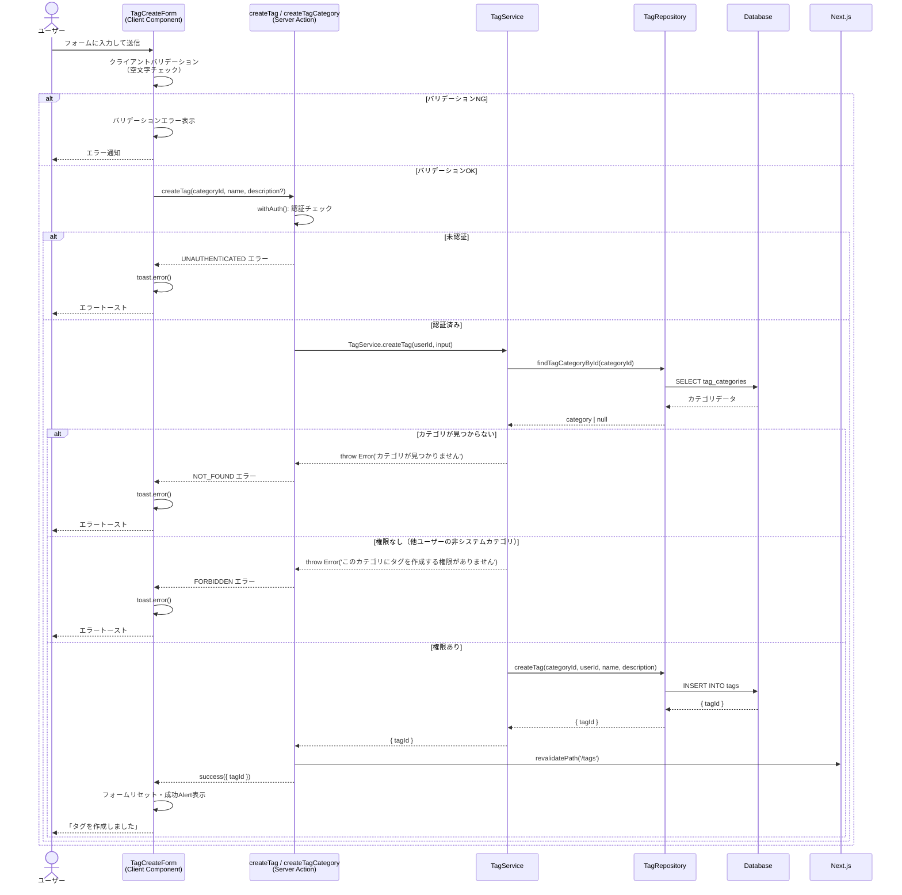

# タグ作成機能

## 概要

レシピを整理・分類するためのタグとタグカテゴリを作成する機能。ユーザーは任意のカテゴリを作成し、そのカテゴリにタグを追加することでレシピを柔軟に分類できる。システムが提供するシステムカテゴリ・システムタグとユーザー作成のカテゴリ・タグが共存する。

## 機能仕様

### 目的

- レシピに任意のタグを付与して、料理ジャンル・調理時間・難易度などで分類できるようにする
- カテゴリ → タグ の階層構造でタグを整理し、大量のタグを管理しやすくする
- システム標準のカテゴリ・タグに加え、ユーザー独自のカテゴリ・タグを作成できるようにする

### 機能詳細

#### タグカテゴリ作成
- カテゴリ名（必須、最大50文字）と説明（任意、最大200文字）を入力して作成する
- 作成したカテゴリは自分のみが所有・編集・削除できる
- カテゴリにタグが1個以上存在する場合は削除不可

#### タグ作成
- 既存のカテゴリを選択し、タグ名（必須、最大50文字）と説明（任意、最大200文字）を入力して作成する
- 自分のカテゴリ、またはシステムカテゴリへのタグ作成が可能
- 作成したタグは自分のみが所有・編集・削除できる

#### システムリソースの保護
- `isSystem: true` のカテゴリ・タグは編集・削除不可
- システムカテゴリにはユーザーがタグを追加可能（システムタグは作成不可）

#### UI/UX
- タブ切り替えで「タグを作成」と「カテゴリを作成」を切り替え
- カテゴリが存在しない場合は送信ボタンを無効化
- 送信中はローディング状態（「作成中...」テキスト）を表示
- 成功時はインラインのアラートとフォームのリセット
- エラー時はトースト通知（sonner）
- 削除時はネイティブconfirmダイアログで確認

#### その他
- 空白文字は自動でtrim処理（説明の空文字列はundefinedとして扱う）
- システムカテゴリとユーザーカテゴリを視覚的に区別（アイコン・カラー）
- 各タグのレシピ使用数をバッジで表示

### ユーザーフロー（カテゴリ作成）

```
1. /tags ページにアクセス
   ↓
2. フォームの「カテゴリを作成」タブをクリック
   ↓
3. カテゴリ名を入力（必須）・説明を入力（任意）
   ↓
4. 「追加」ボタンをクリック
   ↓
5. [成功] フォームがリセットされ「カテゴリを作成しました」が表示、ページ再レンダリング
   [失敗] トーストでエラーメッセージを表示
```

### ユーザーフロー（タグ作成）

```
1. /tags ページにアクセス（カテゴリが1件以上必要）
   ↓
2. フォームの「タグを作成」タブ（デフォルト）を確認
   ↓
3. カテゴリをセレクトから選択（非システムカテゴリがデフォルト選択）
   ↓
4. タグ名を入力（必須）・説明を入力（任意）
   ↓
5. 「追加」ボタンをクリック
   ↓
6. [成功] フォームがリセットされ「タグを作成しました」が表示、ページ再レンダリング
   [失敗] トーストでエラーメッセージを表示
```

## シーケンス図



## 技術仕様

### フロントエンド

#### コンポーネント構成

| コンポーネント | ファイル | タイプ | 役割 |
|---|---|---|---|
| TagCreateForm | `src/features/tags/tag-create-form.tsx` | Client Component | タグ・カテゴリ作成フォーム |
| TagPageContent | `src/features/tags/tag-page-content.tsx` | Client Component | タグページ全体のレイアウト |
| CategoryItem | `src/features/tags/category-item.tsx` | Client Component | カテゴリの表示・編集・削除 |
| TagItem | `src/features/tags/tag-item.tsx` | Client Component | タグの表示・編集・削除 |
| TagInfoBanner | `src/features/tags/tag-info-banner.tsx` | Server Component | 情報バナー |
| TagEmptyState | `src/features/tags/tag-empty-state.tsx` | Server Component | 空状態の表示 |

#### 使用コンポーネント
- `Button` - 送信・編集・削除アクション
- `Input` - テキスト入力フィールド
- `Textarea` - 説明入力フィールド
- `Select` - カテゴリ選択
- `Alert` - 成功メッセージ表示
- `Card`, `CardContent` - レイアウト
- アイコン: `TagIcon`, `FolderIcon`, `PlusIcon`, `PencilIcon`, `TrashIcon`, `BadgeCheckIcon`, `UserCircleSolidIcon`, `BookOpenIcon`, `InfoSolidIcon`

#### 状態管理

```typescript
// TagForm: useReducerで5つの状態を統合管理
type TagFormState = {
  tagName: string
  tagDescription: string
  selectedCategoryId: string
  isSubmittingTag: boolean
  tagCreatedSuccess: boolean
}

// CategoryForm: useStateで個別管理
const [categoryName, setCategoryName] = useState('')
const [categoryDescription, setCategoryDescription] = useState('')
const [isSubmittingCategory, setIsSubmittingCategory] = useState(false)
const [categoryCreatedSuccess, setCategoryCreatedSuccess] = useState(false)
```

#### 主要な処理フロー

```typescript
// タグ作成送信ハンドラ
const handleSubmitTag = async (e: FormEvent<HTMLFormElement>) => {
  e.preventDefault()
  dispatch({ type: 'SET_SUBMITTING', payload: true })
  try {
    const result = await createTag(
      selectedCategoryId,
      tagName.trim(),
      tagDescription.trim() || undefined
    )
    if (isSuccess(result)) {
      dispatch({ type: 'RESET_AND_SUCCESS' })
    } else {
      toast.error(result.error.message)
    }
  } catch {
    toast.error('タグの作成中にエラーが発生しました')
  } finally {
    dispatch({ type: 'SET_SUBMITTING', payload: false })
  }
}
```

### バックエンド

#### Server Actions
- **ファイル**: `src/features/tags/actions.ts`

| 関数 | シグネチャ | 説明 |
|---|---|---|
| `createTagCategory` | `(name: string, description?: string) => Promise<Result<{ categoryId: string }>>` | カテゴリを作成 |
| `createTag` | `(categoryId: string, name: string, description?: string) => Promise<Result<{ tagId: string }>>` | タグを作成 |
| `updateTagCategory` | `(categoryId: string, name: string, description?: string) => Promise<Result<undefined>>` | カテゴリを更新 |
| `updateTag` | `(tagId: string, name: string, description?: string) => Promise<Result<undefined>>` | タグを更新 |
| `deleteTagCategory` | `(categoryId: string) => Promise<Result<undefined>>` | カテゴリを削除 |
| `deleteTag` | `(tagId: string) => Promise<Result<undefined>>` | タグを削除 |
| `getTagCategoriesWithTags` | `() => Promise<Result<TagCategoriesWithTagsOutput>>` | タグページ用一覧取得 |
| `getAllTagsForRecipe` | `() => Promise<Result<TagsForRecipeOutput>>` | レシピ用タグ一覧取得 |

#### バリデーションスキーマ

**ファイル**: `src/backend/domain/tags/validators.ts`

```typescript
// カテゴリ作成
const createTagCategoryInputSchema = z.object({
  name: z.string()
    .min(1, 'カテゴリ名を入力してください')
    .max(50, 'カテゴリ名は50文字以内で入力してください'),
  description: z.string()
    .max(200, '説明は200文字以内で入力してください')
    .optional(),
})

// タグ作成
const createTagInputSchema = z.object({
  categoryId: z.string().min(1, 'カテゴリIDが必要です'),
  name: z.string()
    .min(1, 'タグ名を入力してください')
    .max(50, 'タグ名は50文字以内で入力してください'),
  description: z.string()
    .max(200, '説明は200文字以内で入力してください')
    .optional(),
})
```

#### 処理フロー（タグ作成）

1. `withAuth()` で認証チェック（未認証時は `UNAUTHENTICATED` を返す）
2. `TagService.createTag(userId, input)` を呼び出す
3. `TagRepository.findTagCategoryById(categoryId)` でカテゴリの存在確認
4. カテゴリ不在 → `Error('カテゴリが見つかりません')` をスロー
5. `!category.isSystem && category.userId !== userId` → 権限エラー
6. `TagRepository.createTag(categoryId, userId, name, description)` でDB挿入
7. `revalidatePath('/tags')` でページキャッシュを無効化
8. `success({ tagId })` を返す

#### Service層

**ファイル**: `src/backend/services/tags/tag.service.ts`

ビジネスロジックを集約する層。権限確認・システムリソース保護などのルールをここで実装する。

#### Repository層

**ファイル**: `src/backend/repositories/tag.repository.ts`

Prismaを使ったDB操作を担う層。

主要な関数:
```typescript
findTagCategoryById(categoryId: string): Promise<TagCategory | null>
createTagCategory(userId: string, name: string, description?: string): Promise<{ categoryId: string }>
createTag(categoryId: string, userId: string, name: string, description?: string): Promise<{ tagId: string }>
findTagCategoriesWithRecipeTags(userId: string): Promise<TagCategory[]>
validateTagIdsForUser(tagIds: string[], userId: string): Promise<{ validTagIds: string[]; isValid: boolean }>
```

#### 使用ライブラリ
- `zod` - バリデーション
- `@prisma/client` - DBアクセス
- `sonner` - トースト通知（フロントエンド）
- `next/cache` - `revalidatePath`によるキャッシュ無効化

## データモデル

### TagCategory モデル

```prisma
model TagCategory {
  id          String   @id @default(uuid())
  userId      String?  @map("user_id")   // NULL = システムカテゴリ
  name        String
  description String?
  isSystem    Boolean  @default(false) @map("is_system")
  createdAt   DateTime @default(now()) @map("created_at")
  updatedAt   DateTime @updatedAt @map("updated_at")

  user User?  @relation(fields: [userId], references: [id])
  tags Tag[]

  @@map("tag_categories")
}
```

#### 関連フィールド
- `userId`: NULL可能。NULLの場合はシステムカテゴリ
- `isSystem`: システムカテゴリの場合 `true`。ユーザー作成時は常に `false`

### Tag モデル

```prisma
model Tag {
  id          String   @id @default(uuid())
  categoryId  String   @map("category_id")
  userId      String?  @map("user_id")   // NULL = システムタグ
  name        String
  description String?
  isSystem    Boolean  @default(false) @map("is_system")
  createdAt   DateTime @default(now()) @map("created_at")
  updatedAt   DateTime @updatedAt @map("updated_at")

  category   TagCategory @relation(fields: [categoryId], references: [id])
  recipeTags RecipeTag[]
  user       User?       @relation(fields: [userId], references: [id])

  @@map("tags")
}
```

#### 関連フィールド
- `userId`: NULL可能。NULLの場合はシステムタグ
- `categoryId`: 必須。タグは必ずカテゴリに属する
- `isSystem`: システムタグの場合 `true`。ユーザー作成時は常に `false`

### RecipeTag モデル（中間テーブル）

```prisma
model RecipeTag {
  recipeId  String   @map("recipe_id")
  tagId     String   @map("tag_id")
  createdAt DateTime @default(now()) @map("created_at")

  recipe Recipe @relation(fields: [recipeId], references: [id], onDelete: Cascade)
  tag    Tag    @relation(fields: [tagId], references: [id], onDelete: Cascade)

  @@id([recipeId, tagId])
  @@map("recipe_tags")
}
```

- タグ削除時、関連する `RecipeTag` はカスケード削除される

## API仕様

### createTag (Server Action)

#### 概要
認証済みユーザーが指定したカテゴリにタグを作成する。

#### シグネチャ
```typescript
async function createTag(
  categoryId: string,
  name: string,
  description?: string
): Promise<Result<{ tagId: string }>>
```

#### パラメータ
| 名前 | 型 | 必須 | バリデーション |
|------|------|------|--------------|
| `categoryId` | `string` | ✓ | 1文字以上 |
| `name` | `string` | ✓ | 1〜50文字 |
| `description` | `string` | - | 最大200文字 |

#### 戻り値
```typescript
// 成功
{ success: true, data: { tagId: string } }

// 失敗
{ success: false, error: { code: ErrorCode, message: string } }
```

#### エラーコード
| コード | メッセージ | 発生条件 |
|--------|-----------|---------|
| `UNAUTHENTICATED` | - | 未認証 |
| `NOT_FOUND` | 「カテゴリが見つかりません」 | 指定カテゴリが存在しない |
| `FORBIDDEN` | 「このカテゴリにタグを作成する権限がありません」 | 他ユーザーの非システムカテゴリへの追加 |
| `SERVER_ERROR` | 「タグの作成に失敗しました」 | その他のDBエラー等 |

### createTagCategory (Server Action)

#### 概要
認証済みユーザーがタグカテゴリを作成する。

#### シグネチャ
```typescript
async function createTagCategory(
  name: string,
  description?: string
): Promise<Result<{ categoryId: string }>>
```

#### パラメータ
| 名前 | 型 | 必須 | バリデーション |
|------|------|------|--------------|
| `name` | `string` | ✓ | 1〜50文字 |
| `description` | `string` | - | 最大200文字 |

#### 戻り値
```typescript
// 成功
{ success: true, data: { categoryId: string } }

// 失敗
{ success: false, error: { code: ErrorCode, message: string } }
```

#### エラーコード
| コード | メッセージ | 発生条件 |
|--------|-----------|---------|
| `UNAUTHENTICATED` | - | 未認証 |
| `SERVER_ERROR` | 「カテゴリの作成に失敗しました」 | DBエラー等 |

## テスト

### テストファイル

| ファイル | フレームワーク | テスト対象 |
|---|---|---|
| `src/features/tags/__tests__/tag-create-form.test.tsx` | Vitest / React Testing Library | TagCreateForm コンポーネント |
| `src/backend/services/tags/__tests__/tag.service.test.ts` | Vitest | TagService |
| `src/backend/domain/tags/__tests__/validators.test.ts` | Vitest | バリデーションスキーマ |

### テストケース

1. **初期表示**
   - タグタブがデフォルトアクティブ
   - カテゴリ一覧が表示される
   - 非システムカテゴリがデフォルト選択
   - カテゴリが空の場合は「カテゴリがありません」表示 + ボタン disabled

2. **タブ切り替え**
   - 「カテゴリを作成」タブに切り替え可能
   - 「タグを作成」タブに戻り可能

3. **バリデーション**
   - タグ名が空の場合は送信されない
   - カテゴリ未選択の場合はボタン disabled

4. **タグ作成送信**
   - `createTag` が正しい引数で呼び出される
   - 説明が空の場合は `undefined` を渡す
   - 成功時にAlertが表示されフォームがリセットされる
   - エラー返却時にトーストが表示される
   - 例外発生時にトーストが表示される

5. **ローディング状態**
   - 送信中に「作成中...」テキストが表示される
   - 送信中にボタンが disabled になる

6. **サービス層（TagService）**
   - 自分のカテゴリへのタグ作成成功
   - システムカテゴリへのタグ作成成功
   - カテゴリ不在でエラー
   - 他ユーザーのカテゴリへのタグ作成で権限エラー
   - カテゴリにタグが存在する場合の削除不可

7. **バリデーター**
   - 50文字: OK、51文字: NG
   - 200文字の説明: OK、201文字: NG

## セキュリティ

### 実装されているセキュリティ対策

1. **認証チェック**
   - すべてのServer Actionは `withAuth()` ラッパーで認証状態を確認
   - 未認証の場合は `UNAUTHENTICATED` エラーを返し処理を中断

2. **ユーザー所有権の確認**
   - タグ・カテゴリの操作は自分が作成したリソースのみ
   - `userId !== profile.id` のリソースへの操作はすべて `FORBIDDEN` エラー

3. **システムリソースの保護**
   - `isSystem: true` のカテゴリ・タグは編集・削除不可
   - ユーザー作成時は `isSystem` を常に `false` に設定（DBレベルで保護）

4. **関連リソースの整合性**
   - カテゴリ削除時、タグが存在する場合は `CONFLICT` エラーで削除を阻止
   - タグ削除時の `RecipeTag` はDBのカスケード削除で自動削除

5. **レシピ紐付け時のタグ検証**
   - `validateTagIdsForUser()` でレシピに付与できるタグを制限
   - ユーザー自身のタグまたはシステムタグのみ有効

## 配置場所

TagCreateFormは以下の場所で使用されています：

1. **タグ管理ページ**
   - `src/app/(auth)/tags/page.tsx`
   - タグ・カテゴリ一覧の管理と新規作成のメインページ

タグデータ（getAllTagsForRecipe）は以下で使用されています：

1. **レシピ作成ページ**
   - `src/features/recipes/upload/recipe-upload-page-content.tsx`
   - レシピ新規作成時のタグ選択

2. **レシピ編集ページ**
   - `src/features/recipes/edit/recipe-edit-page-content.tsx`
   - レシピ編集時のタグ選択
