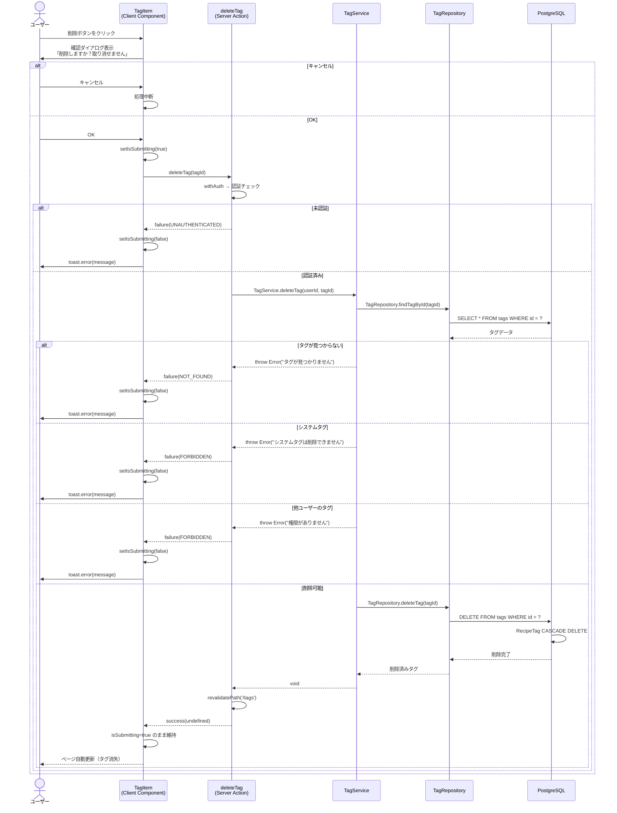
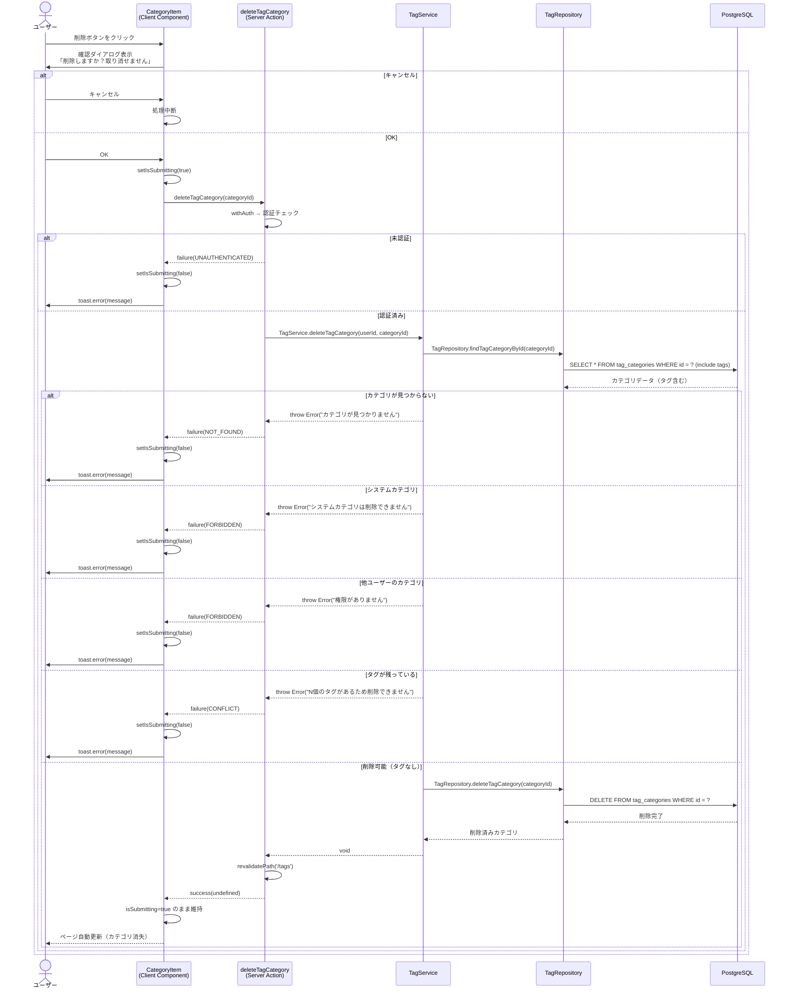

# タグ削除機能

## 概要

ユーザーが作成したタグおよびタグカテゴリを削除する機能。タグ管理ページ（`/tags`）の各タグ・カテゴリに配置された削除ボタンから実行できる。削除前に確認ダイアログを表示し、誤操作を防止する。システムタグ・システムカテゴリおよび他ユーザーのタグは削除不可。

## 機能仕様

### 目的

- ユーザーが作成した不要なタグを削除できるようにする
- ユーザーが作成した空のタグカテゴリを削除できるようにする
- 誤削除防止のために確認ダイアログを表示する

### 機能詳細

#### タグ削除

- 削除ボタン（TrashIcon）クリックで確認ダイアログを表示
- 確認後、タグを削除する
- タグ削除時、そのタグに紐づく RecipeTag は自動削除（カスケード削除）
- Recipe 本体は削除されない（タグ付けが外れるだけ）

#### タグカテゴリ削除

- 削除ボタン（TrashIcon）クリックで確認ダイアログを表示
- カテゴリ内にタグが残っている場合は削除不可（事前チェック）
- カテゴリ削除前に、配下のタグをすべて削除する必要がある

#### 削除制約

- システムタグ（`isSystem=true`）は削除不可 → ボタン非表示
- 他ユーザーのタグは削除不可 → ボタン非表示
- システムカテゴリは削除不可 → ボタン非表示
- タグが存在するカテゴリは削除不可 → `CONFLICT` エラー

#### UI/UX

- 削除ボタン（TrashIcon、赤色）はユーザー所有かつ非システムのタグ・カテゴリにのみ表示
- 確認ダイアログで「この操作は取り消せません」と警告表示
- 削除中は `isSubmitting=true` でボタンを無効化（二重送信防止）
- 削除成功時は `revalidatePath` によりページが自動更新（ローディング状態を維持）
- 失敗時は `toast.error` でエラーメッセージを表示

### ユーザーフロー

**タグ削除:**

```
1. タグ管理ページ（/tags）を開く
   ↓
2. 削除したいタグの削除ボタン（TrashIcon）をクリック
   ↓
3. 確認ダイアログ「「{タグ名}」を削除しますか？この操作は取り消せません。」を表示
   ↓
4a. キャンセル → 削除中止
4b. OK → deleteTag Server Action 呼び出し
   ↓
5a. 失敗 → toast.error でエラーメッセージ表示、ボタン再有効化
5b. 成功 → ページ自動更新（タグが消える）
```

**タグカテゴリ削除:**

```
1. タグ管理ページ（/tags）を開く
   ↓
2. 削除したいカテゴリ内のタグをすべて削除する（前提条件）
   ↓
3. カテゴリの削除ボタン（TrashIcon）をクリック
   ↓
4. 確認ダイアログ「カテゴリ「{カテゴリ名}」を削除しますか？この操作は取り消せません。」を表示
   ↓
5a. キャンセル → 削除中止
5b. OK → deleteTagCategory Server Action 呼び出し
   ↓
6a. タグが残っている → toast.error "このカテゴリには{N}個のタグがあるため削除できません"
6b. 成功 → ページ自動更新（カテゴリが消える）
```

## シーケンス図

### タグ削除



### タグカテゴリ削除



## 技術仕様

### フロントエンド

#### コンポーネント構成

**タグ削除:**
- **ファイル**: `src/features/tags/tag-item.tsx`
- **タイプ**: Client Component
- **スタイリング**: Tailwind CSS v4

**タグカテゴリ削除:**
- **ファイル**: `src/features/tags/category-item.tsx`
- **タイプ**: Client Component
- **スタイリング**: Tailwind CSS v4

#### 使用コンポーネント

- `Button` または `button` - 削除ボタン
- アイコン: `TrashIcon`（赤色）

#### 状態管理

```typescript
// TagItem / CategoryItem 共通
const [isSubmitting, setIsSubmitting] = useState(false)
```

#### 主要な処理フロー（タグ削除）

```typescript
const handleDelete = async () => {
  if (!confirm(`「${tag.name}」を削除しますか？この操作は取り消せません。`)) {
    return
  }

  setIsSubmitting(true)

  try {
    const result = await deleteTag(tag.id)

    if (!isSuccess(result)) {
      toast.error(result.error.message)
      setIsSubmitting(false)
    }
    // 成功時はページがリロードされるのでローディング状態を維持
  } catch {
    toast.error('タグの削除中にエラーが発生しました')
    setIsSubmitting(false)
  }
}
```

#### 削除ボタン表示制御

```typescript
// タグ: ユーザー所有かつ非システムのみ表示
{isUserOwned && !tag.isSystem && (
  <button
    onClick={handleDelete}
    className="rounded-md p-1.5 transition-colors hover:bg-red-200"
    title="削除"
    disabled={isSubmitting}
  >
    <TrashIcon className="h-4 w-4 text-red-700" />
  </button>
)}

// カテゴリ: ユーザー所有かつ非システムのみ表示
{isUserOwned && !category.isSystem && (
  <button
    onClick={handleDelete}
    className="rounded-lg p-2 transition-colors hover:bg-red-100"
    title="削除"
    disabled={isSubmitting}
  >
    <TrashIcon className="h-5 w-5 text-red-600" />
  </button>
)}
```

### バックエンド

#### Server Action（タグ削除）

- **ファイル**: `src/features/tags/actions.ts`
- **関数**: `deleteTag(tagId: string): Promise<Result<void>>`
- **ディレクティブ**: `'use server'`

#### Server Action（タグカテゴリ削除）

- **ファイル**: `src/features/tags/actions.ts`
- **関数**: `deleteTagCategory(categoryId: string): Promise<Result<void>>`
- **ディレクティブ**: `'use server'`

#### 処理フロー（タグ削除）

1. `withAuth` で認証チェック → `UserProfile` 取得
2. `TagService.deleteTag(userId, tagId)` 呼び出し
3. Service層でタグ存在確認、システムタグチェック、所有権チェック
4. `TagRepository.deleteTag` でDB削除（RecipeTag がカスケード削除）
5. `revalidatePath('/tags')` でキャッシュ再検証
6. `Result<void>` 返却

#### 処理フロー（タグカテゴリ削除）

1. `withAuth` で認証チェック → `UserProfile` 取得
2. `TagService.deleteTagCategory(userId, categoryId)` 呼び出し
3. Service層でカテゴリ存在確認（タグ含めて取得）、システムカテゴリチェック、所有権チェック
4. カテゴリ内のタグ数チェック（1件以上あると削除不可）
5. `TagRepository.deleteTagCategory` でDB削除
6. `revalidatePath('/tags')` でキャッシュ再検証
7. `Result<void>` 返却

#### Service層

- **ファイル**: `src/backend/services/tags/tag.service.ts`

**deleteTag:**

```typescript
export async function deleteTag(userId: string, tagId: string): Promise<void> {
  const tag = await TagRepository.findTagById(tagId)

  if (!tag) throw new Error('タグが見つかりません')
  if (tag.isSystem) throw new Error('システムタグは削除できません')
  if (tag.userId !== userId) throw new Error('このタグを削除する権限がありません')

  await TagRepository.deleteTag(tagId)
}
```

**deleteTagCategory:**

```typescript
export async function deleteTagCategory(userId: string, categoryId: string): Promise<void> {
  const category = await TagRepository.findTagCategoryById(categoryId)

  if (!category) throw new Error('カテゴリが見つかりません')
  if (category.isSystem) throw new Error('システムカテゴリは削除できません')
  if (category.userId !== userId) throw new Error('このカテゴリを削除する権限がありません')
  if (category.tags && category.tags.length > 0) {
    throw new Error(`このカテゴリには${category.tags.length}個のタグがあるため削除できません`)
  }

  await TagRepository.deleteTagCategory(categoryId)
}
```

#### Repository層

- **ファイル**: `src/backend/repositories/tag.repository.ts`

```typescript
export async function deleteTag(tagId: string) {
  return prisma.tag.delete({
    where: { id: tagId },
  })
}

export async function deleteTagCategory(categoryId: string) {
  return prisma.tagCategory.delete({
    where: { id: categoryId },
  })
}
```

## データモデル

### Tag モデル

```prisma
model Tag {
  id          String   @id @default(uuid())
  categoryId  String   @map("category_id")
  userId      String?  @map("user_id")
  name        String
  description String?
  isSystem    Boolean  @default(false) @map("is_system")
  createdAt   DateTime @default(now()) @map("created_at")
  updatedAt   DateTime @updatedAt @map("updated_at")

  category   TagCategory @relation(fields: [categoryId], references: [id])
  recipeTags RecipeTag[]
  user       User?       @relation(fields: [userId], references: [id])

  @@map("tags")
}
```

### TagCategory モデル

```prisma
model TagCategory {
  id          String   @id @default(uuid())
  userId      String?  @map("user_id")
  name        String
  description String?
  isSystem    Boolean  @default(false) @map("is_system")
  createdAt   DateTime @default(now()) @map("created_at")
  updatedAt   DateTime @updatedAt @map("updated_at")

  user User? @relation(fields: [userId], references: [id])
  tags Tag[]

  @@map("tag_categories")
}
```

### RecipeTag モデル（中間テーブル）

```prisma
model RecipeTag {
  recipeId  String   @map("recipe_id")
  tagId     String   @map("tag_id")
  createdAt DateTime @default(now()) @map("created_at")

  recipe Recipe @relation(fields: [recipeId], references: [id], onDelete: Cascade)
  tag    Tag    @relation(fields: [tagId], references: [id], onDelete: Cascade)

  @@id([recipeId, tagId])
  @@map("recipe_tags")
}
```

#### カスケード削除の動作

| 操作 | 影響テーブル | 動作 |
|------|------------|------|
| Tag 削除 | RecipeTag | `onDelete: Cascade` により自動削除 |
| Tag 削除 | Recipe | 削除されない（タグ付けが外れるだけ） |
| TagCategory 削除 | Tag | Service層で事前チェックし、タグがある場合はエラー |

#### 関連フィールド

- `userId`: NULL の場合はシステムリソース（削除不可）
- `isSystem`: `true` の場合はシステムリソース（削除不可）

## API仕様

### deleteTag (Server Action)

#### 概要

ユーザー所有のタグを削除する。削除時に関連する RecipeTag もカスケード削除される。

#### シグネチャ

```typescript
async function deleteTag(tagId: string): Promise<Result<void>>
```

#### パラメータ

| 名前 | 型 | 説明 |
|------|------|------|
| tagId | `string` | 削除対象タグのID |

#### 戻り値

```typescript
type Result<void> =
  | { ok: true; data: undefined }
  | { ok: false; error: { code: ErrorCode; message: string } }
```

#### エラーコード

| コード | メッセージ | 発生条件 |
|--------|-----------|---------|
| `UNAUTHENTICATED` | "認証が必要です" | 未ログイン |
| `NOT_FOUND` | "タグが見つかりません" | 指定IDのタグが存在しない |
| `FORBIDDEN` | "システムタグは削除できません" | `isSystem=true` のタグ |
| `FORBIDDEN` | "このタグを削除する権限がありません" | 他ユーザーのタグ |
| `SERVER_ERROR` | "タグの削除に失敗しました" | 予期しないエラー |

#### 処理詳細

1. `withAuth` で認証チェック・UserProfile取得
2. `TagService.deleteTag` でビジネスロジック実行
3. タグ存在確認 → `NOT_FOUND` エラー
4. システムタグチェック → `FORBIDDEN` エラー
5. 所有権チェック → `FORBIDDEN` エラー
6. `TagRepository.deleteTag` でDB削除（RecipeTag がカスケード削除）
7. `revalidatePath('/tags')` でキャッシュ再検証

---

### deleteTagCategory (Server Action)

#### 概要

ユーザー所有のタグカテゴリを削除する。タグが残っている場合は削除不可。

#### シグネチャ

```typescript
async function deleteTagCategory(categoryId: string): Promise<Result<void>>
```

#### パラメータ

| 名前 | 型 | 説明 |
|------|------|------|
| categoryId | `string` | 削除対象カテゴリのID |

#### 戻り値

```typescript
type Result<void> =
  | { ok: true; data: undefined }
  | { ok: false; error: { code: ErrorCode; message: string } }
```

#### エラーコード

| コード | メッセージ | 発生条件 |
|--------|-----------|---------|
| `UNAUTHENTICATED` | "認証が必要です" | 未ログイン |
| `NOT_FOUND` | "カテゴリが見つかりません" | 指定IDのカテゴリが存在しない |
| `FORBIDDEN` | "システムカテゴリは削除できません" | `isSystem=true` のカテゴリ |
| `FORBIDDEN` | "このカテゴリを削除する権限がありません" | 他ユーザーのカテゴリ |
| `CONFLICT` | "このカテゴリには{N}個のタグがあるため削除できません" | カテゴリ内にタグが存在する |
| `SERVER_ERROR` | "カテゴリの削除に失敗しました" | 予期しないエラー |

#### 処理詳細

1. `withAuth` で認証チェック・UserProfile取得
2. `TagService.deleteTagCategory` でビジネスロジック実行
3. カテゴリ存在確認（タグ含めて取得）→ `NOT_FOUND` エラー
4. システムカテゴリチェック → `FORBIDDEN` エラー
5. 所有権チェック → `FORBIDDEN` エラー
6. タグ数チェック → `CONFLICT` エラー（1件以上の場合）
7. `TagRepository.deleteTagCategory` でDB削除
8. `revalidatePath('/tags')` でキャッシュ再検証

## テスト

### テストファイル

- **コンポーネント（タグ）**: `src/features/tags/__tests__/tag-item.test.tsx`
- **コンポーネント（カテゴリ）**: `src/features/tags/__tests__/category-item.test.tsx`
- **Service層**: `src/backend/services/tags/__tests__/tag.service.test.ts`
- **フレームワーク**: Vitest, React Testing Library

### テストケース

1. **確認ダイアログ表示**
   - 削除ボタンクリック → 確認ダイアログが正しいメッセージで表示される
   - タグ: `「{タグ名}」を削除しますか？この操作は取り消せません。`
   - カテゴリ: `カテゴリ「{カテゴリ名}」を削除しますか？この操作は取り消せません。`

2. **確認OK → 削除実行**
   - OK → `deleteTag(tagId)` / `deleteTagCategory(categoryId)` が呼ばれる

3. **確認キャンセル → 削除中止**
   - キャンセル → `deleteTag` / `deleteTagCategory` が呼ばれない

4. **削除エラー**
   - `deleteTag` がエラーを返す → `toast.error` でメッセージ表示
   - `deleteTag` が例外をスロー → 汎用エラートースト表示

5. **ローディング状態**
   - 削除処理中はボタンが無効化される

6. **Service層テスト（deleteTag）**
   - 自分のタグを削除できる
   - タグが見つからない → エラー
   - システムタグ → エラー
   - 他ユーザーのタグ → エラー

7. **Service層テスト（deleteTagCategory）**
   - タグがないカテゴリを削除できる
   - カテゴリが見つからない → エラー
   - システムカテゴリ → エラー
   - 他ユーザーのカテゴリ → エラー
   - タグが存在するカテゴリ → エラー

## セキュリティ

### 実装されているセキュリティ対策

1. **認証チェック**
   - すべての Server Action が `withAuth` でラップ
   - 未認証の場合は `UNAUTHENTICATED` エラーを返却

2. **所有権チェック**
   - Service層で `tag.userId === userId` を検証
   - 他ユーザーのタグは削除不可（`FORBIDDEN` エラー）

3. **システムリソース保護**
   - Service層で `isSystem` フラグを検証
   - `isSystem=true` のタグ・カテゴリは削除不可
   - UI層でもボタン非表示（多層防御）

4. **誤操作防止**
   - 確認ダイアログで「取り消せません」と明示的に警告
   - 削除中はボタンを無効化（二重送信防止）
   - カテゴリにタグが残っている場合は削除不可（データ整合性保護）

5. **エラーメッセージの安全性**
   - ユーザー向けメッセージは抽象的に表示
   - 詳細エラーは `console.error` でサーバーログにのみ記録

6. **キャッシュ再検証**
   - 削除後に `revalidatePath('/tags')` でキャッシュを無効化
   - 最新データが常にユーザーに表示される

## 配置場所

TagItem・CategoryItemコンポーネントは以下の場所で使用されています：

1. **タグ管理ページ**
   - `src/app/(auth)/tags/page.tsx`
   - タグ一覧・カテゴリ一覧を表示するメインページ

2. **タグページコンテンツ**
   - `src/features/tags/tag-page-content.tsx`
   - カテゴリ配下にタグを一覧表示するコンテンツコンポーネント

## 補足・メモ

### カテゴリ削除の手順

カテゴリを削除する際は以下の順序で操作する必要がある：

1. カテゴリ配下のタグをすべて削除する
2. タグがすべてなくなったことを確認する
3. カテゴリの削除ボタンをクリックして削除する

### タグ削除時のレシピへの影響

タグを削除すると、そのタグが付与されたすべてのレシピからタグが外れる（RecipeTag がカスケード削除）。ただし Recipe 本体は削除されない。削除前にユーザーへの警告は現時点では実装されていない（確認ダイアログに影響範囲は表示されない）。
