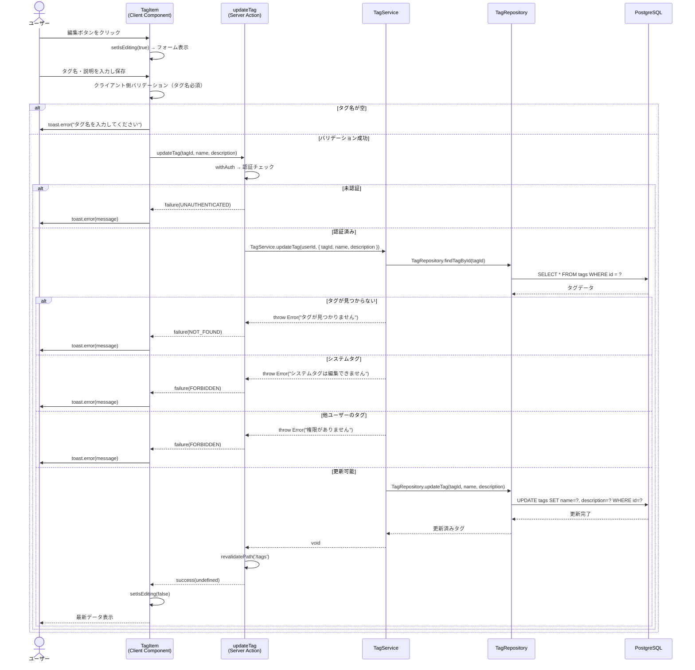
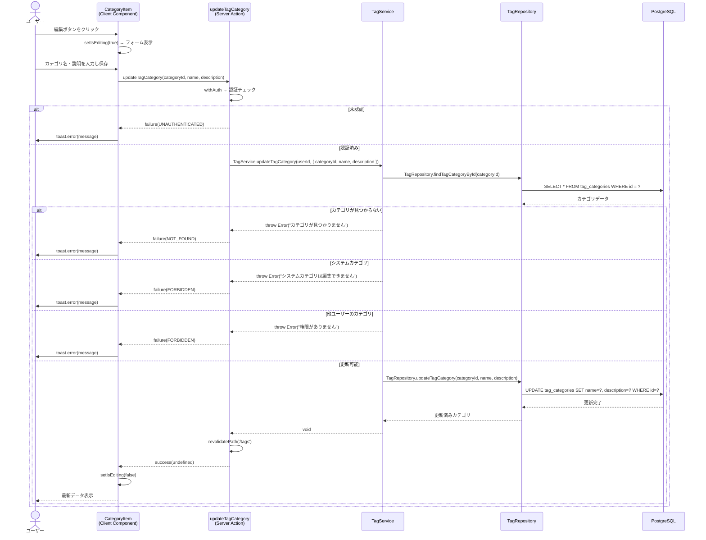

# タグ編集機能

## 概要

ユーザーが作成したタグおよびタグカテゴリの名前・説明を編集する機能。タグ管理ページ（`/tags`）から直接インラインで編集できる。システムタグ・システムカテゴリおよび他ユーザーのタグは編集不可。

## 機能仕様

### 目的

- ユーザーが作成したタグの名前・説明を変更できるようにする
- ユーザーが作成したタグカテゴリの名前・説明を変更できるようにする
- 誤作成したタグ・カテゴリを修正できるようにする

### 機能詳細

#### タグ編集

- タグ名（必須、最大50文字）
- 説明（任意、最大200文字）
- 編集ボタンクリックでインライン編集フォームを表示
- 保存・キャンセルボタンで確定・取消

#### タグカテゴリ編集

- カテゴリ名（必須、最大50文字）
- 説明（任意、最大200文字）
- 編集ボタンクリックでインライン編集フォームを表示
- 保存・キャンセルボタンで確定・取消

#### 編集制約

- システムタグ（`isSystem=true`）は編集不可 → ボタン非表示
- 他ユーザーのタグは編集不可 → ボタン非表示
- システムカテゴリは編集不可

#### UI/UX

- 編集ボタン（PencilIcon）クリックで同一カード内にフォームをインライン表示
- 保存中は `isLoading` 状態でボタンを無効化（二重送信防止）
- キャンセル時は入力内容を編集前の値にリセット
- 成功時はトースト通知なしで編集モードを解除
- 失敗時は toast.error でエラーメッセージを表示

### ユーザーフロー

**タグ編集:**

```
1. タグ管理ページ（/tags）を開く
   ↓
2. 編集したいタグの編集ボタン（PencilIcon）をクリック
   ↓
3. インライン編集フォームが表示される（タグ名・説明の入力欄）
   ↓
4. タグ名・説明を編集する
   ↓
5. 保存ボタンをクリック
   ↓
6. バリデーション（タグ名必須チェック）
   ↓
7a. バリデーションエラー → トースト表示、フォームを維持
7b. バリデーション成功 → updateTag Server Action 呼び出し
   ↓
8a. 失敗 → toast.error でエラーメッセージ表示
8b. 成功 → 編集モード解除、最新データ表示
```

**タグカテゴリ編集:**

```
1. タグ管理ページ（/tags）を開く
   ↓
2. 編集したいカテゴリの編集ボタン（PencilIcon）をクリック
   ↓
3. インライン編集フォームが表示される（カテゴリ名・説明の入力欄）
   ↓
4. カテゴリ名・説明を編集する
   ↓
5. 保存ボタンをクリック
   ↓
6. updateTagCategory Server Action 呼び出し
   ↓
7a. 失敗 → toast.error でエラーメッセージ表示
7b. 成功 → 編集モード解除、最新データ表示
```

## シーケンス図

### タグ編集



### タグカテゴリ編集



## 技術仕様

### フロントエンド

#### コンポーネント構成

**タグ編集:**
- **ファイル**: `src/features/tags/tag-item.tsx`
- **タイプ**: Client Component
- **スタイリング**: Tailwind CSS v4

**タグカテゴリ編集:**
- **ファイル**: `src/features/tags/category-item.tsx`
- **タイプ**: Client Component
- **スタイリング**: Tailwind CSS v4

#### 使用コンポーネント

- `Input` - テキスト入力（タグ名・カテゴリ名）
- `Textarea` - テキストエリア（説明）
- `Button` - 保存・キャンセルボタン
- アイコン: `PencilIcon`（編集）、`TrashIcon`（削除）、`TagIcon`、`FolderIcon`

#### 状態管理

```typescript
// TagItem の状態
const [isEditing, setIsEditing] = useState(false)
const [editName, setEditName] = useState(tag.name)
const [editDescription, setEditDescription] = useState(tag.description || '')
const [isSubmitting, setIsSubmitting] = useState(false)
```

#### 主要な処理フロー

```typescript
const handleEdit = async (e: React.FormEvent) => {
  e.preventDefault()

  // クライアント側バリデーション
  if (!editName.trim()) {
    toast.error('タグ名を入力してください')
    return
  }

  setIsSubmitting(true)
  try {
    const result = await updateTag(tag.id, editName.trim(), editDescription.trim() || undefined)

    if (isSuccess(result)) {
      setIsEditing(false)
    } else {
      toast.error(result.error.message)
    }
  } catch {
    toast.error('タグの更新中にエラーが発生しました')
  } finally {
    setIsSubmitting(false)
  }
}

// キャンセル時の状態復元
const handleCancel = () => {
  setIsEditing(false)
  setEditName(tag.name)
  setEditDescription(tag.description || '')
}
```

### バックエンド

#### Server Action（タグ編集）

- **ファイル**: `src/features/tags/actions.ts`
- **関数**: `updateTag(tagId: string, name: string, description?: string): Promise<Result<void>>`
- **ディレクティブ**: `'use server'`

#### Server Action（タグカテゴリ編集）

- **ファイル**: `src/features/tags/actions.ts`
- **関数**: `updateTagCategory(categoryId: string, name: string, description?: string): Promise<Result<void>>`
- **ディレクティブ**: `'use server'`

#### バリデーションスキーマ

```typescript
// src/backend/domain/tags/validators.ts

const updateTagInputSchema = z.object({
  tagId: z.string().min(1, 'タグIDが必要です'),
  name: z
    .string()
    .min(1, 'タグ名を入力してください')
    .max(50, 'タグ名は50文字以内で入力してください'),
  description: z
    .string()
    .max(200, '説明は200文字以内で入力してください')
    .optional(),
})

const updateTagCategoryInputSchema = z.object({
  categoryId: z.string().min(1, 'カテゴリIDが必要です'),
  name: z
    .string()
    .min(1, 'カテゴリ名を入力してください')
    .max(50, 'カテゴリ名は50文字以内で入力してください'),
  description: z
    .string()
    .max(200, '説明は200文字以内で入力してください')
    .optional(),
})
```

#### 処理フロー（タグ編集）

1. `withAuth` で認証チェック → `UserProfile` 取得
2. `TagService.updateTag(userId, { tagId, name, description })` 呼び出し
3. Service層でタグ存在確認、システムタグチェック、所有権チェック
4. `TagRepository.updateTag` でDB更新
5. `revalidatePath('/tags')` でキャッシュ再検証
6. `Result<void>` 返却

#### Service層

- **ファイル**: `src/backend/services/tags/tag.service.ts`

**updateTag:**

```typescript
export async function updateTag(userId: string, input: UpdateTagInput): Promise<void> {
  const { tagId, name, description } = input

  const tag = await TagRepository.findTagById(tagId)

  if (!tag) throw new Error('タグが見つかりません')
  if (tag.isSystem) throw new Error('システムタグは編集できません')
  if (tag.userId !== userId) throw new Error('このタグを編集する権限がありません')

  await TagRepository.updateTag(tagId, name, description)
}
```

#### Repository層

- **ファイル**: `src/backend/repositories/tag.repository.ts`

```typescript
export async function updateTag(tagId: string, name: string, description?: string) {
  return prisma.tag.update({
    where: { id: tagId },
    data: {
      name,
      description: description || null,
    },
  })
}
```

## データモデル

### Tag モデル

```prisma
model Tag {
  id          String   @id @default(uuid())
  categoryId  String   @map("category_id")
  userId      String?  @map("user_id")
  name        String
  description String?
  isSystem    Boolean  @default(false) @map("is_system")
  createdAt   DateTime @default(now()) @map("created_at")
  updatedAt   DateTime @updatedAt @map("updated_at")

  category   TagCategory @relation(fields: [categoryId], references: [id])
  recipeTags RecipeTag[]
  user       User?       @relation(fields: [userId], references: [id])

  @@map("tags")
}
```

### TagCategory モデル

```prisma
model TagCategory {
  id          String   @id @default(uuid())
  userId      String?  @map("user_id")
  name        String
  description String?
  isSystem    Boolean  @default(false) @map("is_system")
  createdAt   DateTime @default(now()) @map("created_at")
  updatedAt   DateTime @updatedAt @map("updated_at")

  user User? @relation(fields: [userId], references: [id])
  tags Tag[]

  @@map("tag_categories")
}
```

#### 関連フィールド

- `userId`: NULL の場合はシステムタグ（編集・削除不可）
- `isSystem`: `true` の場合はシステムタグ（編集・削除不可）
- `description`: NULL 許容（任意項目）
- `updatedAt`: Prisma `@updatedAt` で自動更新

## API仕様

### updateTag (Server Action)

#### 概要

ユーザー所有のタグの名前・説明を更新する。

#### シグネチャ

```typescript
async function updateTag(
  tagId: string,
  name: string,
  description?: string
): Promise<Result<void>>
```

#### パラメータ

| 名前 | 型 | 説明 |
|------|------|------|
| tagId | `string` | 更新対象タグのID |
| name | `string` | 新しいタグ名（1〜50文字） |
| description | `string \| undefined` | 新しい説明（0〜200文字、省略可） |

#### 戻り値

```typescript
type Result<void> =
  | { ok: true; data: undefined }
  | { ok: false; error: { code: ErrorCode; message: string } }
```

#### エラーコード

| コード | メッセージ | 発生条件 |
|--------|-----------|---------|
| `UNAUTHENTICATED` | "認証が必要です" | 未ログイン |
| `NOT_FOUND` | "タグが見つかりません" | 指定IDのタグが存在しない |
| `FORBIDDEN` | "システムタグは編集できません" | `isSystem=true` のタグ |
| `FORBIDDEN` | "このタグを編集する権限がありません" | 他ユーザーのタグ |
| `SERVER_ERROR` | "タグの更新に失敗しました" | 予期しないエラー |

#### 処理詳細

1. `withAuth` で認証チェック・UserProfile取得
2. `TagService.updateTag` でビジネスロジック実行
3. タグ存在確認 → `NOT_FOUND` エラー
4. システムタグチェック → `FORBIDDEN` エラー
5. 所有権チェック → `FORBIDDEN` エラー
6. `TagRepository.updateTag` でDB更新
7. `revalidatePath('/tags')` でキャッシュ再検証

---

### updateTagCategory (Server Action)

#### 概要

ユーザー所有のタグカテゴリの名前・説明を更新する。

#### シグネチャ

```typescript
async function updateTagCategory(
  categoryId: string,
  name: string,
  description?: string
): Promise<Result<void>>
```

#### パラメータ

| 名前 | 型 | 説明 |
|------|------|------|
| categoryId | `string` | 更新対象カテゴリのID |
| name | `string` | 新しいカテゴリ名（1〜50文字） |
| description | `string \| undefined` | 新しい説明（0〜200文字、省略可） |

#### 戻り値

```typescript
type Result<void> =
  | { ok: true; data: undefined }
  | { ok: false; error: { code: ErrorCode; message: string } }
```

#### エラーコード

| コード | メッセージ | 発生条件 |
|--------|-----------|---------|
| `UNAUTHENTICATED` | "認証が必要です" | 未ログイン |
| `NOT_FOUND` | "カテゴリが見つかりません" | 指定IDのカテゴリが存在しない |
| `FORBIDDEN` | "システムカテゴリは編集できません" | `isSystem=true` のカテゴリ |
| `FORBIDDEN` | "このカテゴリを編集する権限がありません" | 他ユーザーのカテゴリ |
| `SERVER_ERROR` | "カテゴリの更新に失敗しました" | 予期しないエラー |

## テスト

### テストファイル

- **コンポーネント（タグ）**: `src/features/tags/__tests__/tag-item.test.tsx`
- **コンポーネント（カテゴリ）**: `src/features/tags/__tests__/category-item.test.tsx`
- **Service層**: `src/backend/services/tags/__tests__/tag.service.test.ts`
- **バリデータ**: `src/backend/domain/tags/__tests__/validators.test.ts`
- **フレームワーク**: Vitest, React Testing Library

### テストケース

1. **初期表示**
   - タグ名と使用回数が表示される
   - ユーザー所有かつ非システムタグ → 編集・削除ボタン表示
   - システムタグ → 編集・削除ボタン非表示
   - 他ユーザーのタグ → 編集・削除ボタン非表示

2. **編集モード切替**
   - 編集ボタンクリック → フォーム表示
   - キャンセルボタン → 編集モード解除・入力内容リセット
   - 説明が `null` → 空文字として表示

3. **タグ更新**
   - 有効な入力 → `updateTag` 呼び出し
   - 説明が空 → `undefined` で送信
   - 成功時 → 編集モード解除
   - エラー → `toast.error` でメッセージ表示
   - 例外発生 → 汎用エラートースト表示

4. **バリデーション**
   - タグ名が空 → エラートースト表示、`updateTag` 呼ばれない

5. **バリデータ（Zod）**
   - name: 50文字 ✓、51文字 ✗
   - description: 200文字 ✓、201文字 ✗

6. **Service層**
   - 自分のタグを更新できる
   - タグが見つからない → エラー
   - システムタグ → エラー
   - 他ユーザーのタグ → エラー

## セキュリティ

### 実装されているセキュリティ対策

1. **認証チェック**
   - すべての Server Action が `withAuth` でラップ
   - 未認証の場合は `UNAUTHENTICATED` エラーを返却

2. **所有権チェック**
   - Service層で `tag.userId === userId` を検証
   - 他ユーザーのタグは更新不可（`FORBIDDEN` エラー）

3. **システムタグ保護**
   - Service層で `tag.isSystem` を検証
   - `isSystem=true` のタグは更新不可（`FORBIDDEN` エラー）
   - UI層でもボタン非表示（`!tag.isSystem && isUserOwned`）

4. **クライアント側バリデーション**
   - タグ名の必須チェックをクライアント側でも実施
   - 空白のみ入力は `trim()` 後に `undefined` に変換

5. **エラーメッセージの安全性**
   - ユーザー向けメッセージは抽象的に表示
   - 詳細エラーは `console.error` でサーバーログにのみ記録

6. **キャッシュ再検証**
   - 更新後に `revalidatePath('/tags')` でキャッシュを無効化
   - 最新データが常にユーザーに表示される

## 配置場所

TagItem・CategoryItemコンポーネントは以下の場所で使用されています：

1. **タグ管理ページ**
   - `src/app/(auth)/tags/page.tsx`
   - タグ一覧・カテゴリ一覧を表示するメインページ

2. **タグページコンテンツ**
   - `src/features/tags/tag-page-content.tsx`
   - カテゴリ配下にタグを一覧表示するコンテンツコンポーネント
