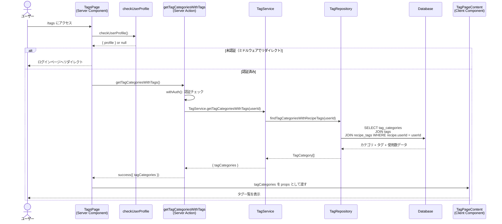

# タグ一覧

## 概要

認証済みユーザーが作成したタグ・タグカテゴリを一覧表示する機能。システムが提供するシステムカテゴリ・タグとユーザー独自のカテゴリ・タグを階層構造（カテゴリ → タグ）で表示する。各タグのレシピ使用数も合わせて表示し、タグの管理（編集・削除）を行うメインページ。

## 機能仕様

### 目的

- 登録済みのタグ・カテゴリをカテゴリ単位でまとめて視覚的に把握できるようにする
- 各タグのレシピ使用数を表示し、タグ利用状況を確認できるようにする
- タグ・カテゴリのインライン編集・削除を提供する

### 機能詳細

#### 一覧表示
- カテゴリごとにタグをグルーピングして表示する
- 表示対象: システムカテゴリ（`isSystem: true`）とユーザー所有カテゴリ
- ソート: カテゴリ・タグとも作成日時の昇順
- カテゴリの種別（システム/ユーザー）をバッジで視覚的に区別する
- 各カテゴリのタグ数、各タグのレシピ使用数をバッジ表示する

#### 使用数の計算
- タグのレシピ使用数は、そのタグに紐付いた**自分のレシピ数**をカウントする
- 他ユーザーのレシピへの適用は使用数に含まれない

#### カテゴリが空の場合
- `TagEmptyState` コンポーネントを表示する
- メッセージ: 「タグがまだありません」
- 使用ガイド: 「カテゴリを作成してからタグを追加」

#### カテゴリ内にタグが0件の場合
- 「このカテゴリにはまだタグがありません。」をテキスト表示する

#### UI/UX
- システムカテゴリ: sky-100背景・`BadgeCheckIcon` で識別
- ユーザーカテゴリ: emerald-100背景・`UserCircleSolidIcon` で識別
- タグはフレックスレイアウトで横並び表示（折り返しあり）
- ホバー時にボーダーとシャドウが変化するアニメーション
- 編集・削除ボタンはユーザー所有かつ非システムのリソースのみ表示

### ユーザーフロー

```
1. /tags ページにアクセス
   ↓
2. [ローディング中] loading.tsx のスケルトン表示
   ↓
3. サーバー側でタグカテゴリ + タグ + 使用数を取得
   ↓
4. TagPageContent で一覧表示
   ├── TagInfoBanner（説明バナー）
   ├── TagCreateForm（作成フォーム）
   └── カテゴリ一覧
       ├── [カテゴリあり] CategoryItem × N
       │    └── TagItem × N（各カテゴリのタグ）
       └── [カテゴリなし] TagEmptyState
```

## シーケンス図



## 技術仕様

### フロントエンド

#### コンポーネント構成

| コンポーネント | ファイル | タイプ | 役割 |
|---|---|---|---|
| TagsPage | `src/app/(auth)/tags/page.tsx` | Server Component | ページ本体、データ取得 |
| loading | `src/app/(auth)/tags/loading.tsx` | Server Component | ローディングスケルトン |
| TagPageContent | `src/features/tags/tag-page-content.tsx` | Client Component | ページ全体のレイアウト |
| TagInfoBanner | `src/features/tags/tag-info-banner.tsx` | Server Component | 説明バナー |
| TagCreateForm | `src/features/tags/tag-create-form.tsx` | Client Component | タグ・カテゴリ作成フォーム |
| CategoryItem | `src/features/tags/category-item.tsx` | Client Component | カテゴリの表示・編集・削除 |
| TagItem | `src/features/tags/tag-item.tsx` | Client Component | タグの表示・編集・削除 |
| TagEmptyState | `src/features/tags/tag-empty-state.tsx` | Server Component | 空状態の表示 |

#### ページレイアウト構造

```
TagsPage (Server)
 └── TagPageContent (Client)
      ├── TagInfoBanner        # オレンジグラデーションの説明バナー
      ├── TagCreateForm        # タブ式の作成フォーム
      ├── セクションヘッダー      # 「登録済みのタグ」+ カテゴリ数バッジ
      └── [カテゴリ一覧 or 空状態]
           ├── CategoryItem × N
           │    ├── カテゴリヘッダー（名前・バッジ・編集削除ボタン）
           │    └── TagItem × N（フレックスラップ）
           └── TagEmptyState（カテゴリが0件の場合）
```

#### 使用コンポーネント・アイコン

- `Button`, `Input`, `Textarea` - フォーム要素
- `Alert`, `Card`, `CardContent` - レイアウト
- アイコン: `TagIcon`, `FolderIcon`, `BadgeCheckIcon`, `UserCircleSolidIcon`, `BookOpenIcon`, `PencilIcon`, `TrashIcon`, `InfoSolidIcon`

#### 主要な表示ロジック

```typescript
// TagPageContent - カテゴリ数の表示
const tagCount = tagCategories.length
// → 「3 カテゴリ」のようなバッジ表示

// CategoryItem - 編集・削除ボタンの表示制御
const isUserOwned = category.userId === currentUserId
const showActions = isUserOwned && !category.isSystem

// TagItem - レシピ使用数の計算
const useCount = tag.recipeTags.length  // ユーザーのレシピのみカウント済み
```

### バックエンド

#### Server Action

**ファイル**: `src/features/tags/actions.ts`

```typescript
export async function getTagCategoriesWithTags(): Promise<
  Result<TagCategoriesWithTagsOutput>
>
```

`'use server'` ディレクティブ使用。`withAuth()` で認証必須。

#### 処理フロー

1. `withAuth()` で認証チェック（未認証時は `UNAUTHENTICATED` を返す）
2. `TagService.getTagCategoriesWithTags(profile.id)` を呼び出す
3. `TagRepository.findTagCategoriesWithRecipeTags(userId)` でDB取得
4. `success({ tagCategories })` を返す
5. 例外発生時は `console.error()` + `Errors.server('タグカテゴリの取得に失敗しました')`

#### Prismaクエリ

**ファイル**: `src/backend/repositories/tag.repository.ts`

```typescript
export async function findTagCategoriesWithRecipeTags(userId: string) {
  return prisma.tagCategory.findMany({
    where: {
      OR: [{ isSystem: true }, { userId }],
    },
    include: {
      tags: {
        include: {
          recipeTags: {
            where: {
              recipe: { userId },  // 自分のレシピのみ
            },
            select: { recipeId: true },  // 使用数計算に必要な最小限のデータ
          },
        },
      },
    },
    orderBy: { createdAt: 'asc' },
  })
}
```

#### キャッシュ戦略

- タグ・カテゴリの作成・更新・削除後に `revalidatePath('/tags')` でキャッシュを無効化
- Next.js の Server Component キャッシュ機構を活用

#### 使用ライブラリ
- `@prisma/client` - DBアクセス
- `next/cache` (`revalidatePath`) - キャッシュ無効化

## データモデル

### TagCategory モデル

```prisma
model TagCategory {
  id          String   @id @default(uuid())
  userId      String?  @map("user_id")   // NULL = システムカテゴリ
  name        String
  description String?
  isSystem    Boolean  @default(false) @map("is_system")
  createdAt   DateTime @default(now()) @map("created_at")
  updatedAt   DateTime @updatedAt @map("updated_at")

  user User?  @relation(fields: [userId], references: [id])
  tags Tag[]

  @@map("tag_categories")
}
```

### Tag モデル

```prisma
model Tag {
  id          String   @id @default(uuid())
  categoryId  String   @map("category_id")
  userId      String?  @map("user_id")   // NULL = システムタグ
  name        String
  description String?
  isSystem    Boolean  @default(false) @map("is_system")
  createdAt   DateTime @default(now()) @map("created_at")
  updatedAt   DateTime @updatedAt @map("updated_at")

  category   TagCategory @relation(fields: [categoryId], references: [id])
  recipeTags RecipeTag[]
  user       User?       @relation(fields: [userId], references: [id])

  @@map("tags")
}
```

### RecipeTag モデル（中間テーブル）

```prisma
model RecipeTag {
  recipeId  String   @map("recipe_id")
  tagId     String   @map("tag_id")
  createdAt DateTime @default(now()) @map("created_at")

  recipe Recipe @relation(fields: [recipeId], references: [id], onDelete: Cascade)
  tag    Tag    @relation(fields: [tagId], references: [id], onDelete: Cascade)

  @@id([recipeId, tagId])
  @@map("recipe_tags")
}
```

### 型定義

**ドメイン層** (`src/backend/domain/tags/types.ts`):

```typescript
export type TagCategoriesWithTagsOutput = {
  tagCategories: Array<{
    id: string
    name: string
    description: string | null
    isSystem: boolean
    userId: string | null
    tags: Array<{
      id: string
      name: string
      description: string | null
      isSystem: boolean
      userId: string | null
      categoryId: string
      recipeTags: Array<{ recipeId: string }>
    }>
  }>
}
```

**フロントエンド層** (`src/types/tag.ts`):

```typescript
// ページ表示用: recipeTags（使用数）を含むカテゴリ型
export type TagCategoryWithTags = TagCategory & {
  tags: Array<Tag & {
    recipeTags: Array<{ recipeId: string }>
  }>
}
```

## API仕様

### getTagCategoriesWithTags (Server Action)

#### 概要
認証済みユーザーのタグカテゴリ（システム + ユーザー所有）とその配下のタグ、各タグのレシピ使用数を一括取得する。

#### シグネチャ
```typescript
async function getTagCategoriesWithTags(): Promise<Result<TagCategoriesWithTagsOutput>>
```

#### パラメータ
なし（認証情報はサーバー側で自動取得）

#### 戻り値
```typescript
// 成功
{
  success: true,
  data: {
    tagCategories: Array<{
      id: string
      name: string
      description: string | null
      isSystem: boolean
      userId: string | null
      tags: Array<{
        id: string
        name: string
        description: string | null
        isSystem: boolean
        userId: string | null
        categoryId: string
        recipeTags: Array<{ recipeId: string }>
      }>
    }>
  }
}

// 失敗
{ success: false, error: { code: ErrorCode, message: string } }
```

#### エラーコード
| コード | メッセージ | 発生条件 |
|--------|-----------|---------|
| `UNAUTHENTICATED` | - | 未認証 |
| `SERVER_ERROR` | 「タグカテゴリの取得に失敗しました」 | DBエラー等 |

#### クライアント側での利用

```typescript
// page.tsx (Server Component)
const result = await getTagCategoriesWithTags()
const tagCategories = isSuccess(result) ? result.data.tagCategories : []

// TagPageContent に props として渡す
<TagPageContent tagCategories={tagCategories} currentUserId={profile.id} />
```

## テスト

### テストファイル

| ファイル | フレームワーク | テスト対象 |
|---|---|---|
| `src/features/tags/__tests__/tag-page-content.test.tsx` | Vitest / RTL | TagPageContent |
| `src/features/tags/__tests__/category-item.test.tsx` | Vitest / RTL | CategoryItem（81テスト） |
| `src/features/tags/__tests__/tag-item.test.tsx` | Vitest / RTL | TagItem（24テスト） |
| `src/features/tags/__tests__/tag-empty-state.test.tsx` | Vitest / RTL | TagEmptyState |
| `src/features/tags/__tests__/tag-info-banner.test.tsx` | Vitest / RTL | TagInfoBanner |
| `src/backend/services/tags/__tests__/tag.service.test.ts` | Vitest | TagService |

### テストケース

1. **TagPageContent**
   - バナー・フォーム・セクションタイトルが表示される
   - カテゴリが存在する場合、カテゴリ数バッジと `CategoryItem` が表示される
   - カテゴリが0件の場合、`TagEmptyState` を表示しカテゴリ数バッジは表示しない

2. **CategoryItem - 表示制御**
   - カテゴリ名・タグ数・説明が表示される
   - システムカテゴリにはシステムバッジ、ユーザーカテゴリにはユーザーバッジが表示される
   - タグが0件の場合「このカテゴリにはまだタグがありません。」を表示
   - 編集・削除ボタンはユーザー所有かつ非システムのみ表示（システム・他ユーザーは非表示）

3. **CategoryItem - 編集・削除**
   - 編集ボタンクリックで編集フォームを表示
   - キャンセルで入力内容をリセットして通常表示に戻る
   - 更新成功で編集モードを解除
   - エラー返却・例外スロー時にエラーメッセージを表示
   - 削除ボタンでconfirmダイアログを表示し、OK/キャンセルで動作を制御

4. **TagItem - 表示制御**
   - タグ名・レシピ使用数が表示される（使用数0も表示）
   - 編集・削除ボタンの表示制御（システム・他ユーザーは非表示）

5. **TagItem - 編集・削除**
   - CategoryItem と同様のパターン（toast.error でエラー通知）
   - タグ名が空の場合 toast.error を表示（送信しない）

6. **TagEmptyState**
   - タイトル・説明・ヘルプメッセージ・アイコンが表示される

## セキュリティ

### 実装されているセキュリティ対策

1. **ページレベルの認証**
   - `checkUserProfile()` でユーザー認証状態を確認
   - ミドルウェアで未認証ユーザーをログインページへリダイレクト

2. **Server Action の認証**
   - `withAuth()` ラッパーですべての操作を保護
   - 未認証の場合は `UNAUTHENTICATED` エラーを返す

3. **データアクセスのスコープ制御**
   - 取得できるカテゴリ: `isSystem: true` または `userId === currentUserId`
   - 使用数のカウント: 自分のレシピへの適用数のみ（`recipe.userId === userId`）

4. **操作権限の多層チェック**
   - UI層: 自分所有かつ非システムのリソースのみ編集・削除ボタンを表示
   - Service層: `userId` と `isSystem` を再度チェックして権限を検証
   - システムリソース（`isSystem: true`）は編集・削除不可

## 配置場所

タグ一覧は以下のページで使用されています：

1. **タグ管理ページ**
   - `src/app/(auth)/tags/page.tsx`
   - タグ・カテゴリの閲覧・編集・削除のメインページ
