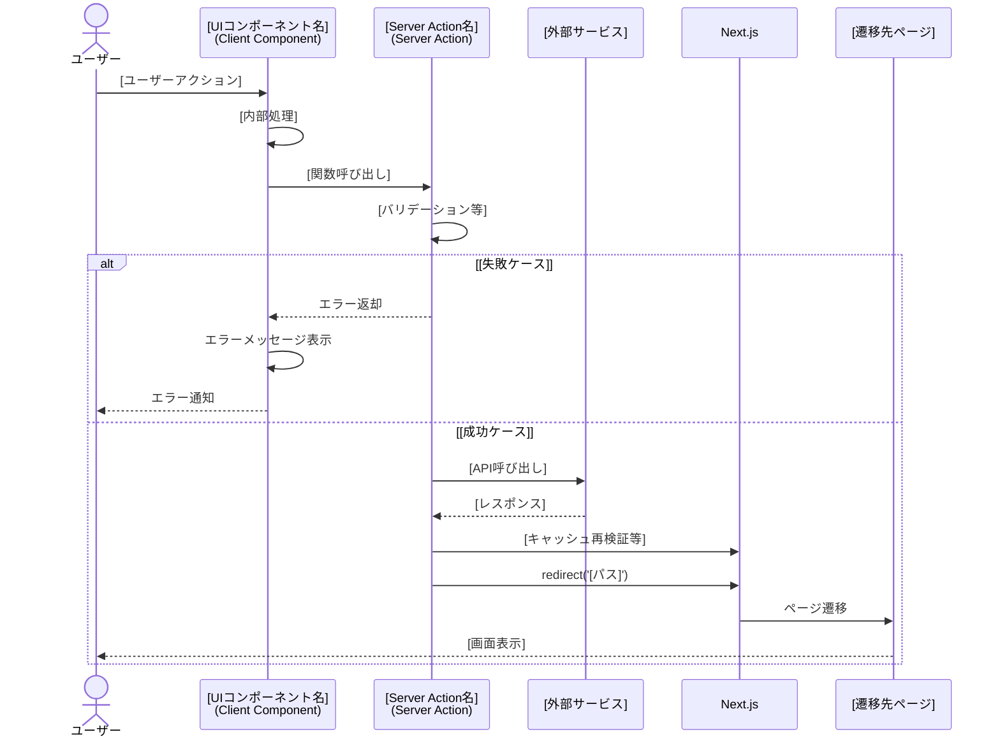

# [機能名]

## 概要

[機能の概要説明。何のための機能か、どのような価値を提供するかを簡潔に記述]

## 機能仕様

### 目的

- [目的1]
- [目的2]
- [目的3]

### 機能詳細

#### [詳細項目1]
- [詳細内容]

#### [詳細項目2]
- [詳細内容]

#### UI/UX
- [UI/UX要件]

#### その他
- [その他の特記事項]

### ユーザーフロー

```
1. [ステップ1]
   ↓
2. [ステップ2]
   ↓
3. [ステップ3]
   ↓
...
```

## シーケンス図



## 技術仕様

### フロントエンド

#### コンポーネント構成
- **ファイル**: `[ファイルパス]`
- **タイプ**: [Client Component / Server Component]
- **スタイリング**: [スタイリング手法]

#### 使用コンポーネント
- `[コンポーネント名]` - [用途]
- アイコン: `[アイコン名]`

#### 状態管理
```typescript
// 状態管理のコード例
```

#### 主要な処理フロー
```typescript
// 主要な処理のコード例
```

### バックエンド

#### Server Action
- **ファイル**: `[ファイルパス]`
- **関数**: `[関数名とシグネチャ]`
- **ディレクティブ**: `'use server'`

#### バリデーションスキーマ
```typescript
// バリデーションスキーマのコード例
```

#### 処理フロー
1. [処理ステップ1]
2. [処理ステップ2]
3. [処理ステップ3]

#### 使用ライブラリ
- `[ライブラリ名]` - [用途]

### [その他のユーティリティ等]

#### ファイル
- `[ファイルパス]`

#### 主要関数
```typescript
// 関数のシグネチャとコード例
```

## データモデル

### [モデル名] モデル

```prisma
model [ModelName] {
  // Prismaスキーマ
}
```

#### 関連フィールド
- `[フィールド名]`: [説明]

## API仕様

### [関数名] (Server Action)

#### 概要
[関数の概要説明]

#### シグネチャ
```typescript
async function [関数名]([パラメータ]): Promise<[戻り値の型]>
```

#### パラメータ
| 名前 | 型 | 説明 |
|------|------|------|
| [パラメータ名] | [型] | [説明] |

#### FormDataフィールド（該当する場合）
| フィールド名 | 型 | 必須 | バリデーション |
|------------|------|------|--------------|
| [フィールド名] | [型] | [✓/空欄] | [バリデーション内容] |

#### 戻り値
```typescript
// 戻り値の型定義
```

#### エラーコード（該当する場合）
| コード | メッセージ | 発生条件 |
|--------|-----------|---------|
| [コード] | [メッセージ] | [発生条件] |

#### 処理詳細
1. [処理ステップ1]
2. [処理ステップ2]
3. [処理ステップ3]

## テスト（該当する場合）

### テストファイル
- **ファイル**: `[テストファイルパス]`
- **フレームワーク**: [テストフレームワーク]

### テストケース
1. **[テストケース名1]**
   - [テスト内容]

2. **[テストケース名2]**
   - [テスト内容]

## セキュリティ

### 実装されているセキュリティ対策

1. **[対策項目1]**
   - [対策内容]

2. **[対策項目2]**
   - [対策内容]

## 配置場所（該当する場合）

[コンポーネント名]は以下の場所で使用されています：

1. **[配置場所1]**
   - `[ファイルパス]`
   - [補足説明]

2. **[配置場所2]**
   - `[ファイルパス]`
   - [補足説明]
