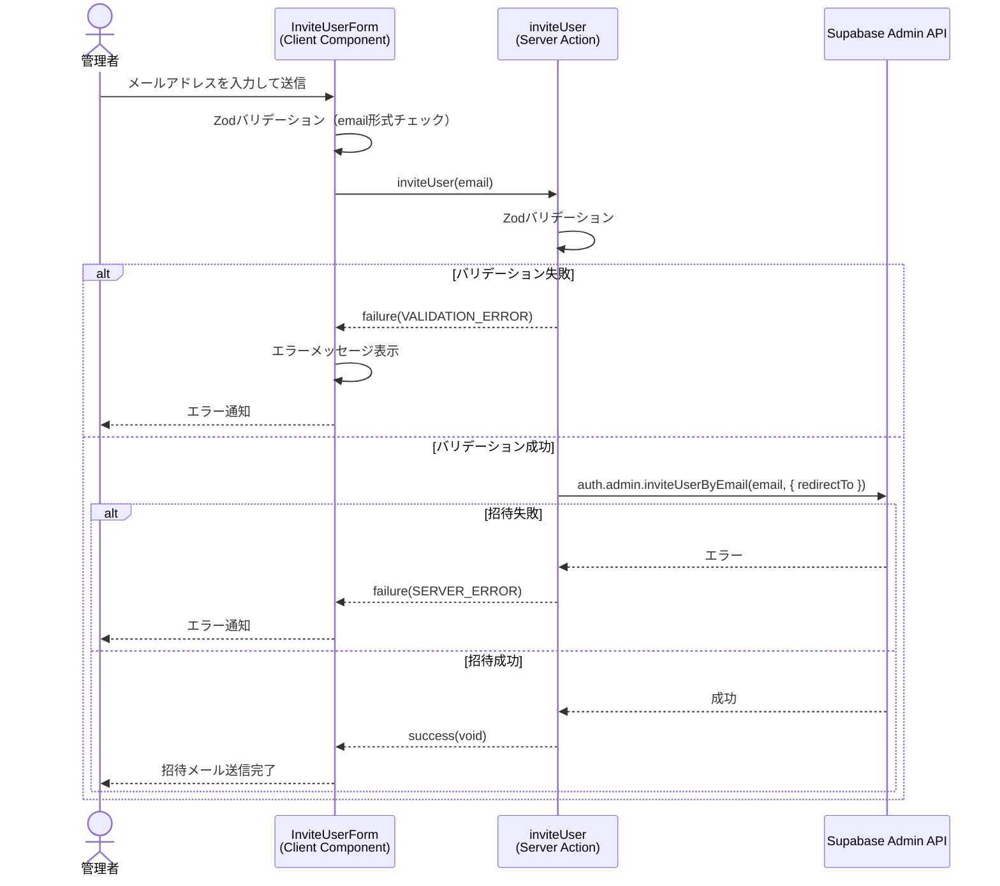
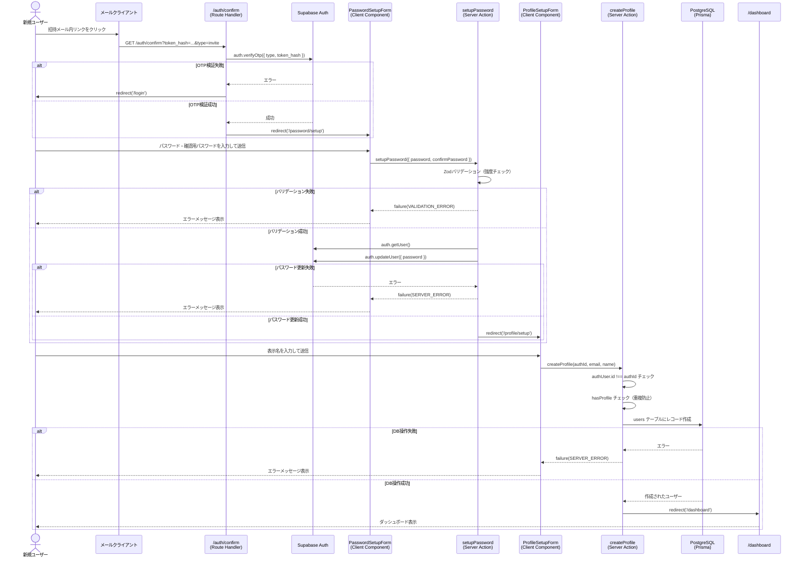

# ユーザー登録（サインアップ）

## 概要

管理者が既存ユーザーを招待することで、新しいユーザーがアカウントを作成できる機能。**招待ベース（Invite-only）**のアプローチを採用しており、直接のセルフサインアップはサポートしていない。招待メール受信後、パスワード設定とプロフィール設定のステップを経てアカウントが完成する。

## 機能仕様

### 目的

- スパム登録を防止し、管理された形でユーザーベースを拡大する
- 招待されたユーザーのみがシステムに登録できる安全な登録フローを提供する
- 段階的なオンボーディングでユーザーのプロフィール情報を収集する

### 機能詳細

#### 招待（管理者操作）
- 管理者が対象ユーザーのメールアドレスを入力して招待メールを送信
- Supabase Admin API (`inviteUserByEmail`) でメール送信
- リダイレクト先は `/auth/confirm`

#### メール確認（OTP検証）
- 招待メール内のリンクをクリックすると `/auth/confirm` にリダイレクト
- `token_hash` と `type` クエリパラメータを使ってOTPを検証
- 検証成功後、`type === 'invite'` の場合は `/password/setup` にリダイレクト

#### パスワード設定
- 新パスワードと確認用パスワードの2フィールドで構成
- パスワード要件をUIに表示（8文字以上、大文字・小文字・数字を含む）
- 設定完了後、`/profile/setup` にリダイレクト

#### プロフィール設定
- メールアドレス（変更不可・自動入力）と表示名の入力
- 表示名が入力されるまで送信ボタンは無効
- 設定完了後、`/dashboard` にリダイレクト

#### UI/UX
- ログイン画面の「新規登録」ボタンは常に無効化（招待ベースであることを示す）
- パスワード要件をフォーム内にリアルタイム表示
- ローディング中は送信ボタンを無効化してテキストを変更
- エラーはフォーム内にインライン表示

### ユーザーフロー

```
1. 管理者が対象ユーザーのメールアドレスを入力して招待送信
   ↓
2. 対象ユーザーが招待メールを受信し、メール内のリンクをクリック
   ↓
3. /auth/confirm でOTP検証
   ↓
4. /password/setup でパスワードを設定・送信
   ↓
5. /profile/setup でメールアドレス確認・表示名を入力して送信
   ↓
6. /dashboard にリダイレクト（登録完了）
```

## シーケンス図

### 招待送信（管理者）



### 招待受諾〜アカウント作成（新規ユーザー）



## 技術仕様

### フロントエンド

#### コンポーネント構成

| コンポーネント | ファイル | タイプ |
|---|---|---|
| InviteUserForm | `src/features/profile/invite/invite-user-form.tsx` | Client Component |
| PasswordSetupForm | `src/features/profile/password/password-setup-form.tsx` | Client Component |
| ProfileSetupForm | `src/features/profile/setup/profile-setup-form.tsx` | Client Component |
| ProfileSetupPageContent | `src/features/profile/setup/profile-setup-page-content.tsx` | Server Component |

#### ページ構成

| ページ | ファイル | 説明 |
|---|---|---|
| パスワード設定 | `src/app/(auth-setup)/password/setup/page.tsx` | 初回パスワード設定画面 |
| プロフィール設定 | `src/app/(auth-setup)/profile/setup/page.tsx` | 表示名設定画面 |
| メール確認 | `src/app/auth/confirm/route.ts` | OTP検証Route Handler |

#### 状態管理

```typescript
// PasswordSetupForm - パスワード設定フォームの状態
const [error, setError] = useState<string | null>(null)
const [isPending, startTransition] = useTransition()

// ProfileSetupForm - プロフィール設定フォームの状態
const [name, setName] = useState('')
const [error, setError] = useState<string | null>(null)
const [isPending, startTransition] = useTransition()
```

#### 送信ボタンの有効/無効制御

```typescript
// ProfileSetupForm - 表示名が入力されるまでボタン無効
<Button
  disabled={!name.trim() || isPending}
>
  {isPending ? '設定中...' : 'プロフィールを設定する'}
</Button>
```

### バックエンド

#### Server Actions

| Server Action | ファイル | 関数名 |
|---|---|---|
| ユーザー招待 | `src/features/profile/invite/actions.ts` | `inviteUser` |
| パスワード設定 | `src/features/profile/password/actions.ts` | `setupPassword` |
| プロフィール作成 | `src/features/profile/setup/actions.ts` | `createProfile` |
| OTP検証 | `src/app/auth/confirm/route.ts` | `GET` (Route Handler) |

#### バリデーションスキーマ

```typescript
// 招待バリデーション
const inviteSchema = z.object({
  email: z.string().email('有効なメールアドレスを入力してください'),
})

// パスワード設定バリデーション
const passwordSetupSchema = z
  .object({
    password: z
      .string()
      .min(8, 'パスワードは8文字以上で入力してください')
      .regex(/[A-Z]/, 'パスワードには大文字を1文字以上含めてください')
      .regex(/[a-z]/, 'パスワードには小文字を1文字以上含めてください')
      .regex(/[0-9]/, 'パスワードには数字を1文字以上含めてください'),
    confirmPassword: z.string(),
  })
  .refine((data) => data.password === data.confirmPassword, {
    message: 'パスワードが一致しません',
    path: ['confirmPassword'],
  })
```

#### 処理フロー（createProfile）

1. `checkUserProfile()` で現在の認証状態とプロフィール有無を確認
2. 未認証の場合は `/login` へリダイレクト
3. `authUser.id !== authId` の場合は `FORBIDDEN` エラーを返す
4. プロフィールが既に存在する場合は `CONFLICT` エラーを返す
5. `UserService.createProfile({ authId, email, name })` でDBに登録
6. 成功後 `/dashboard` へリダイレクト

#### 使用ライブラリ

- `zod` - 入力バリデーション
- `@supabase/ssr` - 認証処理（SSR対応）
- `@prisma/client` - DB操作

### 認証ユーティリティ

#### ファイル
- `src/features/auth/auth-utils.ts`
- `src/utils/server-action/with-auth.ts`

#### 主要関数

```typescript
// 認証状態とプロフィール有無を確認
export async function checkUserProfile() {
  const supabase = await createClient()
  const { data: { user } } = await supabase.auth.getUser()
  if (!user) {
    return { hasAuth: false, hasProfile: false }
  }
  const { exists, profile } = await UserService.checkExistingProfile(user.id)
  return { hasAuth: true, hasProfile: exists, authUser: user, profile }
}
```

## データモデル

### User モデル

```prisma
model User {
  id        String   @id @default(uuid())
  authId    String   @unique @map("auth_id")  // Supabase AuthのユーザーID
  email     String   @unique
  name      String?
  createdAt DateTime @default(now()) @map("created_at")
  updatedAt DateTime @updatedAt @map("updated_at")

  @@map("users")
}
```

#### 関連フィールド
- `authId`: Supabase Auth の `user.id` と紐付け。アプリのDBとAuthを結ぶキー
- `email`: 招待時のメールアドレスをそのまま保存
- `name`: プロフィール設定ステップで入力された表示名

## API仕様

### inviteUser (Server Action)

#### 概要
管理者が新規ユーザーをメールアドレスで招待する

#### シグネチャ
```typescript
async function inviteUser(email: string): Promise<Result<void>>
```

#### パラメータ
| 名前 | 型 | 説明 |
|------|------|------|
| email | string | 招待するユーザーのメールアドレス |

#### エラーコード
| コード | メッセージ | 発生条件 |
|--------|-----------|---------|
| `VALIDATION_ERROR` | 有効なメールアドレスを入力してください | メール形式不正 |
| `SERVER_ERROR` | 招待メールの送信に失敗しました | Supabase API エラー |

---

### setupPassword (Server Action)

#### 概要
招待受諾後の初回パスワード設定

#### シグネチャ
```typescript
async function setupPassword(data: PasswordSetupFormData): Promise<Result<void>>
```

#### パラメータ
| 名前 | 型 | 説明 |
|------|------|------|
| data.password | string | 設定するパスワード |
| data.confirmPassword | string | 確認用パスワード |

#### バリデーション
| ルール | 内容 |
|--------|------|
| 最小文字数 | 8文字以上 |
| 大文字 | 1文字以上含む |
| 小文字 | 1文字以上含む |
| 数字 | 1文字以上含む |
| パスワード一致 | `password` と `confirmPassword` が同じ |

#### エラーコード
| コード | メッセージ | 発生条件 |
|--------|-----------|---------|
| `VALIDATION_ERROR` | パスワードは8文字以上で入力してください | 8文字未満 |
| `VALIDATION_ERROR` | パスワードには大文字を1文字以上含めてください | 大文字なし |
| `VALIDATION_ERROR` | パスワードには小文字を1文字以上含めてください | 小文字なし |
| `VALIDATION_ERROR` | パスワードには数字を1文字以上含めてください | 数字なし |
| `VALIDATION_ERROR` | パスワードが一致しません | 確認用パスワード不一致 |
| `UNAUTHENTICATED` | 認証が必要です | 未認証状態 |
| `SERVER_ERROR` | パスワードの設定に失敗しました | Supabase API エラー |

---

### createProfile (Server Action)

#### 概要
パスワード設定後、ユーザーのプロフィール（DBレコード）を作成する

#### シグネチャ
```typescript
async function createProfile(
  authId: string,
  email: string,
  name: string
): Promise<Result<void>>
```

#### パラメータ
| 名前 | 型 | 説明 |
|------|------|------|
| authId | string | Supabase Auth の user.id |
| email | string | ユーザーのメールアドレス |
| name | string | 表示名（空白文字のみ不可） |

#### エラーコード
| コード | メッセージ | 発生条件 |
|--------|-----------|---------|
| `FORBIDDEN` | 認証エラー: ユーザーIDが一致しません | authId が認証中ユーザーと不一致 |
| `CONFLICT` | プロフィールは既に作成されています | 重複登録 |
| `SERVER_ERROR` | プロフィールの作成に失敗しました | DB操作失敗 |

## テスト

### テストファイル

| ファイル | フレームワーク |
|---|---|
| `src/features/profile/setup/__tests__/profile-setup-form.test.tsx` | Vitest + React Testing Library |
| `src/features/profile/password/__tests__/password-setup-form.test.tsx` | Vitest + React Testing Library |
| `src/backend/services/users/__tests__/user.service.test.ts` | Vitest |

### テストケース

#### ProfileSetupForm
1. **メールアドレスフィールドがdisabled表示** - 変更不可であることを確認
2. **名前入力フィールドが表示される** - フォームのレンダリング確認
3. **送信ボタン初期状態がdisabled** - 名前未入力時は送信不可
4. **名前入力による送信ボタン有効化** - 名前入力後にボタンが有効になる
5. **空白文字のみの入力でボタン無効のまま** - trim()による空白チェック
6. **createProfile()が正しく呼び出される** - Server Action の呼び出し確認
7. **エラーメッセージの表示** - SERVER_ERROR の UI表示確認
8. **重複エラー処理** - CONFLICT エラーの UI表示確認
9. **ローディング状態** - isPending 中のボタン無効化とテキスト変更

#### PasswordSetupForm
1. **有効なパスワードで設定成功** - 正常フロー確認
2. **パスワード不一致でエラー表示** - confirmPassword バリデーション確認
3. **パスワード要件不足でエラー表示** - 強度バリデーション確認
4. **セキュリティ要件がUIに表示される** - 要件リストのレンダリング確認
5. **空フォームで送信ボタン無効** - 初期状態の確認

#### UserService
1. **checkExistingProfile: 存在確認（存在する場合）**
2. **checkExistingProfile: 存在確認（存在しない場合）**
3. **createProfile: 新規作成成功**
4. **createProfile: 重複エラー（既存ユーザー）**

## セキュリティ

### 実装されているセキュリティ対策

1. **招待ベースアクセス制御**
   - セルフサインアップは無効化（ログイン画面の「新規登録」ボタンも常にdisabled）
   - 管理者のみが `inviteUserByEmail` を呼び出せる（Supabase Admin API キーを使用）

2. **パスワード強度ポリシー**
   - 最小8文字、大文字・小文字・数字を必須とする複雑性要件
   - Zodによるサーバーサイドバリデーションで強制

3. **OTPによるメール検証**
   - 招待リンクはOTP（ワンタイムパスワード）で保護
   - `/auth/confirm` でトークンを検証し、失敗時は `/login` へリダイレクト

4. **authId の一致確認**
   - `createProfile` 実行時に `authUser.id !== authId` をチェック
   - 他ユーザーのプロフィールを不正作成できないよう防止

5. **重複登録防止**
   - `hasProfile` チェックにより、同一ユーザーの二重プロフィール作成を防止

6. **セッション管理**
   - Supabase SSRによるクッキーベースのセッション管理
   - ミドルウェアで未認証ユーザーを `/login` へリダイレクト

## 補足・メモ

- 現在は招待ベースのみ。将来的にセルフサインアップが必要な場合は `LoginForm.tsx` の `disabled={true}` を解除し、招待なしの登録フローを追加する必要がある
- Supabase Admin API（`adminClient`）は管理者権限を持つため、クライアントサイドには公開しないこと
- `(auth-setup)` レイアウトグループ配下のページは認証済みかつプロフィール未作成のユーザーのみアクセス可能
