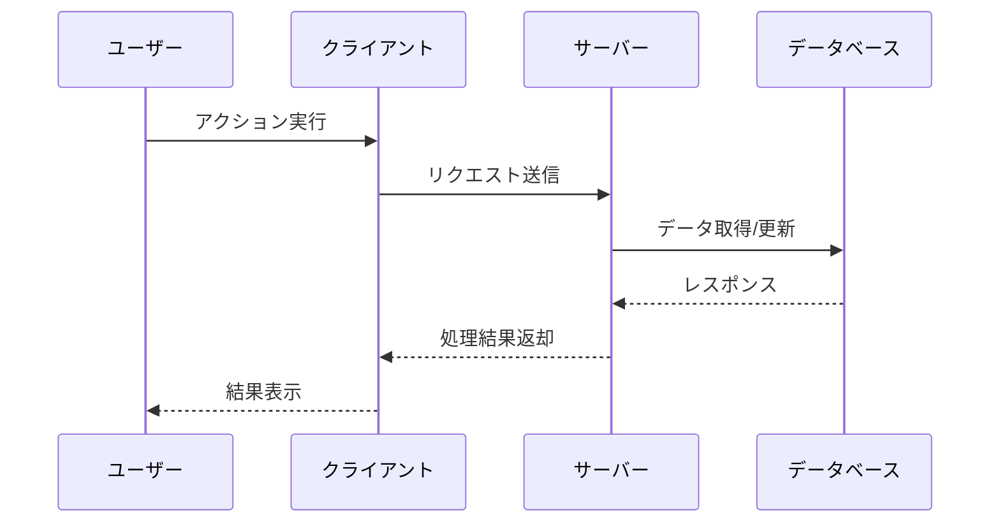

# 機能名

<!-- 機能の名称を記載 -->

## 概要

<!-- 機能の概要を1-2文で簡潔に説明 -->

## 機能仕様

### 目的

<!-- この機能が解決する課題や提供する価値を記載 -->

### 機能詳細

<!-- 機能の詳細な説明を箇条書きで記載 -->

- 機能1の説明
- 機能2の説明
- 機能3の説明

### ユーザーフロー

<!-- ユーザーがこの機能をどのように利用するかを記載 -->

1. ステップ1
2. ステップ2
3. ステップ3

### 技術仕様

<!-- 使用する技術スタック、ライブラリ、APIなどを記載 -->

- **フロントエンド**:
- **バックエンド**:
- **データベース**:
- **外部サービス/API**:

## シーケンス図



## データモデル

<!-- 関連するPrismaスキーマやデータ構造を記載 -->

```prisma
model Example {
  id        String   @id @default(cuid())
  name      String
  createdAt DateTime @default(now())
  updatedAt DateTime @updatedAt
}
```

## API仕様

<!-- 関連するAPIエンドポイントを記載 -->

### エンドポイント1

- **メソッド**: `POST`
- **パス**: `/api/example`
- **リクエストボディ**:
  ```json
  {
    "field1": "value1",
    "field2": "value2"
  }
  ```
- **レスポンス**:
  ```json
  {
    "success": true,
    "data": {}
  }
  ```

## 補足・メモ

<!-- その他の補足情報やメモがあれば記載 -->
